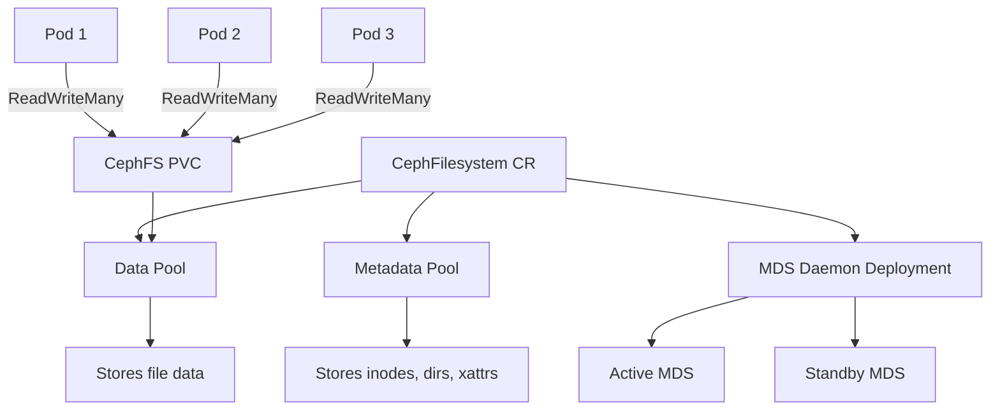

# How to Use CephFilesystem CRD in Rook

Author: [nawazdhandala](https://www.github.com/nawazdhandala)

Tags: Rook, Ceph, Kubernetes, CephFilesystem, CephFS, SharedStorage

Description: Learn how to define and deploy a CephFilesystem custom resource in Rook to create a shared POSIX-compliant filesystem for multi-pod workloads.

---

The `CephFilesystem` CRD (Custom Resource Definition) is Rook's declarative way to provision a CephFS filesystem. Unlike block storage, CephFS enables `ReadWriteMany` access, allowing multiple pods across different nodes to mount the same volume simultaneously.

## Architecture



## Minimal CephFilesystem

```yaml
apiVersion: ceph.rook.io/v1
kind: CephFilesystem
metadata:
  name: myfs
  namespace: rook-ceph
spec:
  metadataPool:
    failureDomain: host
    replicated:
      size: 3
  dataPools:
    - name: data0
      failureDomain: host
      replicated:
        size: 3
  preserveFilesystemOnDelete: true    # protect from accidental deletion
  metadataServer:
    activeCount: 1
    activeStandby: true
```

Apply:

```bash
kubectl apply -f cephfilesystem.yaml
kubectl get cephfilesystem -n rook-ceph
kubectl get pods -n rook-ceph -l app=rook-ceph-mds
```

## Full CephFilesystem Configuration

```yaml
apiVersion: ceph.rook.io/v1
kind: CephFilesystem
metadata:
  name: myfs
  namespace: rook-ceph
spec:
  metadataPool:
    failureDomain: host
    replicated:
      size: 3
      requireSafeReplicaSize: true
    parameters:
      compression_mode: none
  dataPools:
    - name: replicated
      failureDomain: host
      replicated:
        size: 3
        requireSafeReplicaSize: true
      parameters:
        compression_mode: aggressive
        compression_algorithm: zstd
    - name: erasure
      failureDomain: host
      erasureCoded:
        dataChunks: 4
        codingChunks: 2
  preserveFilesystemOnDelete: true
  metadataServer:
    activeCount: 1
    activeStandby: true
    resources:
      requests:
        cpu: "500m"
        memory: "1Gi"
      limits:
        cpu: "2"
        memory: "4Gi"
    placement:
      podAntiAffinity:
        requiredDuringSchedulingIgnoredDuringExecution:
          - labelSelector:
              matchExpressions:
                - key: app
                  operator: In
                  values:
                    - rook-ceph-mds
            topologyKey: kubernetes.io/hostname
    priorityClassName: system-cluster-critical
```

## Create a StorageClass for CephFS

```yaml
apiVersion: storage.k8s.io/v1
kind: StorageClass
metadata:
  name: rook-cephfs
provisioner: rook-ceph.cephfs.csi.ceph.com
parameters:
  clusterID: rook-ceph
  fsName: myfs
  pool: myfs-replicated
  csi.storage.k8s.io/provisioner-secret-name: rook-csi-cephfs-provisioner
  csi.storage.k8s.io/provisioner-secret-namespace: rook-ceph
  csi.storage.k8s.io/controller-expand-secret-name: rook-csi-cephfs-provisioner
  csi.storage.k8s.io/controller-expand-secret-namespace: rook-ceph
  csi.storage.k8s.io/node-stage-secret-name: rook-csi-cephfs-node
  csi.storage.k8s.io/node-stage-secret-namespace: rook-ceph
reclaimPolicy: Delete
allowVolumeExpansion: true
volumeBindingMode: Immediate
```

## Create a ReadWriteMany PVC

```yaml
apiVersion: v1
kind: PersistentVolumeClaim
metadata:
  name: shared-data
  namespace: default
spec:
  accessModes:
    - ReadWriteMany
  resources:
    requests:
      storage: 50Gi
  storageClassName: rook-cephfs
```

## Mount in Multiple Pods

```yaml
apiVersion: apps/v1
kind: Deployment
metadata:
  name: writer
  namespace: default
spec:
  replicas: 3
  selector:
    matchLabels:
      app: writer
  template:
    metadata:
      labels:
        app: writer
    spec:
      containers:
        - name: writer
          image: busybox
          command: ["sh", "-c", "while true; do date >> /data/timestamps.txt; sleep 5; done"]
          volumeMounts:
            - name: shared
              mountPath: /data
      volumes:
        - name: shared
          persistentVolumeClaim:
            claimName: shared-data
```

## Verify the Filesystem

```bash
# Check MDS pods
kubectl get pods -n rook-ceph -l app=rook-ceph-mds

# Check filesystem status in Ceph toolbox
kubectl exec -n rook-ceph deploy/rook-ceph-tools -- ceph fs ls
kubectl exec -n rook-ceph deploy/rook-ceph-tools -- ceph fs status myfs

# Check MDS details
kubectl exec -n rook-ceph deploy/rook-ceph-tools -- ceph mds stat
```

## Summary

The `CephFilesystem` CRD in Rook provisions a full CephFS filesystem with configurable metadata and data pools, and deploys MDS daemons automatically. It is the foundation for all `ReadWriteMany` storage in Rook-based Kubernetes clusters. Configure `preserveFilesystemOnDelete: true` in production to prevent accidental data loss when the CRD is deleted.
