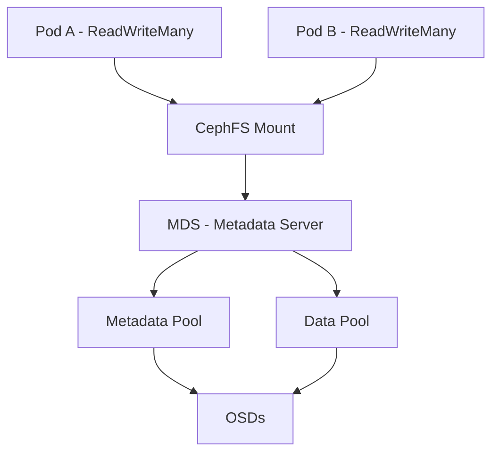

# How to Create a CephFilesystem for Shared File Storage in Rook

Author: [nawazdhandala](https://www.github.com/nawazdhandala)

Tags: Rook, Ceph, Kubernetes, CephFS, Filesystem, SharedStorage

Description: Learn how to create a CephFilesystem custom resource in Rook to enable shared POSIX-compliant file storage accessible by multiple pods simultaneously.

---

## How CephFS Works in Rook

CephFS is a POSIX-compliant distributed filesystem built on top of RADOS. Unlike RBD (block storage), CephFS allows multiple pods to read and write simultaneously through `ReadWriteMany` access mode. CephFS uses two types of pools: a metadata pool (stores directory trees, file attributes, and inode data) and one or more data pools (stores actual file content). The Metadata Server (MDS) manages the filesystem namespace.



## Prerequisites

Before creating a CephFilesystem:

- CephCluster must be in `HEALTH_OK` state with at least 3 OSDs
- At least 3 OSDs are recommended for the data pool replication
- Metadata pool typically needs at least 3 replicas for production

Check cluster readiness:

```bash
kubectl -n rook-ceph exec deploy/rook-ceph-tools -- ceph status
kubectl -n rook-ceph exec deploy/rook-ceph-tools -- ceph osd stat
```

## Creating a CephFilesystem

Create a CephFilesystem with a single metadata pool and a single data pool:

```yaml
apiVersion: ceph.rook.io/v1
kind: CephFilesystem
metadata:
  name: myfs
  namespace: rook-ceph
spec:
  # Configure the metadata pool
  metadataPool:
    replicated:
      size: 3
      requireSafeReplicaSize: true
    parameters:
      # Use compression for metadata (optional)
      compression_mode: none

  # Configure one or more data pools
  dataPools:
    - name: replicated
      failureDomain: host
      replicated:
        size: 3
        requireSafeReplicaSize: true

  # Preserve pools when the filesystem is deleted
  preservePoolsOnDelete: true

  # MDS (Metadata Server) configuration
  metadataServer:
    # Number of active MDS daemons
    activeCount: 1
    # Number of standby MDS daemons for high availability
    activeStandby: true
    resources:
      requests:
        cpu: 500m
        memory: 1Gi
      limits:
        cpu: "2"
        memory: 4Gi
    placement:
      podAntiAffinity:
        requiredDuringSchedulingIgnoredDuringExecution:
          - labelSelector:
              matchExpressions:
                - key: app
                  operator: In
                  values:
                    - rook-ceph-mds
            topologyKey: kubernetes.io/hostname
    priorityClassName: system-cluster-critical
```

Apply it:

```bash
kubectl apply -f ceph-filesystem.yaml
```

## Multiple Data Pools

You can create multiple data pools within one filesystem to allow different directories to use different storage policies:

```yaml
apiVersion: ceph.rook.io/v1
kind: CephFilesystem
metadata:
  name: myfs
  namespace: rook-ceph
spec:
  metadataPool:
    replicated:
      size: 3
  dataPools:
    - name: replicated
      failureDomain: host
      replicated:
        size: 3
    - name: erasurecoded
      failureDomain: host
      erasureCoded:
        dataChunks: 2
        codingChunks: 1
  preservePoolsOnDelete: true
  metadataServer:
    activeCount: 1
    activeStandby: true
```

## Verifying the CephFilesystem

After applying the manifest, watch the MDS pods start:

```bash
kubectl -n rook-ceph get pods -l app=rook-ceph-mds -w
```

Check the filesystem status from the toolbox:

```bash
kubectl -n rook-ceph exec deploy/rook-ceph-tools -- ceph fs status
```

```text
myfs - 1 clients
====
RANK  STATE   MDS   ACTIVITY    DNS  INOS  DIRS  CAPS
   0  active  a     Reqs:    0   10    13    11     0
         STANDBY
       b

POOL         TYPE     USED  AVAIL
myfs-metadata  metadata   0     0   285G
myfs-replicated  data       0     0   285G
```

Check the filesystem was created:

```bash
kubectl -n rook-ceph exec deploy/rook-ceph-tools -- ceph fs ls
```

```text
name: myfs, metadata pool: myfs-metadata, data pools: [myfs-replicated ]
```

## MDS High Availability

For production, enable active standby with `activeStandby: true`. This keeps a warm standby MDS ready to take over immediately if the active MDS fails. The `activeCount` field controls how many MDS daemons handle requests concurrently (useful for very high metadata workloads):

```yaml
metadataServer:
  activeCount: 2
  activeStandby: true
```

With `activeCount: 2`, the filesystem is served by two active MDS daemons with namespace partitioning, plus two standbys.

## CephFilesystem Status Conditions

Inspect the CephFilesystem resource for health information:

```bash
kubectl -n rook-ceph get cephfilesystem myfs -o yaml | grep -A 20 status
```

A healthy filesystem shows:

```text
status:
  conditions:
  - message: Filesystem created successfully
    reason: FilesystemCreated
    status: "True"
    type: Ready
  phase: Ready
  info:
    mdsCount: "2"
```

## Summary

Creating a CephFilesystem in Rook requires a CephFilesystem CR that defines a metadata pool, at least one data pool, and the MDS configuration. Use `activeStandby: true` for high availability so a warm standby MDS can take over without delay. The `preservePoolsOnDelete: true` flag prevents accidental data loss when the CR is deleted. After the MDS pods are running, verify with `ceph fs status` from the toolbox before creating the associated StorageClass for Kubernetes workloads.
