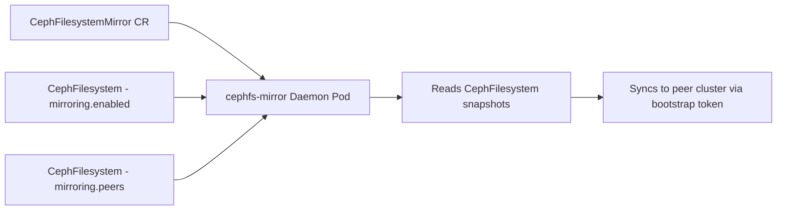

# How to Configure CephFilesystemMirror Daemon in Rook

Author: [nawazdhandala](https://www.github.com/nawazdhandala)

Tags: Rook, Ceph, Kubernetes, CephFilesystemMirror, Mirroring, CRD, CephFS

Description: A complete reference for the CephFilesystemMirror CRD in Rook, covering daemon configuration, placement, resources, and status verification.

---

The `CephFilesystemMirror` CRD manages the `cephfs-mirror` daemon in Rook. This daemon is responsible for asynchronous snapshot-based replication of CephFS directories to a secondary cluster. It must be deployed before enabling mirroring on any `CephFilesystem`.

## CephFilesystemMirror Role



## Minimal CephFilesystemMirror CR

```yaml
apiVersion: ceph.rook.io/v1
kind: CephFilesystemMirror
metadata:
  name: my-fs-mirror
  namespace: rook-ceph
spec:
  count: 1
```

```bash
kubectl apply -f cephfilesystemmirror.yaml
kubectl get cephfilesystemmirror -n rook-ceph
kubectl get pods -n rook-ceph -l app=rook-ceph-fs-mirror
```

## Full CephFilesystemMirror CR

```yaml
apiVersion: ceph.rook.io/v1
kind: CephFilesystemMirror
metadata:
  name: my-fs-mirror
  namespace: rook-ceph
spec:
  # Number of mirror daemon instances
  count: 2

  resources:
    requests:
      cpu: "500m"
      memory: "512Mi"
    limits:
      cpu: "2"
      memory: "2Gi"

  priorityClassName: system-cluster-critical

  placement:
    nodeAffinity:
      requiredDuringSchedulingIgnoredDuringExecution:
        nodeSelectorTerms:
          - matchExpressions:
              - key: role
                operator: In
                values:
                  - storage-node
    podAntiAffinity:
      preferredDuringSchedulingIgnoredDuringExecution:
        - weight: 100
          podAffinityTerm:
            labelSelector:
              matchLabels:
                app: rook-ceph-fs-mirror
            topologyKey: kubernetes.io/hostname
    tolerations:
      - key: storage-only
        operator: Equal
        value: "true"
        effect: NoSchedule
```

## Checking Daemon Status

```bash
# Check CRD status
kubectl get cephfilesystemmirror my-fs-mirror -n rook-ceph -o yaml

# Expected status
kubectl describe cephfilesystemmirror my-fs-mirror -n rook-ceph
# Status.Phase: Ready

# Check running pod
kubectl get pods -n rook-ceph -l app=rook-ceph-fs-mirror

# Check daemon logs
kubectl logs -n rook-ceph -l app=rook-ceph-fs-mirror --tail=50
```

## Checking Mirroring Status via Ceph

```bash
# Mirror daemon info
kubectl exec -n rook-ceph deploy/rook-ceph-tools -- \
  ceph fs snapshot mirror daemon status

# Overall mirror status for a filesystem
kubectl exec -n rook-ceph deploy/rook-ceph-tools -- \
  ceph fs snapshot mirror status myfs

# Per-directory sync status
kubectl exec -n rook-ceph deploy/rook-ceph-tools -- \
  ceph fs snapshot mirror status myfs /

# Peer information
kubectl exec -n rook-ceph deploy/rook-ceph-tools -- \
  ceph fs snapshot mirror peer list myfs
```

## Scaling Mirror Daemons

For high-volume replication, increase `count`:

```bash
kubectl patch cephfilesystemmirror my-fs-mirror -n rook-ceph \
  --type merge \
  -p '{"spec":{"count":3}}'
```

Each daemon instance handles a subset of directories in the filesystem.

## Enabling Mirroring on the CephFilesystem

The mirror daemon is only useful when mirroring is enabled on a filesystem:

```yaml
apiVersion: ceph.rook.io/v1
kind: CephFilesystem
metadata:
  name: myfs
  namespace: rook-ceph
spec:
  # ... pool and MDS config ...
  mirroring:
    enabled: true
    peers:
      secretNames:
        - cephfs-mirror-peer
    snapshotSchedules:
      - interval: "24h"
```

## Deleting the Mirror Daemon

```bash
# Disable mirroring on filesystems first
kubectl patch cephfilesystem myfs -n rook-ceph \
  --type merge \
  -p '{"spec":{"mirroring":{"enabled":false}}}'

# Then delete the daemon
kubectl delete cephfilesystemmirror my-fs-mirror -n rook-ceph
```

## Summary

The `CephFilesystemMirror` CRD deploys the `cephfs-mirror` daemon in Rook. Configure `count` for the number of daemon replicas, use `resources` for CPU/memory limits, and `placement` to control scheduling. The daemon is passive until a `CephFilesystem` has `mirroring.enabled: true` and a peer secret. Scale `count` horizontally for higher replication throughput.
