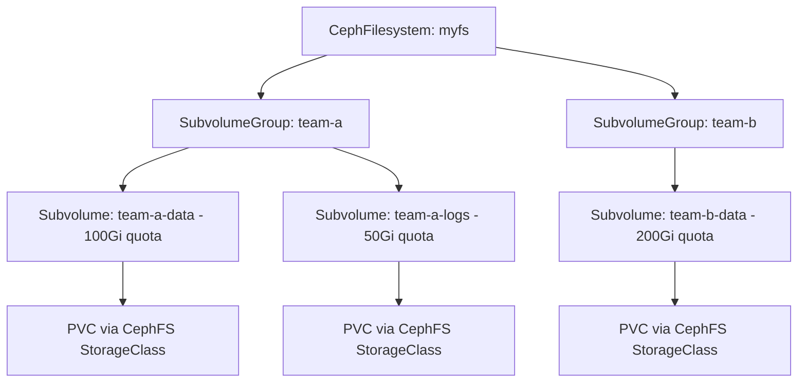

# How to Create Quotas on CephFS Directories in Rook

Author: [nawazdhandala](https://www.github.com/nawazdhandala)

Tags: Rook, Ceph, Kubernetes, CephFS, Quota, Subvolume

Description: Set capacity and file count quotas on CephFS directories and subvolumes in Rook to limit storage consumption per tenant or application.

---

CephFS supports two types of quotas on directories: byte quotas limiting total data size, and file count quotas limiting the number of files. Combined with Rook subvolumes and subvolume groups, these quotas provide multi-tenant storage governance.

## Quota Architecture



## Method 1: Quota via CephFilesystemSubVolumeGroup

Rook CRD-based subvolume groups let you configure quotas declaratively:

```yaml
apiVersion: ceph.rook.io/v1
kind: CephFilesystemSubVolumeGroup
metadata:
  name: team-a
  namespace: rook-ceph
spec:
  filesystemName: myfs
  name: team-a                # subvolume group name in CephFS
  quota:
    maxBytes: 107374182400    # 100 GiB in bytes
    maxFiles: 1000000
  dataPoolName: myfs-data0    # optional: pin to specific data pool
```

```bash
kubectl apply -f subvolumegroup.yaml
kubectl get cephfilesystemsubvolumegroup -n rook-ceph
```

## Method 2: Directory Quota via xattr

For quotas on arbitrary directories (not subvolumes), use xattrs directly:

```bash
kubectl exec -n rook-ceph deploy/rook-ceph-tools -- bash

# Mount CephFS as admin
mkdir -p /mnt/cephfs
mount -t ceph mon-a:6789:/ /mnt/cephfs -o \
  name=admin,secretfile=/etc/ceph/keyring

# Set byte quota (100 GiB) on a directory
setfattr -n ceph.quota.max_bytes -v 107374182400 /mnt/cephfs/team-a

# Set file count quota
setfattr -n ceph.quota.max_files -v 1000000 /mnt/cephfs/team-a

# Verify quotas
getfattr -n ceph.quota.max_bytes /mnt/cephfs/team-a
getfattr -n ceph.quota.max_files /mnt/cephfs/team-a
```

## Method 3: Quota via Ceph CLI Subvolumes

```bash
kubectl exec -n rook-ceph deploy/rook-ceph-tools -- bash

# Create a subvolume group
ceph fs subvolumegroup create myfs team-a

# Create a subvolume with a quota
ceph fs subvolume create myfs app-data team-a \
  --size 107374182400 \
  --mode 0755

# Verify quota
ceph fs subvolume info myfs app-data team-a | grep -i quota
```

## StorageClass Using SubVolumeGroup

When using the Rook CSI CephFS driver with a subvolume group, specify it in the StorageClass:

```yaml
apiVersion: storage.k8s.io/v1
kind: StorageClass
metadata:
  name: cephfs-team-a
provisioner: rook-ceph.cephfs.csi.ceph.com
parameters:
  clusterID: rook-ceph
  fsName: myfs
  pool: myfs-data0
  fsSubvolumegroupName: team-a    # all PVCs go into this subvolume group
  csi.storage.k8s.io/provisioner-secret-name: rook-csi-cephfs-provisioner
  csi.storage.k8s.io/provisioner-secret-namespace: rook-ceph
  csi.storage.k8s.io/controller-expand-secret-name: rook-csi-cephfs-provisioner
  csi.storage.k8s.io/controller-expand-secret-namespace: rook-ceph
  csi.storage.k8s.io/node-stage-secret-name: rook-csi-cephfs-node
  csi.storage.k8s.io/node-stage-secret-namespace: rook-ceph
reclaimPolicy: Delete
allowVolumeExpansion: true
```

## Check Current Quota Usage

```bash
kubectl exec -n rook-ceph deploy/rook-ceph-tools -- bash

# Check subvolume group quota usage
ceph fs subvolumegroup getpath myfs team-a

# Check usage via df
ceph fs subvolume du myfs team-a

# Check per-directory stats (if mounted)
df -h /mnt/cephfs/team-a
getfattr -n ceph.dir.rbytes /mnt/cephfs/team-a     # recursive byte count
getfattr -n ceph.dir.rfiles /mnt/cephfs/team-a     # recursive file count
```

## Remove a Quota

```bash
# Remove byte quota (set to 0 = unlimited)
setfattr -n ceph.quota.max_bytes -v 0 /mnt/cephfs/team-a

# Remove file count quota
setfattr -n ceph.quota.max_files -v 0 /mnt/cephfs/team-a
```

## What Happens When Quota is Exceeded

When a write exceeds the quota:

```
$ dd if=/dev/zero of=/mnt/cephfs/team-a/bigfile bs=1M count=200
dd: error writing '/mnt/cephfs/team-a/bigfile': Disk quota exceeded
```

Ceph returns `EDQUOT` (error 122) to the client. Applications receive a "disk quota exceeded" error similar to standard filesystem quotas.

## Summary

CephFS directory quotas in Rook can be managed through the `CephFilesystemSubVolumeGroup` CRD for declarative governance, or via xattrs and the Ceph CLI for more flexible control. Use subvolume groups to organize PVC storage by team or application, and set both byte and file count limits to prevent runaway storage consumption.
