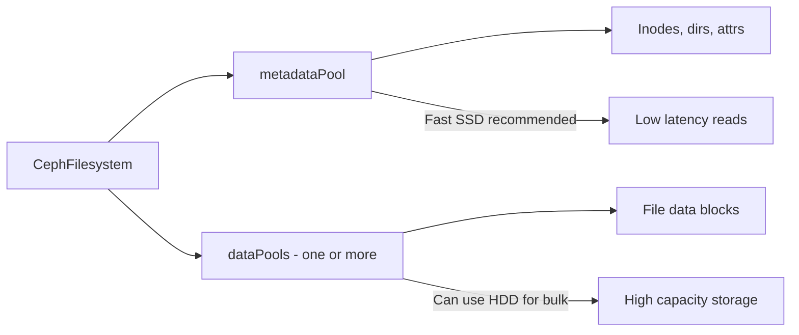

# How to Configure CephFilesystem Metadata Pool and Data Pools in Rook

Author: [nawazdhandala](https://www.github.com/nawazdhandala)

Tags: Rook, Ceph, Kubernetes, CephFilesystem, Pool, CephFS

Description: Learn how to configure separate metadata and data pools in a Rook CephFilesystem, including replication, erasure coding, and device class targeting.

---

A `CephFilesystem` in Rook requires at minimum one metadata pool and one data pool. The metadata pool stores inodes, directory entries, and file attributes. The data pool stores actual file content. These pools can be configured independently for performance and capacity optimization.

## Pool Roles



## Basic Configuration (Single Data Pool)

```yaml
apiVersion: ceph.rook.io/v1
kind: CephFilesystem
metadata:
  name: myfs
  namespace: rook-ceph
spec:
  metadataPool:
    failureDomain: host
    replicated:
      size: 3
      requireSafeReplicaSize: true
  dataPools:
    - name: data0
      failureDomain: host
      replicated:
        size: 3
        requireSafeReplicaSize: true
  preserveFilesystemOnDelete: true
  metadataServer:
    activeCount: 1
    activeStandby: true
```

## SSD Metadata Pool with HDD Data Pool

Optimize for performance by targeting the metadata pool to SSD and data pool to HDD:

```yaml
spec:
  metadataPool:
    failureDomain: host
    replicated:
      size: 3
      requireSafeReplicaSize: true
    deviceClass: ssd      # fast metadata lookups
  dataPools:
    - name: hdd-data
      failureDomain: host
      replicated:
        size: 3
      deviceClass: hdd    # bulk capacity for file content
  metadataServer:
    activeCount: 1
    activeStandby: true
```

## Multiple Data Pools

CephFS supports multiple data pools for storing different types of files:

```yaml
spec:
  metadataPool:
    failureDomain: host
    replicated:
      size: 3
    deviceClass: ssd
  dataPools:
    - name: replicated
      failureDomain: host
      replicated:
        size: 3
      deviceClass: ssd
    - name: bulk-storage
      failureDomain: host
      replicated:
        size: 2    # lower replication for less critical bulk data
      deviceClass: hdd
    - name: erasure-archive
      failureDomain: host
      erasureCoded:
        dataChunks: 4
        codingChunks: 2
      deviceClass: hdd
  metadataServer:
    activeCount: 1
    activeStandby: true
```

## Create StorageClasses for Different Data Pools

```yaml
apiVersion: storage.k8s.io/v1
kind: StorageClass
metadata:
  name: cephfs-ssd
provisioner: rook-ceph.cephfs.csi.ceph.com
parameters:
  clusterID: rook-ceph
  fsName: myfs
  pool: myfs-replicated    # target the SSD pool
  csi.storage.k8s.io/provisioner-secret-name: rook-csi-cephfs-provisioner
  csi.storage.k8s.io/provisioner-secret-namespace: rook-ceph
  csi.storage.k8s.io/controller-expand-secret-name: rook-csi-cephfs-provisioner
  csi.storage.k8s.io/controller-expand-secret-namespace: rook-ceph
  csi.storage.k8s.io/node-stage-secret-name: rook-csi-cephfs-node
  csi.storage.k8s.io/node-stage-secret-namespace: rook-ceph
reclaimPolicy: Delete
allowVolumeExpansion: true
---
apiVersion: storage.k8s.io/v1
kind: StorageClass
metadata:
  name: cephfs-bulk
provisioner: rook-ceph.cephfs.csi.ceph.com
parameters:
  clusterID: rook-ceph
  fsName: myfs
  pool: myfs-bulk-storage    # target the HDD bulk pool
  csi.storage.k8s.io/provisioner-secret-name: rook-csi-cephfs-provisioner
  csi.storage.k8s.io/provisioner-secret-namespace: rook-ceph
  csi.storage.k8s.io/controller-expand-secret-name: rook-csi-cephfs-provisioner
  csi.storage.k8s.io/controller-expand-secret-namespace: rook-ceph
  csi.storage.k8s.io/node-stage-secret-name: rook-csi-cephfs-node
  csi.storage.k8s.io/node-stage-secret-namespace: rook-ceph
reclaimPolicy: Delete
allowVolumeExpansion: true
```

## Pool Parameters for Compression

```yaml
dataPools:
  - name: compressed-data
    failureDomain: host
    replicated:
      size: 3
    parameters:
      compression_mode: aggressive
      compression_algorithm: zstd
```

## Verify Pool Configuration

```bash
kubectl exec -n rook-ceph deploy/rook-ceph-tools -- bash

# List filesystem and its pools
ceph fs ls
ceph fs get myfs

# Check pool details
ceph osd pool ls detail | grep myfs

# Check pool stats
ceph df | grep myfs
```

## Change Default Data Pool

By default CephFS uses the first data pool. To change the default:

```bash
kubectl exec -n rook-ceph deploy/rook-ceph-tools -- \
  ceph fs set myfs default_data_pool myfs-bulk-storage
```

## Protect Metadata Pool

The metadata pool should have higher replication than data pools since its loss corrupts the entire filesystem:

```yaml
metadataPool:
  failureDomain: host
  replicated:
    size: 3
    requireSafeReplicaSize: true    # prevent writes below min_size
```

## Summary

Separating metadata and data pools in a Rook `CephFilesystem` lets you target different hardware tiers for each. Use SSDs for the metadata pool to minimize latency on directory operations, and HDDs or erasure-coded pools for data to maximize capacity. Multiple data pools paired with pool-specific StorageClasses give workloads fine-grained control over which storage tier their data lands on.
