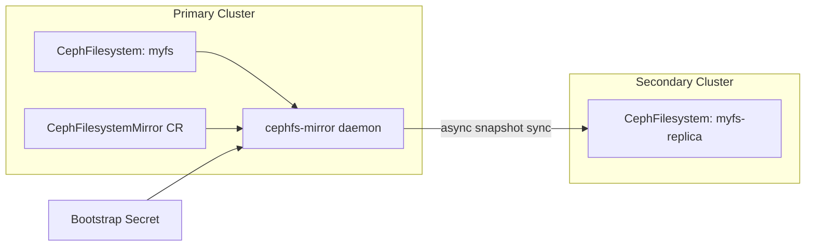

# How to Enable CephFS Mirroring Daemons in Rook

Author: [nawazdhandala](https://www.github.com/nawazdhandala)

Tags: Rook, Ceph, Kubernetes, CephFS, Mirroring, DisasterRecovery, CephFilesystemMirror

Description: Learn how to deploy and configure CephFS mirroring daemons in Rook using the CephFilesystemMirror CRD for asynchronous cross-cluster filesystem replication.

---

CephFS mirroring replicates snapshots of CephFS directories from a primary cluster to a secondary cluster asynchronously. Rook manages the `cephfs-mirror` daemon through the `CephFilesystemMirror` CRD.

## Mirroring Architecture



## Prerequisites

Both clusters must be running Rook v1.8+ and Ceph Pacific (16.x) or later.

```bash
# Verify cephfs-mirror module is available
kubectl exec -n rook-ceph deploy/rook-ceph-tools -- ceph module ls | grep mirroring
```

## Deploy the CephFilesystemMirror Daemon

```yaml
apiVersion: ceph.rook.io/v1
kind: CephFilesystemMirror
metadata:
  name: my-fs-mirror
  namespace: rook-ceph
spec:
  # Number of mirror daemon instances
  count: 1
  resources:
    requests:
      cpu: "500m"
      memory: "512Mi"
    limits:
      cpu: "2"
      memory: "2Gi"
  priorityClassName: system-cluster-critical
```

```bash
kubectl apply -f cephfilesystemmirror.yaml
kubectl get cephfilesystemmirror -n rook-ceph
kubectl get pods -n rook-ceph -l app=rook-ceph-fs-mirror
```

## Enable Mirroring on the Filesystem

After deploying the daemon, enable mirroring on the CephFilesystem:

```yaml
apiVersion: ceph.rook.io/v1
kind: CephFilesystem
metadata:
  name: myfs
  namespace: rook-ceph
spec:
  metadataPool:
    failureDomain: host
    replicated:
      size: 3
  dataPools:
    - name: data0
      failureDomain: host
      replicated:
        size: 3
  preserveFilesystemOnDelete: true
  metadataServer:
    activeCount: 1
    activeStandby: true
  mirroring:
    enabled: true
    # Snapshot schedule for mirroring (ISO 8601 interval)
    snapshotSchedules:
      - interval: "24h"
        startTime: "00:00:00"
    snapshotRetention:
      - duration: "7d"
        prefix: "scheduled"
```

## Create a Bootstrap Secret from the Secondary Cluster

On the secondary cluster, generate a bootstrap token:

```bash
# On secondary cluster
kubectl exec -n rook-ceph deploy/rook-ceph-tools -- \
  ceph fs snapshot mirror peer_bootstrap create myfs-replica client.mirror

# This outputs a token JSON string -- save it
```

Create a secret on the primary cluster with the token:

```bash
kubectl create secret generic fs-mirror-peer \
  --from-literal=token='<base64-encoded-token>' \
  -n rook-ceph
```

## Add the Peer to the CephFilesystem

```yaml
apiVersion: ceph.rook.io/v1
kind: CephFilesystem
metadata:
  name: myfs
  namespace: rook-ceph
spec:
  # ... (pool and MDS config as above)
  mirroring:
    enabled: true
    peers:
      secretNames:
        - fs-mirror-peer
    snapshotSchedules:
      - interval: "24h"
```

## Verify Mirroring Status

```bash
# Check mirror daemon status
kubectl get cephfilesystemmirror -n rook-ceph

# Inspect mirroring state via Ceph toolbox
kubectl exec -n rook-ceph deploy/rook-ceph-tools -- \
  ceph fs snapshot mirror status myfs

# List peers
kubectl exec -n rook-ceph deploy/rook-ceph-tools -- \
  ceph fs snapshot mirror peer list myfs
```

## Placement for Mirror Daemon

```yaml
spec:
  count: 2
  placement:
    nodeAffinity:
      requiredDuringSchedulingIgnoredDuringExecution:
        nodeSelectorTerms:
          - matchExpressions:
              - key: role
                operator: In
                values:
                  - storage-node
    podAntiAffinity:
      preferredDuringSchedulingIgnoredDuringExecution:
        - weight: 100
          podAffinityTerm:
            labelSelector:
              matchLabels:
                app: rook-ceph-fs-mirror
            topologyKey: kubernetes.io/hostname
```

## Summary

CephFS mirroring daemons in Rook are deployed via the `CephFilesystemMirror` CRD. After creating the daemon, enable mirroring on the `CephFilesystem` CR with a snapshot schedule, then add the secondary cluster as a peer using a bootstrap token secret. The daemon handles asynchronous snapshot synchronization without impacting primary cluster performance.
