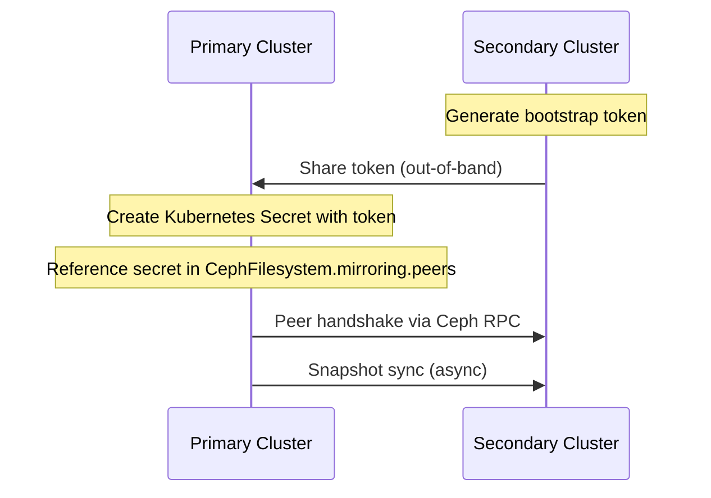

# How to Configure CephFS Peer Cluster for Mirroring in Rook

Author: [nawazdhandala](https://www.github.com/nawazdhandala)

Tags: Rook, Ceph, Kubernetes, CephFS, Mirroring, Peer, DisasterRecovery

Description: Step-by-step guide to configuring a secondary peer cluster for CephFS mirroring in Rook, including bootstrap token exchange and snapshot verification.

---

CephFS mirroring uses a peer relationship between a primary and secondary cluster. This guide walks through the complete peer configuration process on both sides, enabling asynchronous directory snapshot replication.

## Peer Architecture



## Step 1: Prepare the Secondary Cluster

On the secondary cluster, create the target filesystem:

```yaml
apiVersion: ceph.rook.io/v1
kind: CephFilesystem
metadata:
  name: myfs-replica
  namespace: rook-ceph
spec:
  metadataPool:
    failureDomain: host
    replicated:
      size: 3
  dataPools:
    - name: data0
      failureDomain: host
      replicated:
        size: 3
  preserveFilesystemOnDelete: true
  metadataServer:
    activeCount: 1
    activeStandby: true
```

## Step 2: Generate Bootstrap Token on Secondary

```bash
# On the secondary cluster's toolbox
kubectl exec -n rook-ceph deploy/rook-ceph-tools -- \
  ceph fs snapshot mirror peer_bootstrap create \
  myfs-replica client.mirror-primary

# Example output (JSON token):
# {"fsid":"abcd-1234","client_auth_key":"AQA...==","mon_host":"[v2:10.0.0.5:3300]","filesystem":"myfs-replica"}
```

Encode the token for use as a Kubernetes secret:

```bash
TOKEN='{"fsid":"abcd-1234","client_auth_key":"AQA...==","mon_host":"[v2:10.0.0.5:3300]","filesystem":"myfs-replica"}'
echo -n "$TOKEN" | base64 -w 0
```

## Step 3: Create the Peer Secret on Primary

```bash
kubectl create secret generic cephfs-mirror-peer \
  --from-literal=token="$TOKEN" \
  -n rook-ceph
```

Or declaratively:

```yaml
apiVersion: v1
kind: Secret
metadata:
  name: cephfs-mirror-peer
  namespace: rook-ceph
stringData:
  token: |
    {"fsid":"abcd-1234","client_auth_key":"AQA...==","mon_host":"[v2:10.0.0.5:3300]","filesystem":"myfs-replica"}
```

## Step 4: Configure Mirroring on the Primary CephFilesystem

```yaml
apiVersion: ceph.rook.io/v1
kind: CephFilesystem
metadata:
  name: myfs
  namespace: rook-ceph
spec:
  metadataPool:
    failureDomain: host
    replicated:
      size: 3
  dataPools:
    - name: data0
      failureDomain: host
      replicated:
        size: 3
  preserveFilesystemOnDelete: true
  metadataServer:
    activeCount: 1
    activeStandby: true
  mirroring:
    enabled: true
    peers:
      secretNames:
        - cephfs-mirror-peer
    snapshotSchedules:
      - interval: "1h"
        startTime: "00:00:00"
    snapshotRetention:
      - duration: "7d"
        prefix: "hourly"
      - duration: "30d"
        prefix: "daily"
```

## Step 5: Enable Mirror Daemon on Primary

```yaml
apiVersion: ceph.rook.io/v1
kind: CephFilesystemMirror
metadata:
  name: my-fs-mirror
  namespace: rook-ceph
spec:
  count: 1
```

```bash
kubectl apply -f cephfilesystemmirror.yaml
```

## Verify the Peer Connection

```bash
# On primary cluster
kubectl exec -n rook-ceph deploy/rook-ceph-tools -- \
  ceph fs snapshot mirror peer list myfs

# Check sync status
kubectl exec -n rook-ceph deploy/rook-ceph-tools -- \
  ceph fs snapshot mirror status myfs

# On secondary cluster, verify snapshots are arriving
kubectl exec -n rook-ceph deploy/rook-ceph-tools -- \
  ceph fs subvolume snapshot ls myfs-replica csi-vol-xyz --group_name csi
```

## Snapshot Schedule Verification

```bash
# Check snapshot schedules on primary
kubectl exec -n rook-ceph deploy/rook-ceph-tools -- \
  ceph fs snapshot schedule list /

# Check last snapshot
kubectl exec -n rook-ceph deploy/rook-ceph-tools -- \
  ceph fs snapshot schedule status /
```

## Removing a Peer

```bash
# Get peer UUID
kubectl exec -n rook-ceph deploy/rook-ceph-tools -- \
  ceph fs snapshot mirror peer list myfs

# Remove peer by UUID
kubectl exec -n rook-ceph deploy/rook-ceph-tools -- \
  ceph fs snapshot mirror peer remove myfs <peer-uuid>

# Remove the secret
kubectl delete secret cephfs-mirror-peer -n rook-ceph
```

## Summary

Configuring a CephFS peer for mirroring in Rook involves generating a bootstrap token on the secondary cluster, creating a Kubernetes secret on the primary with that token, and referencing the secret in the `CephFilesystem` CR's `mirroring.peers` list. Once connected, the `cephfs-mirror` daemon syncs snapshots on the configured schedule to the secondary filesystem.
