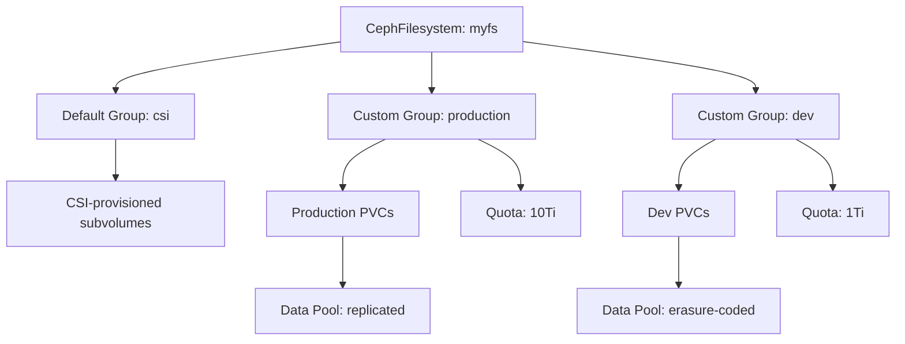

# How to Configure Subvolume Groups for CephFS in Rook

Author: [nawazdhandala](https://www.github.com/nawazdhandala)

Tags: Rook, Ceph, Kubernetes, CephFS, Subvolume, Storage, CSI

Description: Learn how to configure CephFS subvolume groups in Rook to organize CSI-provisioned volumes, apply quotas, and control data pool placement.

---

CephFS subvolume groups are namespace containers within a filesystem that group related subvolumes. The Rook CSI driver creates PVCs as subvolumes inside a group. You can use the `CephFilesystemSubVolumeGroup` CRD to customize these groups.

## Subvolume Group Architecture



## Default CSI Subvolume Group

Without configuration, the Rook CSI driver uses a group named `csi`. You can override this in the StorageClass:

```yaml
apiVersion: storage.k8s.io/v1
kind: StorageClass
metadata:
  name: rook-cephfs
provisioner: rook-ceph.cephfs.csi.ceph.com
parameters:
  clusterID: rook-ceph
  fsName: myfs
  pool: myfs-data0
  # Override the default CSI subvolume group
  cephFS.subvolumeGroup: production
  csi.storage.k8s.io/provisioner-secret-name: rook-csi-cephfs-provisioner
  csi.storage.k8s.io/provisioner-secret-namespace: rook-ceph
  csi.storage.k8s.io/controller-expand-secret-name: rook-csi-cephfs-provisioner
  csi.storage.k8s.io/controller-expand-secret-namespace: rook-ceph
  csi.storage.k8s.io/node-stage-secret-name: rook-csi-cephfs-node
  csi.storage.k8s.io/node-stage-secret-namespace: rook-ceph
reclaimPolicy: Delete
allowVolumeExpansion: true
```

## Using CephFilesystemSubVolumeGroup CRD

```yaml
apiVersion: ceph.rook.io/v1
kind: CephFilesystemSubVolumeGroup
metadata:
  name: production
  namespace: rook-ceph
spec:
  filesystemName: myfs
  name: production
  dataPoolName: myfs-replicated
  quota:
    maxBytes: 10995116277760   # 10 TiB
    maxFiles: 1000000
```

Apply and verify:

```bash
kubectl apply -f subvolumegroup.yaml
kubectl get cephfilesystemsubvolumegroup -n rook-ceph
```

## Multiple Groups for Environment Isolation

```yaml
---
apiVersion: ceph.rook.io/v1
kind: CephFilesystemSubVolumeGroup
metadata:
  name: production
  namespace: rook-ceph
spec:
  filesystemName: myfs
  name: production
  dataPoolName: myfs-replicated
  quota:
    maxBytes: 10995116277760
---
apiVersion: ceph.rook.io/v1
kind: CephFilesystemSubVolumeGroup
metadata:
  name: staging
  namespace: rook-ceph
spec:
  filesystemName: myfs
  name: staging
  dataPoolName: myfs-replicated
  quota:
    maxBytes: 2199023255552   # 2 TiB
---
apiVersion: ceph.rook.io/v1
kind: CephFilesystemSubVolumeGroup
metadata:
  name: dev
  namespace: rook-ceph
spec:
  filesystemName: myfs
  name: dev
  dataPoolName: myfs-erasure
  quota:
    maxBytes: 549755813888   # 512 GiB
```

## StorageClasses Per Group

```yaml
---
apiVersion: storage.k8s.io/v1
kind: StorageClass
metadata:
  name: cephfs-production
provisioner: rook-ceph.cephfs.csi.ceph.com
parameters:
  clusterID: rook-ceph
  fsName: myfs
  pool: myfs-replicated
  cephFS.subvolumeGroup: production
  csi.storage.k8s.io/provisioner-secret-name: rook-csi-cephfs-provisioner
  csi.storage.k8s.io/provisioner-secret-namespace: rook-ceph
  csi.storage.k8s.io/controller-expand-secret-name: rook-csi-cephfs-provisioner
  csi.storage.k8s.io/controller-expand-secret-namespace: rook-ceph
  csi.storage.k8s.io/node-stage-secret-name: rook-csi-cephfs-node
  csi.storage.k8s.io/node-stage-secret-namespace: rook-ceph
reclaimPolicy: Retain
allowVolumeExpansion: true
---
apiVersion: storage.k8s.io/v1
kind: StorageClass
metadata:
  name: cephfs-dev
provisioner: rook-ceph.cephfs.csi.ceph.com
parameters:
  clusterID: rook-ceph
  fsName: myfs
  pool: myfs-erasure
  cephFS.subvolumeGroup: dev
  csi.storage.k8s.io/provisioner-secret-name: rook-csi-cephfs-provisioner
  csi.storage.k8s.io/provisioner-secret-namespace: rook-ceph
  csi.storage.k8s.io/controller-expand-secret-name: rook-csi-cephfs-provisioner
  csi.storage.k8s.io/controller-expand-secret-namespace: rook-ceph
  csi.storage.k8s.io/node-stage-secret-name: rook-csi-cephfs-node
  csi.storage.k8s.io/node-stage-secret-namespace: rook-ceph
reclaimPolicy: Delete
allowVolumeExpansion: true
```

## Inspecting Subvolume Groups

```bash
# List all subvolume groups
kubectl exec -n rook-ceph deploy/rook-ceph-tools -- \
  ceph fs subvolumegroup ls myfs

# Get quota info for a group
kubectl exec -n rook-ceph deploy/rook-ceph-tools -- \
  ceph fs subvolumegroup getpath myfs production

# List subvolumes in a group
kubectl exec -n rook-ceph deploy/rook-ceph-tools -- \
  ceph fs subvolume ls myfs --group_name production
```

## Summary

CephFS subvolume groups in Rook organize CSI-provisioned PVCs into named namespaces within a filesystem. Use the `CephFilesystemSubVolumeGroup` CRD to create groups with quotas and data pool assignments, then reference them in StorageClass parameters via `cephFS.subvolumeGroup`. This enables environment isolation, quota enforcement, and per-group data pool routing in a single CephFS instance.
