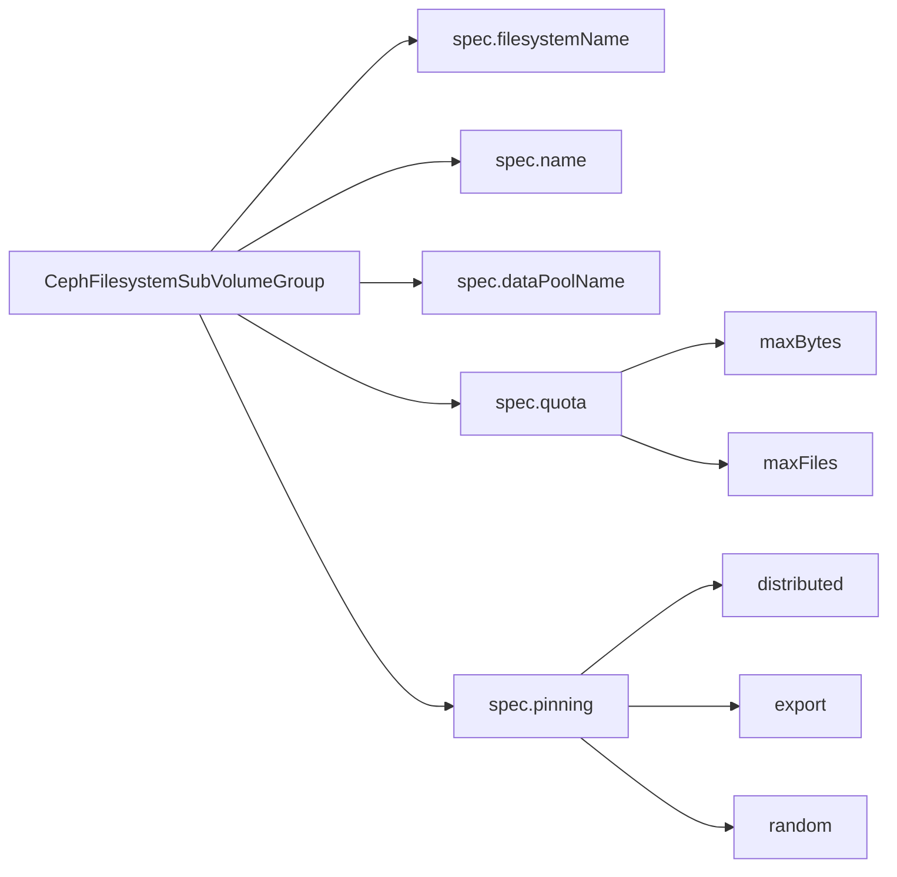

# How to Use CephFilesystemSubVolumeGroup CRD in Rook

Author: [nawazdhandala](https://www.github.com/nawazdhandala)

Tags: Rook, Ceph, Kubernetes, CephFS, SubVolumeGroup, CRD, Storage

Description: A complete reference for the CephFilesystemSubVolumeGroup CRD in Rook, covering all fields, status conditions, and integration with CSI StorageClasses.

---

The `CephFilesystemSubVolumeGroup` CRD is a Rook resource that declaratively manages CephFS subvolume groups. It is the recommended way to create and configure subvolume groups that the Rook CSI driver uses when provisioning PersistentVolumes.

## CRD Schema Overview



## Minimal CRD Example

```yaml
apiVersion: ceph.rook.io/v1
kind: CephFilesystemSubVolumeGroup
metadata:
  name: mygroup
  namespace: rook-ceph
spec:
  filesystemName: myfs
```

When `name` is omitted, Rook uses the `metadata.name` as the group name in Ceph.

## Full CRD with All Fields

```yaml
apiVersion: ceph.rook.io/v1
kind: CephFilesystemSubVolumeGroup
metadata:
  name: production-group
  namespace: rook-ceph
spec:
  # Name of the CephFilesystem this group belongs to
  filesystemName: myfs

  # Explicit Ceph-level group name (defaults to metadata.name)
  name: production

  # Data pool for new subvolumes in this group
  dataPoolName: myfs-replicated

  # Quota applied to the entire group
  quota:
    maxBytes: 5497558138880   # 5 TiB
    maxFiles: 500000

  # MDS pinning strategy for this group
  pinning:
    distributed: 1
```

## Pinning Strategies

MDS pinning controls which MDS rank handles a subtree. Three mutually exclusive strategies are available:

```yaml
# Distribute load across all active MDS ranks
pinning:
  distributed: 1

# Pin to a specific MDS export (rank number)
pinning:
  export: 0

# Random pinning -- let Ceph choose
pinning:
  random: 0.5
```

## Checking CRD Status

```bash
# Get all subvolume groups
kubectl get cephfilesystemsubvolumegroup -n rook-ceph

# Describe a specific group
kubectl describe cephfilesystemsubvolumegroup production-group -n rook-ceph
```

Expected status:

```yaml
Status:
  Conditions:
    Message:               Resource is Ready
    Reason:                Ready
    Status:                True
    Type:                  Ready
  Observed Generation:     1
  Phase:                   Ready
```

## Referencing in a StorageClass

```yaml
apiVersion: storage.k8s.io/v1
kind: StorageClass
metadata:
  name: cephfs-production
provisioner: rook-ceph.cephfs.csi.ceph.com
parameters:
  clusterID: rook-ceph
  fsName: myfs
  pool: myfs-replicated
  cephFS.subvolumeGroup: production
  csi.storage.k8s.io/provisioner-secret-name: rook-csi-cephfs-provisioner
  csi.storage.k8s.io/provisioner-secret-namespace: rook-ceph
  csi.storage.k8s.io/controller-expand-secret-name: rook-csi-cephfs-provisioner
  csi.storage.k8s.io/controller-expand-secret-namespace: rook-ceph
  csi.storage.k8s.io/node-stage-secret-name: rook-csi-cephfs-node
  csi.storage.k8s.io/node-stage-secret-namespace: rook-ceph
reclaimPolicy: Retain
allowVolumeExpansion: true
```

## Listing Subvolumes Inside a Group

```bash
# List subvolumes inside the group (each PVC becomes a subvolume)
kubectl exec -n rook-ceph deploy/rook-ceph-tools -- \
  ceph fs subvolume ls myfs --group_name production

# Get the path of a specific subvolume
kubectl exec -n rook-ceph deploy/rook-ceph-tools -- \
  ceph fs subvolume getpath myfs csi-vol-abc123 --group_name production

# Check group quota usage
kubectl exec -n rook-ceph deploy/rook-ceph-tools -- \
  ceph fs subvolumegroup info myfs production
```

## Deleting a SubVolumeGroup

A group cannot be deleted while it still contains subvolumes. Empty the group first:

```bash
# List and remove subvolumes before deleting the CRD
kubectl exec -n rook-ceph deploy/rook-ceph-tools -- \
  ceph fs subvolume ls myfs --group_name production

# Delete the CRD after confirming it is empty
kubectl delete cephfilesystemsubvolumegroup production-group -n rook-ceph
```

## Summary

The `CephFilesystemSubVolumeGroup` CRD gives Rook operators declarative control over CephFS subvolume groups. Key fields include `filesystemName`, `dataPoolName`, `quota`, and `pinning`. After creating a group, reference it in StorageClass parameters to route CSI-provisioned PVCs into that group for isolation, quota enforcement, and MDS load distribution.
