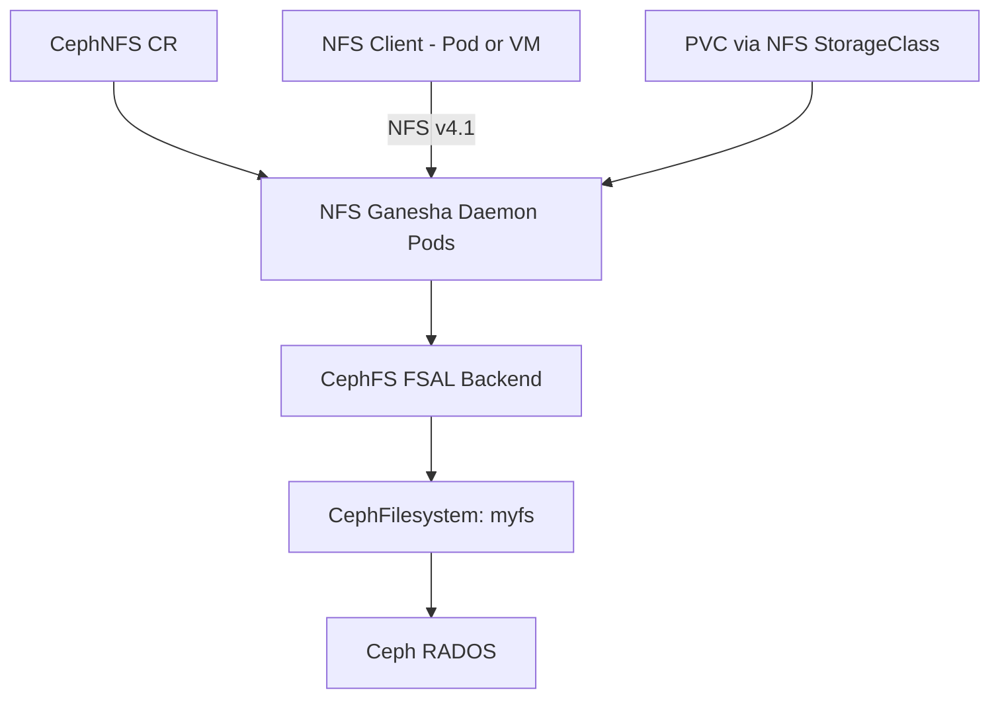

# How to Create a CephNFS CRD in Rook for NFS Exports

Author: [nawazdhandala](https://www.github.com/nawazdhandala)

Tags: Rook, Ceph, Kubernetes, NFS, CephNFS, CRD, Ganesha, Storage

Description: Learn how to create and configure a CephNFS custom resource in Rook to deploy NFS Ganesha daemons backed by CephFS for NFS-accessible shared storage.

---

The `CephNFS` CRD in Rook deploys NFS Ganesha daemons that export CephFS directories over the NFS protocol. This enables workloads that cannot use the CephFS CSI driver to access Ceph storage via standard NFS mounts.

## CephNFS Architecture



## Prerequisites

The CephFilesystem must already exist:

```bash
kubectl get cephfilesystem -n rook-ceph
# NAME   ACTIVEMDS  AGE  PHASE
# myfs   1          10m  Ready
```

## Minimal CephNFS CR

```yaml
apiVersion: ceph.rook.io/v1
kind: CephNFS
metadata:
  name: my-nfs
  namespace: rook-ceph
spec:
  rados:
    # RADOS pool that stores NFS GANESHA configuration objects
    pool: myfs-metadata
    namespace: nfs-ns
  server:
    active: 1
```

```bash
kubectl apply -f cephnfs.yaml
kubectl get cephnfs -n rook-ceph
kubectl get pods -n rook-ceph -l app=rook-ceph-nfs
```

## Full CephNFS CR with Resources and Placement

```yaml
apiVersion: ceph.rook.io/v1
kind: CephNFS
metadata:
  name: my-nfs
  namespace: rook-ceph
spec:
  rados:
    pool: myfs-metadata
    namespace: nfs-ns
  server:
    active: 2
    resources:
      requests:
        cpu: "500m"
        memory: "1Gi"
      limits:
        cpu: "2"
        memory: "4Gi"
    priorityClassName: system-cluster-critical
    placement:
      podAntiAffinity:
        requiredDuringSchedulingIgnoredDuringExecution:
          - labelSelector:
              matchExpressions:
                - key: app
                  operator: In
                  values:
                    - rook-ceph-nfs
            topologyKey: kubernetes.io/hostname
      nodeAffinity:
        requiredDuringSchedulingIgnoredDuringExecution:
          nodeSelectorTerms:
            - matchExpressions:
                - key: role
                  operator: In
                  values:
                    - storage-node
      tolerations:
        - key: storage-only
          operator: Equal
          value: "true"
          effect: NoSchedule
```

## Verify the NFS Daemon

```bash
# Check CephNFS status
kubectl get cephnfs my-nfs -n rook-ceph -o yaml

# Check NFS pods
kubectl get pods -n rook-ceph -l app=rook-ceph-nfs

# Check NFS exports via toolbox
kubectl exec -n rook-ceph deploy/rook-ceph-tools -- \
  ceph nfs export ls my-nfs

# Check Ganesha service info
kubectl exec -n rook-ceph deploy/rook-ceph-tools -- \
  ceph nfs cluster info my-nfs
```

## NFS Service

Rook creates a ClusterIP service for the NFS daemon:

```bash
kubectl get svc -n rook-ceph | grep nfs
# rook-ceph-nfs-my-nfs-a  ClusterIP  10.96.x.x  2049/TCP
```

## StorageClass for Dynamic NFS Provisioning

To use NFS via CSI (with nfs-subdir-external-provisioner or similar):

```yaml
apiVersion: storage.k8s.io/v1
kind: StorageClass
metadata:
  name: rook-ceph-nfs
provisioner: rook-ceph.nfs.csi.ceph.com
parameters:
  clusterID: rook-ceph
  nfsClusterID: my-nfs
  fsName: myfs
  pool: myfs-data0
  csi.storage.k8s.io/provisioner-secret-name: rook-csi-cephfs-provisioner
  csi.storage.k8s.io/provisioner-secret-namespace: rook-ceph
  csi.storage.k8s.io/node-stage-secret-name: rook-csi-cephfs-node
  csi.storage.k8s.io/node-stage-secret-namespace: rook-ceph
reclaimPolicy: Delete
allowVolumeExpansion: true
volumeBindingMode: Immediate
```

## Deleting CephNFS

```bash
# First remove all exports and PVCs using NFS
kubectl delete cephnfs my-nfs -n rook-ceph
```

## Summary

The `CephNFS` CRD in Rook deploys NFS Ganesha daemons backed by CephFS, exposing Ceph storage over the NFS v4.1 protocol. Configure `spec.rados` with the pool and namespace for Ganesha's config objects, and `spec.server.active` for the number of daemon replicas. Placement rules control node selection and HA distribution of daemon pods.
