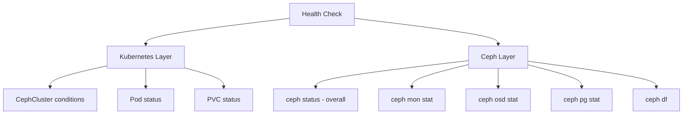

# How to Check Ceph Cluster Health in Rook

Author: [nawazdhandala](https://www.github.com/nawazdhandala)

Tags: Rook, Ceph, Kubernetes, Health, Diagnostics, Operations

Description: A systematic guide to checking Rook-Ceph cluster health using kubectl, the Ceph toolbox, and Ceph CLI commands for mon, OSD, PG, and pool status.

---

## Health Check Layers

Rook-Ceph health is visible at multiple layers: the Kubernetes resource status (CephCluster conditions), the Ceph cluster status (`ceph status`), and individual component health (monitors, OSDs, placement groups). A thorough health check covers all three.



## Layer 1 - Kubernetes Resource Health

Check the CephCluster custom resource status:

```bash
kubectl -n rook-ceph get cephcluster rook-ceph -o yaml | grep -A 30 "^status:"
```

A healthy cluster shows:

```text
status:
  ceph:
    health: HEALTH_OK
    lastChecked: "2026-03-31T10:00:00Z"
    previousHealth: HEALTH_OK
    lastChanged: "2026-03-31T09:00:00Z"
  conditions:
  - message: Cluster created successfully
    reason: ClusterCreated
    status: "True"
    type: Ready
  phase: Ready
  state: Created
  version:
    image: quay.io/ceph/ceph:v18.2.0
    version: 18.2.0-0
```

Check all Rook pod statuses:

```bash
kubectl -n rook-ceph get pods -o wide
```

All pods should show `Running` or `Completed`. Look for any pods in `Error`, `CrashLoopBackOff`, or `Pending` states:

```bash
kubectl -n rook-ceph get pods --field-selector=status.phase!=Running
```

Check operator logs for recent errors:

```bash
kubectl -n rook-ceph logs deployment/rook-ceph-operator --tail=100 | grep -E "ERROR|WARN"
```

## Layer 2 - Overall Ceph Cluster Status

Open a shell in the toolbox for all subsequent Ceph commands:

```bash
kubectl -n rook-ceph exec -it deploy/rook-ceph-tools -- bash
```

Run the comprehensive cluster status:

```bash
ceph status
```

Interpret the output:

```text
  cluster:
    id:     abc123...
    health: HEALTH_OK        <- Green: no issues
                              <- HEALTH_WARN: non-critical issues
                              <- HEALTH_ERR: critical issues

  services:
    mon: 3 daemons, quorum a,b,c  <- All 3 mons in quorum
    mgr: a(active, since 1h), standbys: b   <- Active mgr with standby
    osd: 9 osds: 9 up, 9 in      <- All OSDs up and participating
    rgw: 2 daemons active         <- Object store gateways (if used)

  data:
    pools:   3 pools, 96 pgs
    objects: 1.2k objects, 5.0 GiB
    usage:   20 GiB used, 880 GiB / 900 GiB avail
    pgs:     96 active+clean      <- All PGs clean
```

## Layer 3 - Detailed Health Warnings

When health is not OK, get detailed information:

```bash
ceph health detail
```

Common warning messages and their meaning:

```text
HEALTH_WARN 1 nearfull osd(s)
  - OSD is above the nearfull threshold (75% by default)

HEALTH_WARN Degraded data redundancy: X objects degraded
  - Some objects have fewer than the expected number of copies
  - Usually caused by an OSD being down

HEALTH_WARN clock skew detected on mon.b
  - Node hosting monitor b has clock out of sync by >0.05 seconds

HEALTH_WARN application not enabled on X pool(s)
  - Informational: pools don't have an application tag set
```

## Layer 4 - Monitor Health

```bash
ceph mon stat
```

```text
e3: 3 mons at {a=[v2:10.0.0.1:3300/0,v1:10.0.0.1:6789/0],b=[v2:10.0.0.2:3300/0,v1:10.0.0.2:6789/0],c=[v2:10.0.0.3:3300/0,v1:10.0.0.3:6789/0]}, election epoch 8, leader a, quorum a,b,c
```

All monitors should appear in the quorum list. If a monitor is missing, investigate its pod:

```bash
kubectl -n rook-ceph logs -l app=rook-ceph-mon --tail=50
```

## Layer 5 - OSD Health

```bash
ceph osd stat
```

```text
9 osds: 9 up, 9 in; epoch: e42
```

Get per-OSD status:

```bash
ceph osd status
```

Check which OSDs are down or out:

```bash
ceph osd tree | grep -E "down|out"
```

Check OSD utilization to find imbalanced OSDs:

```bash
ceph osd df tree
```

OSDs above 80% usage are approaching the nearfull threshold.

## Layer 6 - Placement Group Health

```bash
ceph pg stat
```

```text
96 pgs: 96 active+clean; 5.0 GiB data, 20 GiB used, 880 GiB / 900 GiB avail
```

All PGs should be `active+clean`. Other states and their meaning:

| PG State | Meaning |
|----------|---------|
| active+clean | Healthy, fully replicated |
| active+degraded | Active but below replication target |
| active+remapped | Being recovered to correct OSDs |
| undersized | Fewer replicas than `min_size` |
| peering | Negotiating state between OSDs |
| stale | Primary OSD not reporting |
| inactive | Cannot serve I/O |

List all PGs not in active+clean state:

```bash
ceph pg dump_stuck inactive
ceph pg dump_stuck unclean
ceph pg dump_stuck stale
```

## Layer 7 - Capacity Check

```bash
ceph df
```

```text
--- RAW STORAGE ---
CLASS    SIZE    AVAIL    USED  RAW USED  %RAW USED
ssd    900 GiB  880 GiB  5 GiB    20 GiB       2.22
TOTAL  900 GiB  880 GiB  5 GiB    20 GiB       2.22

--- POOLS ---
POOL          ID  PGS   STORED  OBJECTS  USED  %USED  MAX AVAIL
replicapool    1   32  1.7 GiB      500  5 GiB   0.6   280 GiB
```

## Quick Health Check Script

Run all checks non-interactively from outside the toolbox:

```bash
#!/bin/bash
echo "=== Ceph Cluster Health Check ==="
echo ""

echo "--- Kubernetes Resource Status ---"
kubectl -n rook-ceph get cephcluster rook-ceph \
  -o jsonpath='{.status.ceph.health}' && echo ""

echo ""
echo "--- Pod Status ---"
kubectl -n rook-ceph get pods --field-selector=status.phase!=Running \
  --field-selector=status.phase!=Succeeded 2>/dev/null || echo "All pods running"

echo ""
echo "--- Ceph Status ---"
kubectl -n rook-ceph exec deploy/rook-ceph-tools -- ceph status

echo ""
echo "--- OSD Status ---"
kubectl -n rook-ceph exec deploy/rook-ceph-tools -- ceph osd stat

echo ""
echo "--- PG Status ---"
kubectl -n rook-ceph exec deploy/rook-ceph-tools -- ceph pg stat

echo ""
echo "--- Capacity ---"
kubectl -n rook-ceph exec deploy/rook-ceph-tools -- ceph df

echo ""
echo "=== Health check complete ==="
```

## Summary

A thorough Rook-Ceph health check covers four layers: Kubernetes resource conditions (CephCluster phase and pod status), overall cluster health from `ceph status`, component-level health from `ceph mon stat`, `ceph osd stat`, and `ceph pg stat`, and capacity from `ceph df`. When health is degraded, `ceph health detail` gives the specific reason and recommended action. Automate these checks as a daily script or integrate them with Prometheus alerts for continuous monitoring.
