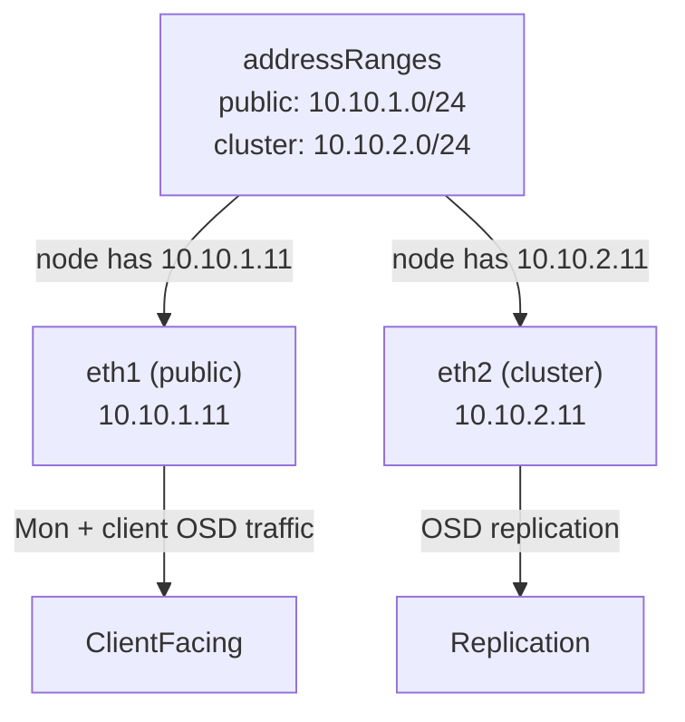

# How to Configure Address Ranges (CIDR) for Rook-Ceph Networks

Author: [nawazdhandala](https://www.github.com/nawazdhandala)

Tags: Rook, Ceph, Kubernetes, Network, Storage, CIDR

Description: Configure CIDR address ranges for Rook-Ceph public and cluster networks to control which node NICs Ceph daemons bind to for client traffic and replication traffic.

---

## How CIDR Ranges Work in Rook-Ceph

When you configure `network.addressRanges` in the CephCluster CRD, Rook translates these CIDRs into Ceph's `public_network` and `cluster_network` settings in `ceph.conf`. Ceph automatically selects the correct NIC on each node by matching node IP addresses against the configured CIDRs.



## Basic CIDR Configuration

```yaml
apiVersion: ceph.rook.io/v1
kind: CephCluster
metadata:
  name: rook-ceph
  namespace: rook-ceph
spec:
  cephVersion:
    image: quay.io/ceph/ceph:v19.2.0
  dataDirHostPath: /var/lib/rook
  network:
    provider: host
    addressRanges:
      public:
        - 192.168.10.0/24
      cluster:
        - 192.168.20.0/24
```

## Multiple CIDRs per Network Plane

You can specify multiple CIDRs if your storage network spans multiple subnets or VLANs:

```yaml
spec:
  network:
    provider: host
    addressRanges:
      public:
        - 10.10.1.0/24
        - 10.10.3.0/24
      cluster:
        - 10.10.2.0/24
        - 10.10.4.0/24
```

This is useful in multi-rack deployments where each rack has a distinct subnet.

## IPv6 CIDR Ranges

For IPv6 networks, specify the IPv6 CIDR:

```yaml
spec:
  network:
    provider: host
    ipFamily: IPv6
    addressRanges:
      public:
        - fd00:10::/64
      cluster:
        - fd00:20::/64
```

## Dual-Stack CIDR Configuration

For dual-stack (IPv4 and IPv6):

```yaml
spec:
  network:
    provider: host
    dualStack: true
    addressRanges:
      public:
        - 10.10.1.0/24
        - fd00:10::/64
      cluster:
        - 10.10.2.0/24
        - fd00:20::/64
```

## Verifying CIDR Application

After deploying, check that Ceph has applied the CIDR ranges to its configuration:

```bash
kubectl -n rook-ceph exec -it deploy/rook-ceph-tools -- \
  ceph config get osd.0 public_network

kubectl -n rook-ceph exec -it deploy/rook-ceph-tools -- \
  ceph config get osd.0 cluster_network
```

Or check the global Ceph config:

```bash
kubectl -n rook-ceph exec -it deploy/rook-ceph-tools -- \
  ceph config dump | grep -E "public_network|cluster_network"
```

## Checking OSD Bound Addresses

Verify OSDs are bound to the correct CIDRs:

```bash
kubectl -n rook-ceph exec -it deploy/rook-ceph-tools -- \
  ceph osd dump | grep -E "public_addr|cluster_addr" | head -6
```

The public addresses should be in the public CIDR range and cluster addresses in the cluster CIDR range.

## Common Mistakes

**Using the wrong subnet mask:**

```yaml
# Wrong: /32 is a single host, not a subnet
public:
  - 10.10.1.5/32

# Correct: specify the network range
public:
  - 10.10.1.0/24
```

**Overlapping public and cluster CIDRs:**

```yaml
# Wrong: overlapping ranges cause Ceph to pick the wrong NIC
public:
  - 10.10.0.0/16
cluster:
  - 10.10.1.0/24  # This is inside the public range
```

**CIDR not matching any node NIC:**
If no NIC on a node has an IP within the CIDR, Ceph falls back to the default route interface. Always verify node IP assignments match the configured CIDRs.

```bash
# Check node NIC IPs
ip addr show | grep "inet "
```

## Summary

CIDR address ranges in the Rook-Ceph `network.addressRanges` spec tell Ceph which NICs to use for client traffic (public) and replication traffic (cluster) by matching node IP addresses against the specified subnets. Use `/24` or broader subnets for flexibility. Multiple CIDRs per plane are supported for multi-subnet environments. Verify the configuration was applied with `ceph config dump | grep network` and confirm OSD addresses are within the expected CIDR ranges using `ceph osd dump`.
