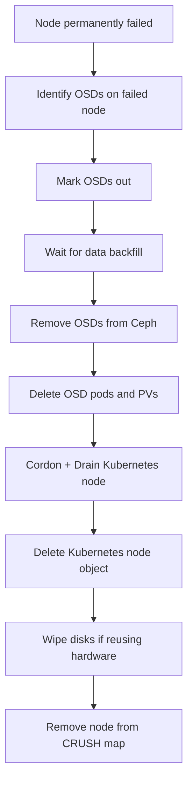

# How to Clean Up a Failed Rook-Ceph Node

Author: [nawazdhandala](https://www.github.com/nawazdhandala)

Tags: Rook, Ceph, Kubernetes, Node, Cleanup, OSD, Maintenance, Recovery

Description: Step-by-step procedure to safely clean up a permanently failed Rook-Ceph node, including OSD removal, disk wipe, and Kubernetes node decommission.

---

When a node permanently fails and cannot be recovered, you must remove all Ceph OSDs it hosted, clean the disks, remove the node from the cluster, and update the Ceph configuration. Failing to do this properly leaves orphan OSD entries and degraded PGs.

## Cleanup Sequence



## Step 1: Identify OSDs on the Failed Node

```bash
# Find all OSDs on the node
kubectl exec -n rook-ceph deploy/rook-ceph-tools -- \
  ceph osd tree | grep -A5 <node-name>

# Or list OSD pods on that node
kubectl get pods -n rook-ceph -l app=rook-ceph-osd \
  --field-selector spec.nodeName=<node-name>
```

## Step 2: Mark OSDs Out

```bash
# Mark each OSD out to move data away
kubectl exec -n rook-ceph deploy/rook-ceph-tools -- \
  ceph osd out osd.0 osd.3 osd.6

# Watch recovery progress
watch kubectl exec -n rook-ceph deploy/rook-ceph-tools -- ceph status
# Wait until: "0 bytes misplaced" or minimal degradation
```

## Step 3: Wait for Data Backfill

```bash
# Check PG status
kubectl exec -n rook-ceph deploy/rook-ceph-tools -- ceph pg stat

# Wait until recovery is complete
kubectl exec -n rook-ceph deploy/rook-ceph-tools -- \
  ceph health detail
# Should show HEALTH_OK or only minor warnings
```

## Step 4: Remove OSDs from Ceph

```bash
# Stop each OSD (mark down)
kubectl exec -n rook-ceph deploy/rook-ceph-tools -- \
  ceph osd down osd.0

# Remove from CRUSH map
kubectl exec -n rook-ceph deploy/rook-ceph-tools -- \
  ceph osd crush remove osd.0

# Remove auth key
kubectl exec -n rook-ceph deploy/rook-ceph-tools -- \
  ceph auth del osd.0

# Remove OSD from cluster
kubectl exec -n rook-ceph deploy/rook-ceph-tools -- \
  ceph osd rm osd.0

# Repeat for osd.3, osd.6
```

## Step 5: Delete OSD Pods and Resources

```bash
# Delete OSD pods for the node
kubectl delete pod -n rook-ceph -l app=rook-ceph-osd,node=<node-name>

# Delete OSD PVs if using PVC-based storage
kubectl get pv | grep <node-name>
kubectl delete pv <pv-name>

# Delete OSD PVCs
kubectl get pvc -n rook-ceph | grep <node-name>
kubectl delete pvc -n rook-ceph <pvc-name>
```

## Step 6: Cordon and Delete the Kubernetes Node

```bash
# Cordon (prevent new scheduling)
kubectl cordon <node-name>

# Force delete pods (since node is unreachable)
kubectl drain <node-name> \
  --force \
  --ignore-daemonsets \
  --delete-emptydir-data \
  --timeout=60s

# Delete the node object
kubectl delete node <node-name>
```

## Step 7: Remove Node from Ceph CRUSH Map

```bash
# Verify the node bucket is removed
kubectl exec -n rook-ceph deploy/rook-ceph-tools -- \
  ceph osd tree

# Manually remove if it still appears
kubectl exec -n rook-ceph deploy/rook-ceph-tools -- \
  ceph osd crush remove <node-name>
```

## Step 8: Clean Up Remaining Resources

```bash
# Delete any ConfigMaps or Secrets referencing the node
kubectl get configmap -n rook-ceph | grep <node-name>

# Check for orphaned CephCluster node config
kubectl get cephcluster -n rook-ceph -o yaml | grep <node-name>
```

## Step 9: Wipe Disks (If Reusing Hardware)

If the node hardware will be re-added to the cluster:

```bash
# On the recovered node (as root)
DISK=/dev/sdb

# Zap the disk
sgdisk --zap-all $DISK
dd if=/dev/zero of=$DISK bs=4096 count=100 oflag=direct

# Remove any LVM artifacts
pvremove /dev/sdb || true
lvremove /dev/ceph-* || true
vgremove /dev/ceph-* || true
dmsetup remove_all

# Remove lingering udev rules
ls /dev/mapper/ | grep ceph
```

## Step 10: Verify Cluster Health

```bash
kubectl exec -n rook-ceph deploy/rook-ceph-tools -- ceph status
kubectl exec -n rook-ceph deploy/rook-ceph-tools -- ceph osd tree
kubectl exec -n rook-ceph deploy/rook-ceph-tools -- ceph pg stat
```

## Summary

Cleaning up a failed Rook-Ceph node requires removing OSDs from Ceph (out, crush remove, auth del, rm), deleting the Kubernetes node object, cleaning up related Kubernetes resources, and optionally wiping disks for hardware reuse. Always wait for data backfill to complete before removing OSDs to avoid data loss. Verify cluster health returns to HEALTH_OK after the process.
