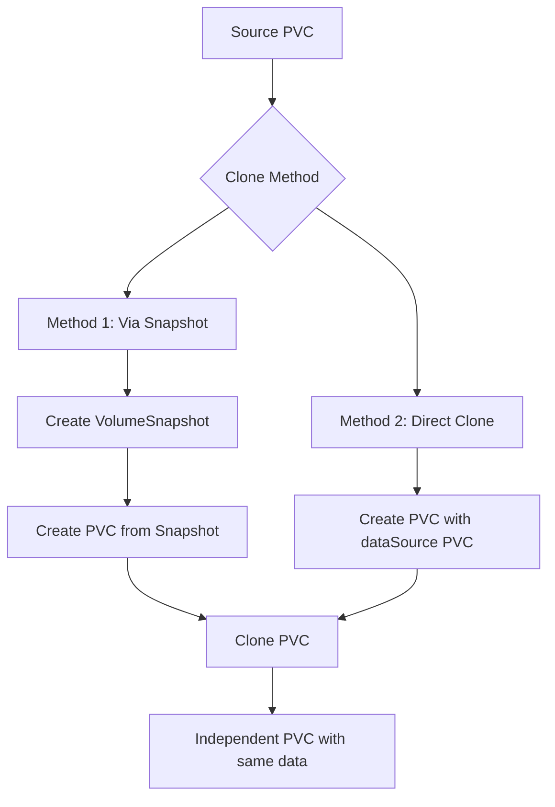

# How to Clone a PVC Using Rook-Ceph Snapshots

Author: [nawazdhandala](https://www.github.com/nawazdhandala)

Tags: Rook, Ceph, Kubernetes, PVC, Clone, Snapshot, DataManagement

Description: Learn how to clone a PersistentVolumeClaim in Rook-Ceph using both VolumeSnapshot-based cloning and direct PVC cloning for fast data duplication.

---

## Two Methods for Cloning PVCs in Rook-Ceph

Rook-Ceph supports two ways to duplicate PVC data:

1. **Snapshot-based cloning**: Create a VolumeSnapshot first, then create a new PVC from that snapshot. This is useful when you need multiple clones from the same point in time.
2. **Direct PVC cloning**: Create a new PVC directly from an existing PVC using `dataSource.kind: PersistentVolumeClaim`. This is simpler and faster for single clones.



## Method 1 - Snapshot-Based Cloning

### Step 1: Create a Snapshot

```yaml
apiVersion: snapshot.storage.k8s.io/v1
kind: VolumeSnapshot
metadata:
  name: source-pvc-snapshot
  namespace: default
spec:
  volumeSnapshotClassName: csi-rbdplugin-snapclass
  source:
    persistentVolumeClaimName: source-pvc
```

```bash
kubectl apply -f snapshot.yaml
kubectl wait volumesnapshot/source-pvc-snapshot \
  --for=jsonpath='{.status.readyToUse}'=true \
  --timeout=120s
```

### Step 2: Create Multiple Clones from the Snapshot

```yaml
apiVersion: v1
kind: PersistentVolumeClaim
metadata:
  name: clone-a
  namespace: default
spec:
  accessModes:
    - ReadWriteOnce
  resources:
    requests:
      storage: 20Gi
  storageClassName: rook-ceph-block
  dataSource:
    name: source-pvc-snapshot
    kind: VolumeSnapshot
    apiGroup: snapshot.storage.k8s.io
---
apiVersion: v1
kind: PersistentVolumeClaim
metadata:
  name: clone-b
  namespace: default
spec:
  accessModes:
    - ReadWriteOnce
  resources:
    requests:
      storage: 20Gi
  storageClassName: rook-ceph-block
  dataSource:
    name: source-pvc-snapshot
    kind: VolumeSnapshot
    apiGroup: snapshot.storage.k8s.io
```

```bash
kubectl apply -f clones.yaml
kubectl get pvc clone-a clone-b -w
```

## Method 2 - Direct PVC Cloning

Create a PVC directly from another PVC without creating a snapshot first:

```yaml
apiVersion: v1
kind: PersistentVolumeClaim
metadata:
  name: cloned-pvc
  namespace: default
spec:
  accessModes:
    - ReadWriteOnce
  resources:
    requests:
      # Must match the source PVC capacity
      storage: 20Gi
  storageClassName: rook-ceph-block
  dataSource:
    # Reference the source PVC directly
    name: source-pvc
    kind: PersistentVolumeClaim
```

```bash
kubectl apply -f direct-clone.yaml
kubectl get pvc cloned-pvc -w
```

Direct PVC cloning works only when source and clone are in the same namespace and StorageClass.

## Use Cases for PVC Cloning

### Development/Test Environment Seeding

Clone a production-like database PVC for testing:

```yaml
apiVersion: v1
kind: PersistentVolumeClaim
metadata:
  name: postgres-test
  namespace: testing
spec:
  accessModes:
    - ReadWriteOnce
  resources:
    requests:
      storage: 50Gi
  storageClassName: rook-ceph-block
  dataSource:
    name: prod-snapshot-20260331
    kind: VolumeSnapshot
    apiGroup: snapshot.storage.k8s.io
```

### Pre-populating Multiple Replicas

Seed multiple StatefulSet replicas from a golden copy:

```bash
for i in 0 1 2; do
  kubectl apply -f - <<EOF
apiVersion: v1
kind: PersistentVolumeClaim
metadata:
  name: app-data-${i}
  namespace: default
spec:
  accessModes:
    - ReadWriteOnce
  resources:
    requests:
      storage: 20Gi
  storageClassName: rook-ceph-block
  dataSource:
    name: golden-image-snapshot
    kind: VolumeSnapshot
    apiGroup: snapshot.storage.k8s.io
EOF
done
```

### Blue-Green Deployment

Clone production storage for a blue-green deployment test:

```bash
# Snapshot the current (blue) PVC
kubectl apply -f - <<EOF
apiVersion: snapshot.storage.k8s.io/v1
kind: VolumeSnapshot
metadata:
  name: blue-pvc-snapshot
spec:
  volumeSnapshotClassName: csi-rbdplugin-snapclass
  source:
    persistentVolumeClaimName: app-data-blue
EOF

# Create green PVC from the snapshot
kubectl apply -f - <<EOF
apiVersion: v1
kind: PersistentVolumeClaim
metadata:
  name: app-data-green
spec:
  accessModes:
    - ReadWriteOnce
  resources:
    requests:
      storage: 20Gi
  storageClassName: rook-ceph-block
  dataSource:
    name: blue-pvc-snapshot
    kind: VolumeSnapshot
    apiGroup: snapshot.storage.k8s.io
EOF
```

## Verifying Clone Contents

Mount the cloned PVC and compare with the source:

```bash
kubectl run verify-clone --rm -it --image=busybox --restart=Never \
  --overrides='{"spec":{"volumes":[{"name":"clone","persistentVolumeClaim":{"claimName":"cloned-pvc"}}],"containers":[{"name":"v","image":"busybox","command":["sh","-c","ls /data && md5sum /data/* && sleep 5"],"volumeMounts":[{"name":"clone","mountPath":"/data"}]}]}}' \
  -- sh
```

## Flattening a Clone

RBD clones initially share data blocks with the parent snapshot (copy-on-write). To make the clone fully independent (useful before deleting the source snapshot), flatten it:

```bash
# Get the RBD image name from the cloned PVC
VOLUME_HANDLE=$(kubectl get pvc cloned-pvc \
  -o jsonpath='{.spec.volumeName}')
POOL=$(kubectl get pv $VOLUME_HANDLE \
  -o jsonpath='{.spec.csi.volumeAttributes.pool}')
IMAGE=$(kubectl get pv $VOLUME_HANDLE \
  -o jsonpath='{.spec.csi.volumeHandle}' | cut -d- -f2-)

kubectl -n rook-ceph exec deploy/rook-ceph-tools -- \
  rbd flatten $POOL/csi-vol-$IMAGE
```

Flattening copies all inherited blocks from the parent, making the clone fully independent. This allows the source snapshot to be deleted without affecting the clone.

## Summary

Rook-Ceph supports two PVC cloning methods: snapshot-based cloning (create a VolumeSnapshot first, then create PVCs referencing it) and direct PVC cloning (use `dataSource.kind: PersistentVolumeClaim` without a snapshot). Snapshot-based cloning is better when you need multiple clones from the same point in time or need cross-namespace cloning. Direct cloning is simpler for single same-namespace duplicates. All clones use copy-on-write until explicitly flattened, so they are fast to create regardless of PVC size. Flatten clones before deleting source snapshots if you want them to remain independent.
