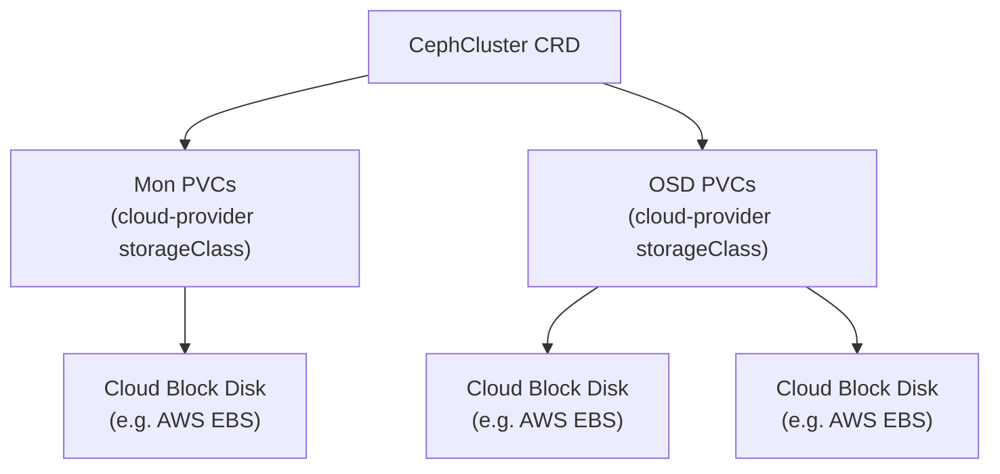

# How to Set Up Rook-Ceph Example Configs for Cloud/PVC Deployments

Author: [nawazdhandala](https://www.github.com/nawazdhandala)

Tags: Rook, Ceph, Kubernetes, Storage, Cloud, PVC

Description: Configure Rook-Ceph for cloud Kubernetes clusters using PVC-backed OSDs and monitors, enabling dynamic storage provisioning without direct block device access.

---

## Cloud PVC Storage vs. Bare Metal

On managed cloud Kubernetes clusters (EKS, GKE, AKS), worker nodes typically have no spare raw block devices. Rook supports a PVC-based storage model where OSD backing disks and Mon data volumes are provisioned using the cloud provider's CSI driver (gp3, pd-ssd, Azure Disk). Rook creates PVCs automatically, and the cloud handles the underlying block device lifecycle.



## Prerequisites

- A managed Kubernetes cluster (EKS, GKE, AKS, DigitalOcean, etc.) with a working StorageClass
- CSI driver for block volumes installed (usually pre-installed on managed clusters)
- At least 3 worker nodes for 3 Mon replicas
- Rook operator deployed

## Step 1 - Identify the Cloud StorageClass

```bash
kubectl get storageclass
```

Look for a block-backed class like `gp3`, `standard`, `premium-disk`, or `do-block-storage`. Note the name; you'll reference it in the CephCluster spec.

## Step 2 - CephCluster for PVC-Backed Storage

This manifest uses `volumeClaimTemplates` for Mon storage and `storageClassDeviceSets` for OSD PVCs:

```yaml
apiVersion: ceph.rook.io/v1
kind: CephCluster
metadata:
  name: rook-ceph
  namespace: rook-ceph
spec:
  cephVersion:
    image: quay.io/ceph/ceph:v19.2.0
    allowUnsupported: false
  dataDirHostPath: /var/lib/rook
  skipUpgradeChecks: false
  mon:
    count: 3
    allowMultiplePerNode: false
    volumeClaimTemplate:
      spec:
        storageClassName: gp3
        resources:
          requests:
            storage: 10Gi
  mgr:
    count: 2
    modules:
      - name: pg_autoscaler
        enabled: true
  dashboard:
    enabled: true
    ssl: true
  monitoring:
    enabled: true
  storage:
    storageClassDeviceSets:
      - name: set1
        count: 3
        portable: true
        encrypted: false
        volumeClaimTemplates:
          - metadata:
              name: data
            spec:
              resources:
                requests:
                  storage: 100Gi
              storageClassName: gp3
              volumeMode: Block
              accessModes:
                - ReadWriteOnce
  resources:
    osd:
      requests:
        cpu: "500m"
        memory: "2Gi"
    mon:
      requests:
        cpu: "200m"
        memory: "512Mi"
    mgr:
      requests:
        cpu: "200m"
        memory: "512Mi"
```

## Step 3 - Understanding storageClassDeviceSets

| Field | Description |
|-------|-------------|
| `count` | Number of OSD PVCs to create (minimum 3 for replication) |
| `portable` | Allow OSD PVCs to be scheduled on any node (recommended for cloud) |
| `encrypted` | Enable encryption at rest via dm-crypt |
| `volumeMode: Block` | Required for raw block device access |

Increase `count` to add more OSDs. Each OSD gets its own PVC and therefore its own cloud block disk.

## Step 4 - Metadata Device on a Faster StorageClass

On clouds with NVMe-backed premium storage classes, you can separate the OSD WAL and DB onto a faster disk:

```yaml
storage:
  storageClassDeviceSets:
    - name: set1
      count: 3
      portable: true
      volumeClaimTemplates:
        - metadata:
            name: data
          spec:
            resources:
              requests:
                storage: 200Gi
            storageClassName: gp3
            volumeMode: Block
            accessModes:
              - ReadWriteOnce
        - metadata:
            name: metadata
          spec:
            resources:
              requests:
                storage: 10Gi
            storageClassName: io2-premium
            volumeMode: Block
            accessModes:
              - ReadWriteOnce
```

When a second volumeClaimTemplate named `metadata` is present, Rook places the OSD WAL and RocksDB on that faster volume.

## Step 5 - Deploy and Verify

Apply the manifest:

```bash
kubectl apply -f cluster-cloud.yaml
```

Watch OSD PVCs get created:

```bash
kubectl -n rook-ceph get pvc -w
```

Check cluster health:

```bash
kubectl -n rook-ceph exec -it deploy/rook-ceph-tools -- ceph status
```

## Scaling OSD Count

To add more OSDs, increase `count` and re-apply:

```bash
# Edit count from 3 to 6
kubectl -n rook-ceph edit cephcluster rook-ceph
```

Rook creates the new PVCs and provisions OSDs automatically.

## Summary

Cloud-based Rook-Ceph deployments replace raw host disks with PVCs provisioned by the cloud provider's CSI driver. Configure `mon.volumeClaimTemplate` for Mon data persistence and `storage.storageClassDeviceSets` for OSD backing volumes. Set `portable: true` so OSD pods are not pinned to specific nodes, allowing the scheduler to rebalance across availability zones. Scale by increasing the `count` field and re-applying the CephCluster manifest.
