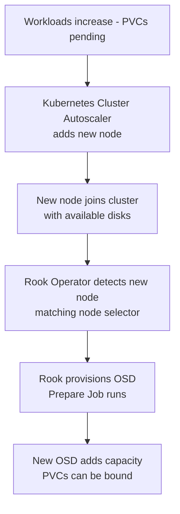

# How to Configure Rook-Ceph Cluster Autoscaling

Author: [nawazdhandala](https://www.github.com/nawazdhandala)

Tags: Rook, Ceph, Kubernetes, Autoscaling, Storage, OSD

Description: Configure Rook-Ceph storage cluster autoscaling to automatically add OSDs and expand capacity as Kubernetes nodes are added by the Cluster Autoscaler.

---

## How Rook-Ceph Autoscaling Works

Rook-Ceph can automatically provision new OSDs when new storage nodes are added to the cluster. This works naturally with the Kubernetes Cluster Autoscaler: when the autoscaler adds new nodes (because pods are pending), Rook detects the new nodes and provisions OSDs on their available disks, expanding storage capacity automatically.



## Prerequisites

- Kubernetes Cluster Autoscaler configured and running
- Auto-scaling node group with nodes that include available disks or PVC-based storage
- Rook-Ceph operator deployed with `useAllNodes: true` or auto-discovery enabled

## Configuring Rook to Auto-Discover New Nodes

Enable automatic OSD provisioning on all nodes that match a selector:

```yaml
apiVersion: ceph.rook.io/v1
kind: CephCluster
metadata:
  name: rook-ceph
  namespace: rook-ceph
spec:
  storage:
    useAllNodes: true
    useAllDevices: false
    deviceFilter: "^sd[b-z]"
    config:
      storeType: bluestore
  placement:
    osd:
      nodeAffinity:
        requiredDuringSchedulingIgnoredDuringExecution:
          nodeSelectorTerms:
            - matchExpressions:
                - key: role
                  operator: In
                  values:
                    - storage-node
```

With `useAllNodes: true` and `deviceFilter`, Rook automatically provisions OSDs on any node labeled `role=storage-node` that has a device matching `^sd[b-z]`.

## Configuring Cluster Autoscaler Node Groups

In your Cluster Autoscaler configuration, define a separate node group for storage nodes. The new nodes must already have the storage role label configured via the node group's user-data or bootstrap script.

For AWS (kOps/EKS), add the label in the instance template user-data:

```bash
#!/bin/bash
kubectl label node $(hostname) role=storage-node
```

Or use node templates in the Cluster Autoscaler config:

```yaml
apiVersion: autoscaling/v1beta1
kind: NodeTemplate
metadata:
  name: storage-node-template
spec:
  metadata:
    labels:
      role: storage-node
  spec:
    taints:
      - key: storage
        value: "true"
        effect: NoSchedule
```

## Using PVC-Based OSDs with Auto-Scaling

For cloud environments where raw disk is not available, use PVC-based OSDs. Define a `storageClassDeviceSets` in the CephCluster that Rook can scale:

```yaml
apiVersion: ceph.rook.io/v1
kind: CephCluster
metadata:
  name: rook-ceph
  namespace: rook-ceph
spec:
  storage:
    storageClassDeviceSets:
      - name: set1
        count: 3
        portable: true
        tuneSlowDeviceClass: false
        volumeClaimTemplates:
          - metadata:
              name: data
            spec:
              resources:
                requests:
                  storage: 1Ti
              storageClassName: local-storage
              volumeMode: Block
              accessModes:
                - ReadWriteOnce
```

To scale up OSDs, increase the `count` field:

```bash
kubectl -n rook-ceph patch cephcluster rook-ceph --type merge \
  -p '{"spec":{"storage":{"storageClassDeviceSets":[{"name":"set1","count":6}]}}}'
```

Rook detects the increased count and provisions 3 additional OSD PVCs automatically.

## Automating OSD Count with Custom Scripts

Create a simple script or CronJob that monitors cluster fill level and scales OSDs:

```yaml
apiVersion: batch/v1
kind: CronJob
metadata:
  name: rook-capacity-check
  namespace: rook-ceph
spec:
  schedule: "*/15 * * * *"
  jobTemplate:
    spec:
      template:
        spec:
          serviceAccountName: rook-ceph-system
          restartPolicy: OnFailure
          containers:
            - name: capacity-check
              image: bitnami/kubectl:latest
              command:
                - sh
                - -c
                - |
                  # Get cluster fill percentage
                  FILL=$(kubectl -n rook-ceph exec deploy/rook-ceph-tools -- \
                    ceph df --format json | python3 -c "
                  import json,sys
                  d=json.load(sys.stdin)
                  total=d['stats']['total_bytes']
                  used=d['stats']['total_used_raw_bytes']
                  print(int(used*100/total))
                  ")
                  echo "Cluster fill: ${FILL}%"
                  if [ "$FILL" -gt 70 ]; then
                    echo "WARNING: Cluster above 70%, consider adding OSDs"
                  fi
```

## Enabling PG Autoscaler

With OSDs scaling up, PG counts need to adjust automatically. The PG autoscaler (enabled by default in recent Ceph versions) handles this:

```bash
kubectl -n rook-ceph exec -it deploy/rook-ceph-tools -- \
  ceph mgr module enable pg_autoscaler
```

Set the autoscale mode on pools:

```bash
kubectl -n rook-ceph exec -it deploy/rook-ceph-tools -- \
  ceph osd pool set replicapool pg_autoscale_mode on
```

## Verifying Autoscaling Behavior

After a new node is added, watch Rook provision OSDs:

```bash
kubectl -n rook-ceph get jobs | grep osd-prepare
kubectl -n rook-ceph get pods | grep osd-prepare
```

Check the new OSD is added to the cluster:

```bash
kubectl -n rook-ceph exec -it deploy/rook-ceph-tools -- ceph osd tree
```

Verify the cluster capacity increased:

```bash
kubectl -n rook-ceph exec -it deploy/rook-ceph-tools -- ceph df
```

## Summary

Rook-Ceph cluster autoscaling works by setting `useAllNodes: true` with a device filter and a node affinity on the OSD placement so Rook automatically provisions OSDs on any new storage-labeled node added by the Cluster Autoscaler. For cloud environments, PVC-based OSD sets can be scaled by increasing the `storageClassDeviceSets.count` field. The PG autoscaler handles placement group rebalancing automatically as capacity changes. Monitor fill levels and trigger node group scaling before reaching 80% capacity to ensure smooth expansion without I/O impact.
