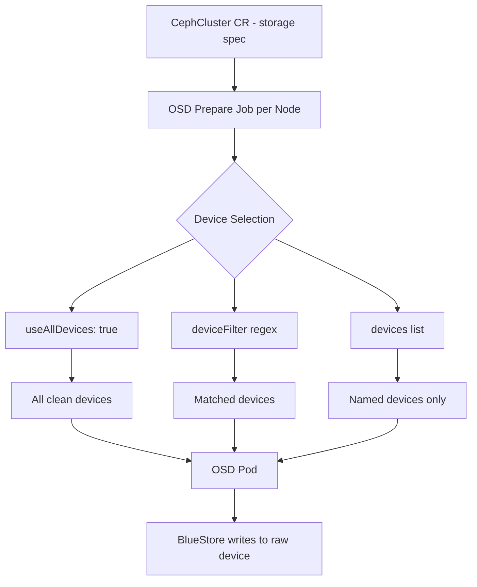

# How to Configure Raw Disks for Rook-Ceph OSD Provisioning

Author: [nawazdhandala](https://www.github.com/nawazdhandala)

Tags: Rook, Ceph, Kubernetes, OSD, Disk, Storage, BlueStore

Description: Learn how to select, prepare, and configure raw block devices for Rook-Ceph OSD provisioning including device filters, specific device lists, and BlueStore options.

---

## How Rook-Ceph Discovers and Uses Disks

Rook-Ceph discovers available block devices on each node using the OSD prepare job. Each OSD pod manages exactly one storage device and runs the Ceph BlueStore backend, which writes directly to the raw device without any intervening filesystem.



## Device Selection Methods

Rook-Ceph supports three mutually exclusive ways to specify which disks to use for OSDs in the `storage` section of the CephCluster CR.

### Method 1 - Use All Devices Automatically

The simplest approach lets Rook use every clean block device it finds on each node:

```yaml
spec:
  storage:
    useAllNodes: true
    useAllDevices: true
```

Rook considers a device "clean" if it has no filesystem signature, no partition table, and is not mounted. Previously used disks must be wiped first.

### Method 2 - Filter Devices by Name Pattern

Use a regex pattern to select devices matching a naming convention:

```yaml
spec:
  storage:
    useAllNodes: true
    useAllDevices: false
    deviceFilter: "^sd[b-z]"
```

This example selects all SATA drives except `sda` (typically the OS disk). Common patterns:

| Pattern | Matches |
|---------|---------|
| `^sd[b-z]` | sdb, sdc, sdd, ... |
| `^nvme[0-9]n1` | nvme0n1, nvme1n1, ... |
| `^vd[b-z]` | vdb, vdc, ... (virtual disks) |
| `^sd` | All SCSI disks |

### Method 3 - Explicit Device List per Node

For precise control, specify exactly which device on each node should become an OSD:

```yaml
spec:
  storage:
    useAllNodes: false
    nodes:
      - name: "node1"
        devices:
          - name: "sdb"
          - name: "sdc"
          - name: "nvme0n1"
      - name: "node2"
        devices:
          - name: "sdb"
          - name: "nvme0n1"
      - name: "node3"
        devices:
          - name: "sdb"
```

## Configuring OSDs per Device

By default, Rook creates one OSD per physical device. You can create multiple OSDs on a single device using partitions, though this is discouraged for production as it does not improve performance:

```yaml
spec:
  storage:
    useAllNodes: true
    useAllDevices: true
    config:
      osdsPerDevice: "1"
```

## BlueStore DB and WAL Placement

Ceph BlueStore uses a RocksDB metadata store (DB) and a Write-Ahead Log (WAL). By default both live on the same device as the data. For better performance, you can place the DB and WAL on a faster NVMe device while data lives on slower HDDs.

```yaml
spec:
  storage:
    useAllNodes: true
    useAllDevices: false
    nodes:
      - name: "node1"
        devices:
          - name: "sdb"
            config:
              # Place BlueStore DB on NVMe device
              metadataDevice: "nvme0n1"
          - name: "sdc"
            config:
              metadataDevice: "nvme0n1"
```

The NVMe device is automatically partitioned to hold DB/WAL for each HDD OSD that references it.

## Device Encryption

Rook-Ceph can encrypt OSD devices at rest using LUKS (Linux Unified Key Setup). Enable it per-node or globally:

```yaml
spec:
  storage:
    useAllNodes: true
    useAllDevices: true
    config:
      # Enable LUKS2 encryption for all OSDs
      encryptedDevice: "true"
```

Encryption keys are stored as Kubernetes secrets in the `rook-ceph` namespace. Ensure `cryptsetup` is installed on all nodes before enabling this option.

## Directory-Based OSDs for Testing

For development environments without spare raw disks, Rook can create file-based OSDs in a directory. This is not suitable for production due to performance limitations and lacks BlueStore benefits:

```yaml
spec:
  storage:
    useAllNodes: true
    useAllDevices: false
    directories:
      - path: "/var/lib/rook-data"
```

The directory must exist on each node before Rook creates OSDs in it:

```bash
sudo mkdir -p /var/lib/rook-data
```

## Disk Wiping Before Reuse

Before adding a previously used disk to Rook-Ceph, wipe all existing data and signatures:

```bash
# Identify the disk
lsblk -f /dev/sdc

# Remove filesystem signatures
sudo wipefs -a /dev/sdc

# Zero out the first and last few megabytes
sudo dd if=/dev/zero of=/dev/sdc bs=1M count=100 status=progress
sudo dd if=/dev/zero of=/dev/sdc bs=1M count=100 seek=$(($(blockdev --getsz /dev/sdc) * 512 / 1024 / 1024 - 100)) status=progress

# Remove partition table
sudo sgdisk --zap-all /dev/sdc

# Confirm the disk is clean
lsblk -f /dev/sdc
```

The disk should show no FSTYPE after wiping.

## Checking OSD Status After Provisioning

After applying your CephCluster CR with disk configuration, monitor the OSD prepare jobs:

```bash
# Watch OSD prepare jobs complete
kubectl -n rook-ceph get jobs -l app=rook-ceph-osd-prepare -w

# Check OSD pods are running
kubectl -n rook-ceph get pods -l app=rook-ceph-osd

# Verify OSDs from inside the toolbox
kubectl -n rook-ceph exec -it deploy/rook-ceph-tools -- ceph osd status
```

Expected output from `ceph osd status`:

```text
ID  HOST     USED  AVAIL  WR OPS  WR DATA  RD OPS  RD DATA  STATE
 0  node1  1026M  98.9G      0        0       0        0   exists,up
 1  node2  1026M  98.9G      0        0       0        0   exists,up
 2  node3  1026M  98.9G      0        0       0        0   exists,up
```

## Summary

Rook-Ceph supports flexible disk configuration through three selection methods: automatic discovery of all clean devices, regex-based device filtering, and explicit per-node device lists. For production clusters, use either the device filter or explicit list to avoid accidentally claiming the OS disk. BlueStore DB/WAL separation onto NVMe improves write performance for HDD-based OSDs. Always wipe disks before reuse to remove filesystem signatures that Rook would otherwise reject. After applying the configuration, monitor OSD prepare jobs and verify all OSDs reach the `up` state before creating storage classes.
