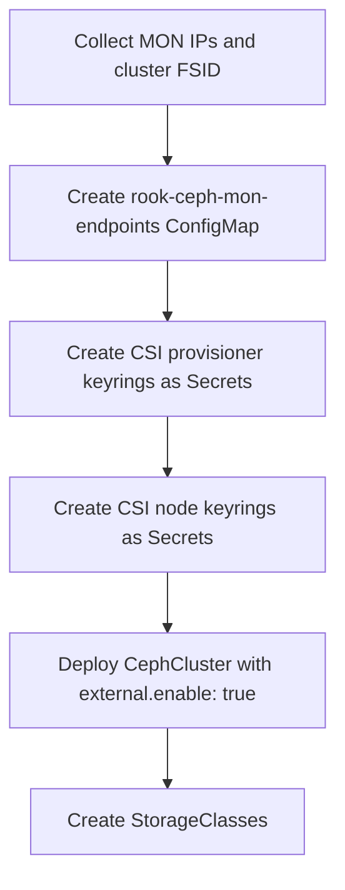

# How to Connect Rook to an Existing Ceph Cluster

Author: [nawazdhandala](https://www.github.com/nawazdhandala)

Tags: Rook, Ceph, Kubernetes, External Cluster, Storage, Integration

Description: Connect a Rook deployment to an already-running Ceph cluster by manually importing MON endpoints, keyrings, and pool configuration into Kubernetes.

---

## How Manual Rook-to-Ceph Connection Works

When the automated `create-external-cluster-resources.py` script is not practical, you can manually gather MON endpoints and keyrings from your Ceph cluster and create the required Kubernetes secrets directly. This gives you precise control over what access Rook has to the external cluster.



## Step 1 - Gather Information from the Existing Ceph Cluster

On the Ceph admin node, collect the required information.

Get the cluster FSID:

```bash
ceph fsid
```

Get MON endpoints:

```bash
ceph mon dump
```

Note the MON addresses in the format `<id>=<ip>:<port>`.

## Step 2 - Create CSI Users on the External Ceph Cluster

Create dedicated users with minimal permissions for the Rook CSI drivers.

Create the RBD provisioner user:

```bash
ceph auth get-or-create client.csi-rbd-provisioner \
  mon 'profile rbd' \
  osd 'profile rbd pool=replicapool' \
  > /etc/ceph/ceph.client.csi-rbd-provisioner.keyring
```

Create the RBD node user:

```bash
ceph auth get-or-create client.csi-rbd-node \
  mon 'profile rbd' \
  osd 'profile rbd pool=replicapool' \
  > /etc/ceph/ceph.client.csi-rbd-node.keyring
```

For CephFS, create the CephFS provisioner user:

```bash
ceph auth get-or-create client.csi-cephfs-provisioner \
  mon 'allow r' \
  mgr 'allow rw' \
  osd 'allow rw tag cephfs metadata=myfs' \
  > /etc/ceph/ceph.client.csi-cephfs-provisioner.keyring
```

Create the CephFS node user:

```bash
ceph auth get-or-create client.csi-cephfs-node \
  mon 'allow r' \
  mgr 'allow rw' \
  osd 'allow rw tag cephfs *=myfs' \
  mds 'allow rw fsname=myfs' \
  > /etc/ceph/ceph.client.csi-cephfs-node.keyring
```

Retrieve the key values:

```bash
ceph auth get-key client.csi-rbd-provisioner
ceph auth get-key client.csi-rbd-node
ceph auth get-key client.csi-cephfs-provisioner
ceph auth get-key client.csi-cephfs-node
```

## Step 3 - Create the MON Endpoints ConfigMap in Kubernetes

Create the ConfigMap with the cluster FSID and MON endpoints:

```bash
CLUSTER_FSID="<your-cluster-fsid>"
MON_ENDPOINTS="mon1=192.168.1.10:6789,mon2=192.168.1.11:6789,mon3=192.168.1.12:6789"

kubectl -n rook-ceph create configmap rook-ceph-mon-endpoints \
  --from-literal=data="$MON_ENDPOINTS" \
  --from-literal=mapping="{}" \
  --from-literal=maxMonId="2"
```

Also create the cluster info secret:

```bash
kubectl -n rook-ceph create secret generic rook-ceph-mon \
  --from-literal=cluster-name="rook-ceph" \
  --from-literal=fsid="$CLUSTER_FSID" \
  --from-literal=admin-secret="$(ceph auth get-key client.admin)" \
  --from-literal=mon-secret="$(ceph auth get-key client.admin)"
```

## Step 4 - Create CSI Secrets in Kubernetes

Create the RBD CSI provisioner secret:

```bash
kubectl -n rook-ceph create secret generic rook-csi-rbd-provisioner \
  --type="kubernetes.io/rook" \
  --from-literal=userID=csi-rbd-provisioner \
  --from-literal=userKey="$(ceph auth get-key client.csi-rbd-provisioner)"
```

Create the RBD CSI node secret:

```bash
kubectl -n rook-ceph create secret generic rook-csi-rbd-node \
  --type="kubernetes.io/rook" \
  --from-literal=userID=csi-rbd-node \
  --from-literal=userKey="$(ceph auth get-key client.csi-rbd-node)"
```

Create the CephFS CSI provisioner secret:

```bash
kubectl -n rook-ceph create secret generic rook-csi-cephfs-provisioner \
  --type="kubernetes.io/rook" \
  --from-literal=adminID=csi-cephfs-provisioner \
  --from-literal=adminKey="$(ceph auth get-key client.csi-cephfs-provisioner)"
```

Create the CephFS CSI node secret:

```bash
kubectl -n rook-ceph create secret generic rook-csi-cephfs-node \
  --type="kubernetes.io/rook" \
  --from-literal=adminID=csi-cephfs-node \
  --from-literal=adminKey="$(ceph auth get-key client.csi-cephfs-node)"
```

## Step 5 - Deploy the External CephCluster Resource

```yaml
apiVersion: ceph.rook.io/v1
kind: CephCluster
metadata:
  name: rook-ceph-external
  namespace: rook-ceph
spec:
  external:
    enable: true
  dataDirHostPath: /var/lib/rook
  cephVersion:
    image: quay.io/ceph/ceph:v19.2.0
```

```bash
kubectl apply -f cephcluster-external.yaml
```

## Step 6 - Verify the Connection

Check that the CephCluster resource shows `Connected`:

```bash
kubectl -n rook-ceph get cephcluster rook-ceph-external -o wide
```

Check the Rook operator logs for connection errors:

```bash
kubectl -n rook-ceph logs deployment/rook-ceph-operator --tail=50
```

Test PVC provisioning with a simple block storage PVC:

```yaml
apiVersion: v1
kind: PersistentVolumeClaim
metadata:
  name: test-rbd-pvc
spec:
  accessModes:
    - ReadWriteOnce
  storageClassName: rook-ceph-block-external
  resources:
    requests:
      storage: 1Gi
```

```bash
kubectl apply -f test-pvc.yaml
kubectl get pvc test-rbd-pvc
```

## Summary

Manually connecting Rook to an existing Ceph cluster involves creating dedicated CSI users on Ceph, importing MON endpoints and keyrings as Kubernetes Secrets and ConfigMaps, and deploying a CephCluster with `external.enable: true`. This approach gives you fine-grained control over which pools and permissions Rook has access to, and is suitable when the automated import script is not available or when you need custom user capabilities.
