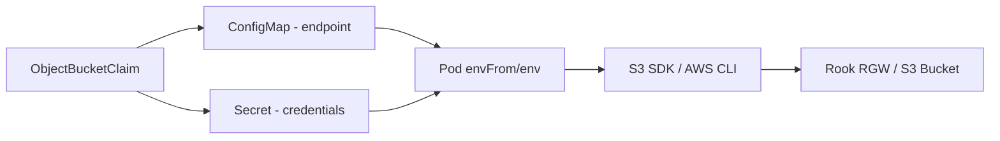

# How to Consume S3 Buckets from Applications Using OBC in Rook

Author: [nawazdhandala](https://www.github.com/nawazdhandala)

Tags: Rook, Ceph, Kubernetes, S3, OBC, Application

Description: Wire Rook ObjectBucketClaim credentials and endpoint into application pods using ConfigMap and Secret references for S3-native storage access.

---

Once an `ObjectBucketClaim` is created in Rook, applications consume the provisioned S3 bucket by referencing the generated ConfigMap (endpoint info) and Secret (credentials) in their Pod or Deployment specs.

## Connection Flow



## Reference: OBC-Generated Resources

When an OBC named `my-app-bucket` is created in the `default` namespace, Rook generates:

**ConfigMap** (`my-app-bucket`):
- `BUCKET_HOST` - RGW service hostname
- `BUCKET_PORT` - port (80 or 443)
- `BUCKET_NAME` - generated bucket name
- `BUCKET_REGION` - region string
- `BUCKET_SSL` - whether SSL is enabled

**Secret** (`my-app-bucket`):
- `AWS_ACCESS_KEY_ID` - access key
- `AWS_SECRET_ACCESS_KEY` - secret key

## Method 1: envFrom (Inject All Variables)

The simplest approach injects all ConfigMap and Secret keys as environment variables:

```yaml
apiVersion: apps/v1
kind: Deployment
metadata:
  name: s3-app
  namespace: default
spec:
  replicas: 1
  selector:
    matchLabels:
      app: s3-app
  template:
    metadata:
      labels:
        app: s3-app
    spec:
      containers:
        - name: app
          image: amazon/aws-cli:latest
          command:
            - sh
            - -c
            - |
              aws s3 ls s3://${BUCKET_NAME} \
                --endpoint-url http://${BUCKET_HOST}:${BUCKET_PORT}
          envFrom:
            - configMapRef:
                name: my-app-bucket    # OBC name
            - secretRef:
                name: my-app-bucket    # OBC name
```

## Method 2: Explicit env References

For more control over which variables are exposed:

```yaml
containers:
  - name: app
    image: myapp:latest
    env:
      - name: S3_BUCKET
        valueFrom:
          configMapKeyRef:
            name: my-app-bucket
            key: BUCKET_NAME
      - name: S3_ENDPOINT
        valueFrom:
          configMapKeyRef:
            name: my-app-bucket
            key: BUCKET_HOST
      - name: S3_PORT
        valueFrom:
          configMapKeyRef:
            name: my-app-bucket
            key: BUCKET_PORT
      - name: AWS_ACCESS_KEY_ID
        valueFrom:
          secretKeyRef:
            name: my-app-bucket
            key: AWS_ACCESS_KEY_ID
      - name: AWS_SECRET_ACCESS_KEY
        valueFrom:
          secretKeyRef:
            name: my-app-bucket
            key: AWS_SECRET_ACCESS_KEY
```

## Full Application Example: MinIO Client

```yaml
apiVersion: v1
kind: Pod
metadata:
  name: minio-test
  namespace: default
spec:
  restartPolicy: Never
  containers:
    - name: mc
      image: minio/mc:latest
      command:
        - sh
        - -c
        - |
          mc alias set rook http://${BUCKET_HOST}:${BUCKET_PORT} \
            ${AWS_ACCESS_KEY_ID} ${AWS_SECRET_ACCESS_KEY}
          mc ls rook/${BUCKET_NAME}
          echo "hello" | mc pipe rook/${BUCKET_NAME}/test.txt
          mc ls rook/${BUCKET_NAME}
      envFrom:
        - configMapRef:
            name: my-app-bucket
        - secretRef:
            name: my-app-bucket
```

## Python Application using boto3

```yaml
apiVersion: batch/v1
kind: Job
metadata:
  name: python-s3-test
  namespace: default
spec:
  template:
    spec:
      restartPolicy: Never
      containers:
        - name: python
          image: python:3.11-slim
          command:
            - python3
            - -c
            - |
              import boto3, os
              s3 = boto3.client('s3',
                endpoint_url=f"http://{os.environ['BUCKET_HOST']}:{os.environ['BUCKET_PORT']}",
                aws_access_key_id=os.environ['AWS_ACCESS_KEY_ID'],
                aws_secret_access_key=os.environ['AWS_SECRET_ACCESS_KEY'],
                region_name=os.environ.get('BUCKET_REGION', 'us-east-1')
              )
              bucket = os.environ['BUCKET_NAME']
              s3.put_object(Bucket=bucket, Key='hello.txt', Body=b'Hello from Rook!')
              response = s3.get_object(Bucket=bucket, Key='hello.txt')
              print(response['Body'].read().decode())
          envFrom:
            - configMapRef:
                name: my-app-bucket
            - secretRef:
                name: my-app-bucket
```

## Use OBC in a Different Namespace

OBCs are namespace-scoped. If your application is in a different namespace, copy the ConfigMap and Secret:

```bash
# Copy ConfigMap to app namespace
kubectl get configmap my-app-bucket -n default -o yaml | \
  sed 's/namespace: default/namespace: my-app/' | \
  kubectl apply -f -

# Copy Secret to app namespace
kubectl get secret my-app-bucket -n default -o yaml | \
  sed 's/namespace: default/namespace: my-app/' | \
  kubectl apply -f -
```

Or create the OBC directly in the application namespace.

## Verify S3 Access from Pod

```bash
# Execute AWS CLI commands in a running pod
kubectl exec -it s3-app -n default -- bash

aws s3 ls s3://${BUCKET_NAME} --endpoint-url http://${BUCKET_HOST}:${BUCKET_PORT}
aws s3 cp /etc/hostname s3://${BUCKET_NAME}/pod-hostname \
  --endpoint-url http://${BUCKET_HOST}:${BUCKET_PORT}
```

## Summary

Consuming S3 buckets from applications in Rook follows a simple pattern: reference the OBC-generated ConfigMap and Secret in pod specs using `envFrom`. This injects all necessary endpoint and credential information as environment variables, letting any S3-compatible SDK (boto3, AWS SDK, MinIO client) connect directly to the RGW endpoint without hardcoded configuration.
