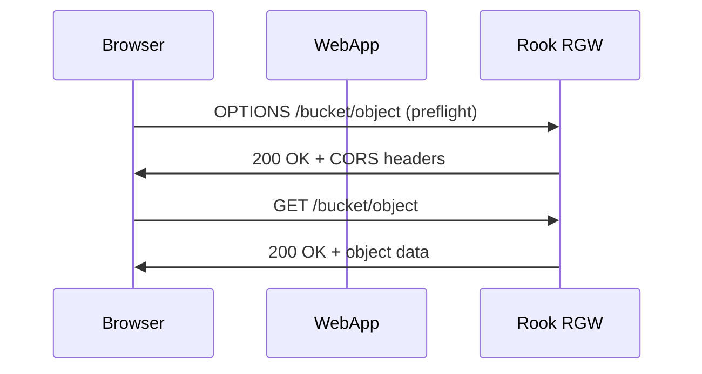

# How to Configure CORS in Rook-Ceph Object Store

Author: [nawazdhandala](https://www.github.com/nawazdhandala)

Tags: Rook, Ceph, Kubernetes, S3, CORS, ObjectStorage

Description: Configure Cross-Origin Resource Sharing (CORS) rules on Rook-Ceph S3 buckets to allow browser-based applications to access object storage directly.

---

CORS (Cross-Origin Resource Sharing) configuration on Rook-Ceph buckets allows browser-based web applications to make direct S3 API calls to RGW from different domains. Without CORS rules, browsers block cross-origin requests by default.

## CORS Architecture



## Prerequisites

- CephObjectStore deployed
- A bucket created
- AWS CLI or s3cmd pointed at the RGW endpoint

## Configure AWS CLI for RGW

```bash
export RGW_HOST=$(kubectl get svc -n rook-ceph rook-ceph-rgw-my-store \
  -o jsonpath='{.spec.clusterIP}')
export RGW_ENDPOINT=http://${RGW_HOST}

# Get credentials from Rook secret
export AWS_ACCESS_KEY_ID=$(kubectl get secret rook-ceph-object-user-my-store-my-user \
  -n rook-ceph -o jsonpath='{.data.AccessKey}' | base64 -d)
export AWS_SECRET_ACCESS_KEY=$(kubectl get secret rook-ceph-object-user-my-store-my-user \
  -n rook-ceph -o jsonpath='{.data.SecretKey}' | base64 -d)
```

## Basic CORS Configuration

Allow GET and PUT from any origin:

```json
{
  "CORSRules": [
    {
      "AllowedOrigins": ["*"],
      "AllowedMethods": ["GET", "PUT", "POST", "DELETE", "HEAD"],
      "AllowedHeaders": ["*"],
      "ExposeHeaders": ["ETag", "x-amz-server-side-encryption"],
      "MaxAgeSeconds": 3000
    }
  ]
}
```

Apply to a bucket:

```bash
aws s3api put-bucket-cors \
  --bucket my-app-bucket \
  --cors-configuration file://cors.json \
  --endpoint-url ${RGW_ENDPOINT}
```

## Restrict to Specific Origins

For production, restrict CORS to your known application domains:

```json
{
  "CORSRules": [
    {
      "AllowedOrigins": [
        "https://app.example.com",
        "https://staging.example.com"
      ],
      "AllowedMethods": ["GET", "HEAD"],
      "AllowedHeaders": ["Authorization", "Content-Type"],
      "ExposeHeaders": ["ETag", "Content-Length"],
      "MaxAgeSeconds": 86400
    },
    {
      "AllowedOrigins": [
        "https://upload.example.com"
      ],
      "AllowedMethods": ["PUT", "POST"],
      "AllowedHeaders": [
        "Authorization",
        "Content-Type",
        "x-amz-content-sha256",
        "x-amz-date",
        "x-amz-security-token"
      ],
      "MaxAgeSeconds": 3600
    }
  ]
}
```

## Allow Pre-signed URL Uploads from Browser

For browser-based direct uploads using pre-signed URLs:

```json
{
  "CORSRules": [
    {
      "AllowedOrigins": ["https://app.example.com"],
      "AllowedMethods": ["PUT", "GET", "HEAD"],
      "AllowedHeaders": [
        "Content-Type",
        "Content-MD5",
        "x-amz-acl"
      ],
      "ExposeHeaders": ["ETag"],
      "MaxAgeSeconds": 3600
    }
  ]
}
```

Generate a pre-signed URL for the upload:

```bash
aws s3 presign s3://my-app-bucket/uploads/file.jpg \
  --expires-in 3600 \
  --endpoint-url ${RGW_ENDPOINT}
```

## Read Current CORS Configuration

```bash
aws s3api get-bucket-cors \
  --bucket my-app-bucket \
  --endpoint-url ${RGW_ENDPOINT} \
  --output json | python3 -m json.tool
```

## Delete CORS Configuration

```bash
aws s3api delete-bucket-cors \
  --bucket my-app-bucket \
  --endpoint-url ${RGW_ENDPOINT}
```

## Apply CORS via Kubernetes Job

```yaml
apiVersion: batch/v1
kind: Job
metadata:
  name: set-bucket-cors
  namespace: rook-ceph
spec:
  template:
    spec:
      restartPolicy: OnFailure
      containers:
        - name: aws-cli
          image: amazon/aws-cli:latest
          command:
            - sh
            - -c
            - |
              aws s3api put-bucket-cors \
                --bucket ${BUCKET_NAME} \
                --endpoint-url http://rook-ceph-rgw-my-store.rook-ceph.svc \
                --cors-configuration '{
                  "CORSRules": [{
                    "AllowedOrigins": ["https://app.example.com"],
                    "AllowedMethods": ["GET","PUT","HEAD"],
                    "AllowedHeaders": ["*"],
                    "MaxAgeSeconds": 3000
                  }]
                }'
          env:
            - name: BUCKET_NAME
              value: my-app-bucket
            - name: AWS_ACCESS_KEY_ID
              valueFrom:
                secretKeyRef:
                  name: rook-ceph-object-user-my-store-admin
                  key: AccessKey
            - name: AWS_SECRET_ACCESS_KEY
              valueFrom:
                secretKeyRef:
                  name: rook-ceph-object-user-my-store-admin
                  key: SecretKey
            - name: AWS_DEFAULT_REGION
              value: us-east-1
```

## Test CORS with curl

```bash
# Test preflight request
curl -v -X OPTIONS ${RGW_ENDPOINT}/my-app-bucket/test.txt \
  -H "Origin: https://app.example.com" \
  -H "Access-Control-Request-Method: GET" \
  -H "Access-Control-Request-Headers: Authorization"

# Expected response headers:
# Access-Control-Allow-Origin: https://app.example.com
# Access-Control-Allow-Methods: GET
# Access-Control-Max-Age: 86400
```

## Summary

CORS configuration in Rook-Ceph is applied per-bucket using the S3 `put-bucket-cors` API via the AWS CLI or SDK. Define `AllowedOrigins`, `AllowedMethods`, and `AllowedHeaders` to match your application's domain and HTTP method usage. Restrict origins to specific domains in production and use generous `MaxAgeSeconds` values to reduce preflight request overhead.
