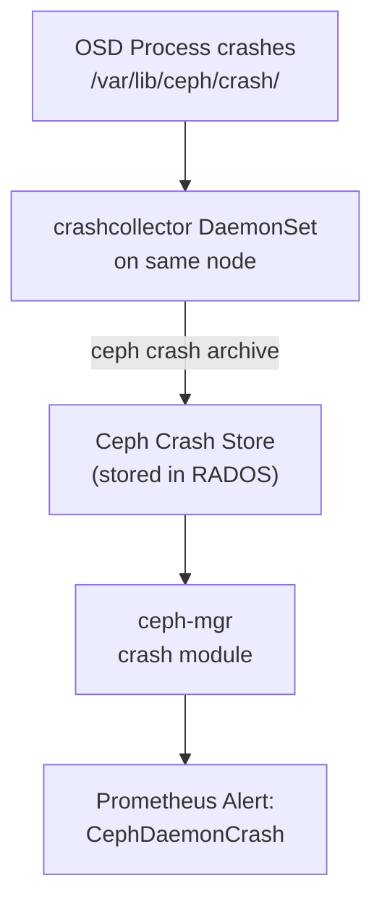

# How to Configure the Crash Collector in Rook-Ceph

Author: [nawazdhandala](https://www.github.com/nawazdhandala)

Tags: Rook, Ceph, Kubernetes, Storage, Crash, Diagnostic

Description: Configure the Rook-Ceph crash collector to capture and archive Ceph daemon crash reports, set retention policies, and integrate with monitoring for crash alerting.

---

## What the Crash Collector Does

The Ceph crash collector (`rook-ceph-crashcollector`) is a DaemonSet deployed on every node running Ceph daemons. It periodically scans for crash reports generated by Ceph processes (Mon, OSD, MGR) and archives them to the Ceph cluster's crash store. This gives operators visibility into daemon panics and assertion failures that may not show up as pod restarts in Kubernetes.



## Enabling the Crash Collector

The crash collector is enabled by default. Explicitly configure it in the CephCluster spec:

```yaml
apiVersion: ceph.rook.io/v1
kind: CephCluster
metadata:
  name: rook-ceph
  namespace: rook-ceph
spec:
  cephVersion:
    image: quay.io/ceph/ceph:v19.2.0
  dataDirHostPath: /var/lib/rook
  crashCollector:
    disable: false
    daysToRetain: 30
```

## Disabling the Crash Collector

If you do not want the crashcollector DaemonSet deployed (for minimal resource usage or testing):

```yaml
spec:
  crashCollector:
    disable: true
```

## Setting Crash Retention Period

The `daysToRetain` field controls how long crash reports are kept in the Ceph crash store before automatic pruning:

```yaml
spec:
  crashCollector:
    disable: false
    daysToRetain: 14
```

Crashes older than 14 days are automatically deleted. The default is 0 (retain forever until manually pruned).

## Viewing Crash Reports

List all recorded crashes via the Rook toolbox:

```bash
kubectl -n rook-ceph exec -it deploy/rook-ceph-tools -- \
  ceph crash ls
```

View details of a specific crash:

```bash
kubectl -n rook-ceph exec -it deploy/rook-ceph-tools -- \
  ceph crash info <crash-id>
```

Archive (acknowledge) a crash to prevent alerting:

```bash
kubectl -n rook-ceph exec -it deploy/rook-ceph-tools -- \
  ceph crash archive <crash-id>
```

Archive all crashes to clear alerts:

```bash
kubectl -n rook-ceph exec -it deploy/rook-ceph-tools -- \
  ceph crash archive-all
```

## Prometheus Alert for Crashes

The bundled Ceph PrometheusRules include a `CephDaemonCrash` alert that fires when there are unarchived crashes:

```yaml
- alert: CephDaemonCrash
  expr: ceph_health_detail{name="RECENT_CRASH"} == 1
  for: 1m
  labels:
    severity: warning
  annotations:
    summary: "A Ceph daemon has crashed"
    description: "One or more Ceph daemons have crashed recently. Run 'ceph crash ls' for details."
```

Apply the Rook alerting rules:

```bash
kubectl apply -f rook/deploy/examples/monitoring/prometheus-ceph-rules.yaml
```

## Checking Crashcollector Pod Status

```bash
kubectl -n rook-ceph get pods -l app=rook-ceph-crashcollector
```

The DaemonSet creates one pod per node where Ceph daemons run.

Check crashcollector logs on a node:

```bash
CRASH_POD=$(kubectl -n rook-ceph get pods -l app=rook-ceph-crashcollector \
  -o jsonpath='{.items[0].metadata.name}')
kubectl -n rook-ceph logs $CRASH_POD --tail=30
```

## Crash Collector Resource Limits

Add resource limits to the crash collector to bound its impact:

```yaml
spec:
  crashCollector:
    disable: false
    daysToRetain: 30
  resources:
    crashCollector:
      requests:
        cpu: "50m"
        memory: "60Mi"
      limits:
        cpu: "200m"
        memory: "128Mi"
```

## Summary

The Rook-Ceph crash collector is a DaemonSet that archives Ceph daemon crash reports to the Ceph crash store. Configure it via `spec.crashCollector.disable` and `daysToRetain` in the CephCluster CRD. Use `ceph crash ls` in the toolbox to list crashes, `ceph crash info <id>` to inspect them, and `ceph crash archive-all` to acknowledge and clear Prometheus `CephDaemonCrash` alerts. Set `daysToRetain` to automatically prune old crash records and prevent unbounded growth.
