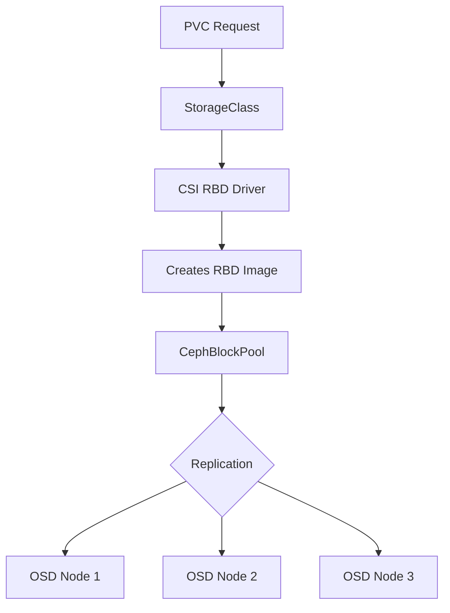

# How to Create a Rook-Ceph Block Storage Pool

Author: [nawazdhandala](https://www.github.com/nawazdhandala)

Tags: Rook, Ceph, Kubernetes, BlockStorage, Pool, Storage

Description: Learn how to create a Rook-Ceph block storage pool using the CephBlockPool custom resource and configure it for replicated or erasure-coded workloads.

---

## How Block Storage Pools Work in Rook-Ceph

A CephBlockPool is a Ceph storage pool configured for RADOS Block Device (RBD) images. Each pool defines how data is distributed across OSDs (either replicated or erasure-coded), what failure domain to use (host, rack, zone), and which CRUSH rule governs placement. Kubernetes PersistentVolumes backed by Rook-Ceph are stored as images inside these pools.



## Prerequisites

Before creating a block pool, ensure:

- The Rook operator is running
- A CephCluster exists and is in `HEALTH_OK` state
- At least 3 OSDs are up and in (for 3-replica pools)

Check cluster health:

```bash
kubectl -n rook-ceph exec deploy/rook-ceph-tools -- ceph status
```

## Creating a Replicated Block Pool

Create a standard three-replica block pool. The `failureDomain: host` setting ensures each replica lands on a different physical host:

```yaml
apiVersion: ceph.rook.io/v1
kind: CephBlockPool
metadata:
  name: replicapool
  namespace: rook-ceph
spec:
  # Spread replicas across different hosts
  failureDomain: host
  replicated:
    # Number of data copies (3 = one primary + two replicas)
    size: 3
    # Require all replicas to be written before acknowledging writes
    requireSafeReplicaSize: true
```

Apply it:

```bash
kubectl apply -f block-pool.yaml
```

## Creating Multiple Pools for Different Tiers

Production clusters often have multiple pools for different workload types:

```yaml
---
# High-performance pool backed by SSD OSDs
apiVersion: ceph.rook.io/v1
kind: CephBlockPool
metadata:
  name: ssd-pool
  namespace: rook-ceph
spec:
  failureDomain: host
  replicated:
    size: 3
    requireSafeReplicaSize: true
  deviceClass: ssd

---
# High-capacity pool backed by HDD OSDs
apiVersion: ceph.rook.io/v1
kind: CephBlockPool
metadata:
  name: hdd-pool
  namespace: rook-ceph
spec:
  failureDomain: host
  replicated:
    size: 3
    requireSafeReplicaSize: true
  deviceClass: hdd
```

The `deviceClass` field maps to the Ceph CRUSH device class. Ceph automatically assigns device classes based on disk type (`ssd`, `hdd`, `nvme`).

## Pool Compression

Enable inline compression to reduce storage usage for compressible data:

```yaml
apiVersion: ceph.rook.io/v1
kind: CephBlockPool
metadata:
  name: compressed-pool
  namespace: rook-ceph
spec:
  failureDomain: host
  replicated:
    size: 3
  parameters:
    # Options: none, snappy, zlib, zstd, lz4
    compression_mode: "aggressive"
```

## Verifying the Pool Was Created

After applying the CephBlockPool CR, verify it exists in both Kubernetes and Ceph:

```bash
# Check the Kubernetes resource
kubectl -n rook-ceph get cephblockpool

# Check the pool exists in Ceph
kubectl -n rook-ceph exec deploy/rook-ceph-tools -- ceph osd pool ls
```

Get pool details including placement group count and replication settings:

```bash
kubectl -n rook-ceph exec deploy/rook-ceph-tools -- ceph osd pool get replicapool all
```

Check pool health and usage:

```bash
kubectl -n rook-ceph exec deploy/rook-ceph-tools -- ceph df detail
```

## Configuring Pool-Level Settings

After pool creation, you can tune parameters using `ceph osd pool set` from the toolbox:

```bash
# Set minimum number of replicas required for I/O (default is size - 1)
kubectl -n rook-ceph exec deploy/rook-ceph-tools -- \
  ceph osd pool set replicapool min_size 2

# Enable PG autoscaling
kubectl -n rook-ceph exec deploy/rook-ceph-tools -- \
  ceph osd pool set replicapool pg_autoscale_mode on

# Set a target size ratio for the PG autoscaler
kubectl -n rook-ceph exec deploy/rook-ceph-tools -- \
  ceph osd pool set replicapool target_size_ratio 0.2
```

## Deleting a Block Pool

To delete a CephBlockPool, first ensure no PVCs are using it, then delete the StorageClass and pool:

```bash
# Check for RBD images in the pool
kubectl -n rook-ceph exec deploy/rook-ceph-tools -- rbd ls replicapool

# Delete the pool CR
kubectl -n rook-ceph delete cephblockpool replicapool
```

The operator removes the Ceph pool after the CR is deleted.

## Summary

Creating a Rook-Ceph block storage pool requires applying a CephBlockPool custom resource that specifies the failure domain and replication factor. Use `failureDomain: host` with `size: 3` for standard production deployments to ensure data survives a single host failure. For performance tiering, create separate pools with `deviceClass: ssd` and `deviceClass: hdd`. Pool compression can be enabled inline with the `parameters.compression_mode` field. Once the pool is created and verified healthy, pair it with a StorageClass to expose it as dynamic storage for Kubernetes workloads.
