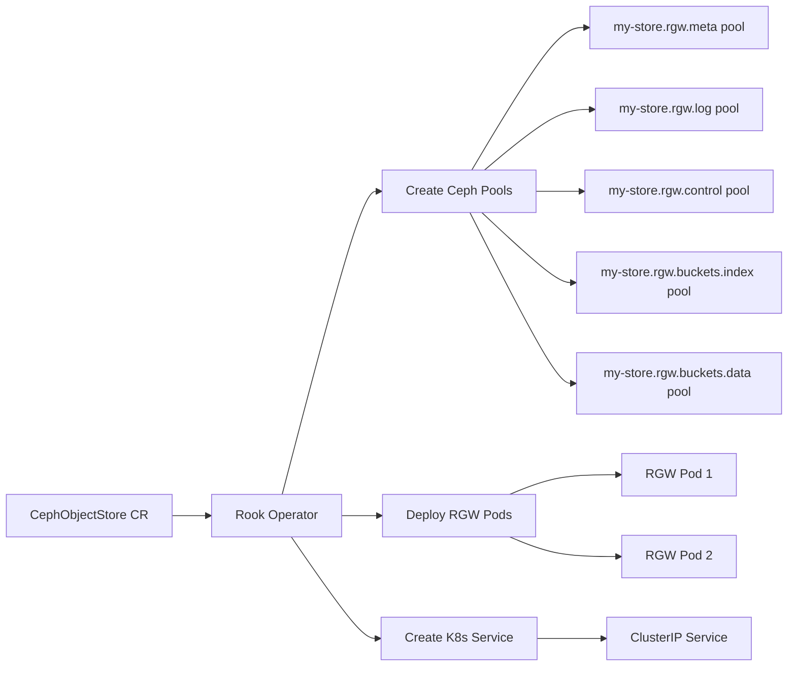

# How to Create a CephObjectStore in Rook

Author: [nawazdhandala](https://www.github.com/nawazdhandala)

Tags: Rook, Ceph, Kubernetes, CephObjectStore, RGW, ObjectStorage

Description: Detailed guide to authoring and deploying a CephObjectStore custom resource in Rook, covering pool configuration, gateway settings, and TLS setup.

---

## What the CephObjectStore CR Controls

The CephObjectStore custom resource is the complete specification for a Ceph RADOS Gateway (RGW) deployment. It controls three things: the Ceph pools used to store object data and metadata, the number and configuration of RGW gateway instances, and the networking/TLS settings for the S3 endpoint.



## Full CephObjectStore Specification

A complete CephObjectStore with all commonly used fields:

```yaml
apiVersion: ceph.rook.io/v1
kind: CephObjectStore
metadata:
  name: my-store
  namespace: rook-ceph
spec:
  # Metadata pool: stores RGW internal metadata (index, users, etc.)
  metadataPool:
    failureDomain: host
    replicated:
      size: 3
      requireSafeReplicaSize: true

  # Data pool: stores actual object data
  # Using erasure coding for storage efficiency
  dataPool:
    failureDomain: host
    erasureCoded:
      dataChunks: 2
      codingChunks: 1
    parameters:
      # Compress objects at rest
      compression_mode: "passive"

  # Keep pools if the CephObjectStore CR is deleted
  preservePoolsOnDelete: true

  gateway:
    # HTTP port (unencrypted, use only in trusted networks)
    port: 80
    # HTTPS port requires a TLS secret (see TLS section below)
    # securePort: 443
    # sslCertificateRef: rgw-tls-secret

    # Number of RGW instances (scale for throughput)
    instances: 2

    # Use a specific Ceph user for the gateway (optional)
    # rgwDaemonCephUser: ""

    resources:
      requests:
        cpu: 500m
        memory: 512Mi
      limits:
        cpu: "2"
        memory: 2Gi

    # Spread RGW pods across hosts
    placement:
      podAntiAffinity:
        preferredDuringSchedulingIgnoredDuringExecution:
          - weight: 100
            podAffinityTerm:
              labelSelector:
                matchExpressions:
                  - key: app
                    operator: In
                    values:
                      - rook-ceph-rgw
              topologyKey: kubernetes.io/hostname

    priorityClassName: system-cluster-critical

  # Zone configuration for multi-site setups (optional)
  # zone:
  #   name: us-east-1

  # Health check: Rook periodically tests bucket access
  healthCheck:
    bucket:
      disabled: false
      interval: 60s
    livenessProbe:
      disabled: false
    readinessProbe:
      disabled: false
```

## Minimal CephObjectStore

For a basic single-RGW deployment with replicated data:

```yaml
apiVersion: ceph.rook.io/v1
kind: CephObjectStore
metadata:
  name: my-store
  namespace: rook-ceph
spec:
  metadataPool:
    replicated:
      size: 3
  dataPool:
    failureDomain: host
    replicated:
      size: 3
  preservePoolsOnDelete: true
  gateway:
    port: 80
    instances: 1
```

## Enabling TLS on the RGW Endpoint

For HTTPS, create a TLS secret and reference it in the gateway spec. First, create the secret from your certificate files:

```bash
kubectl -n rook-ceph create secret tls rgw-tls-secret \
  --cert=rgw.crt \
  --key=rgw.key
```

Then update the CephObjectStore to use HTTPS:

```yaml
spec:
  gateway:
    # Disable plain HTTP
    port: 0
    # Enable HTTPS
    securePort: 443
    sslCertificateRef: rgw-tls-secret
    instances: 2
```

## Deploying and Monitoring

Apply the CephObjectStore:

```bash
kubectl apply -f object-store.yaml
```

Watch for RGW pods to become ready:

```bash
kubectl -n rook-ceph get pods -l app=rook-ceph-rgw -w
```

Check the CephObjectStore status:

```bash
kubectl -n rook-ceph get cephobjectstore my-store -o yaml | grep -A 15 status
```

A healthy store reports:

```text
status:
  bucketCount: 0
  conditions:
  - message: ObjectStore created successfully
    reason: ObjectStoreCreated
    status: "True"
    type: Ready
  phase: Ready
  info:
    endpoint: http://rook-ceph-rgw-my-store-a.rook-ceph.svc.cluster.local:80
```

## Verifying RGW Pools Were Created

Check that all required RGW pools exist in Ceph:

```bash
kubectl -n rook-ceph exec deploy/rook-ceph-tools -- ceph osd pool ls | grep my-store
```

Expected pools:

```text
.rgw.root
my-store.rgw.control
my-store.rgw.meta
my-store.rgw.log
my-store.rgw.buckets.index
my-store.rgw.buckets.non-ec
my-store.rgw.buckets.data
```

Check RGW daemon status:

```bash
kubectl -n rook-ceph exec deploy/rook-ceph-tools -- \
  radosgw-admin period get-current --format json | jq '.current_period.id'
```

## Scaling the RGW

To increase throughput, scale the number of RGW instances by editing the CephObjectStore:

```bash
kubectl -n rook-ceph patch cephobjectstore my-store \
  --type=merge \
  -p '{"spec":{"gateway":{"instances":4}}}'
```

The operator adds new RGW pods and updates the service to include them.

## Summary

The CephObjectStore CR gives you full control over RGW deployment: pool configuration (replicated vs. erasure-coded for data), gateway scaling (multiple `instances` for throughput), TLS termination via Kubernetes secrets, and health check behavior. Always set `preservePoolsOnDelete: true` in production to prevent accidental data loss on CR deletion. After deployment, verify pool creation with `ceph osd pool ls`, check the service endpoint in the status field, and use `radosgw-admin` from the toolbox for administrative operations.
