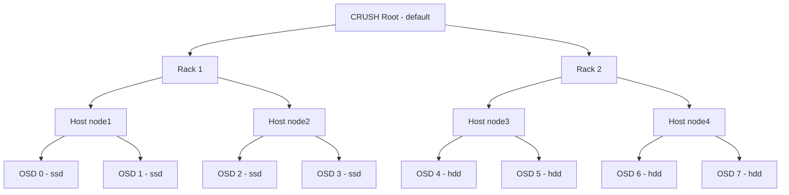

# How to Configure Ceph CRUSH Map in Rook

Author: [nawazdhandala](https://www.github.com/nawazdhandala)

Tags: Rook, Ceph, Kubernetes, CRUSH, DataPlacement, Storage

Description: Learn how to view and customize the Ceph CRUSH map in Rook deployments to control data placement across hosts, racks, and availability zones.

---

## What the CRUSH Map Is

CRUSH (Controlled Replication Under Scalable Hashing) is the algorithm Ceph uses to determine where to store data across OSDs. The CRUSH map defines a hierarchy of storage devices (OSDs) grouped into buckets (hosts, racks, rows, datacenters) and rules that specify how data should be distributed across those buckets.



## Viewing the Current CRUSH Map

Display the current CRUSH hierarchy from the toolbox:

```bash
kubectl -n rook-ceph exec deploy/rook-ceph-tools -- ceph osd tree
```

Get a detailed text dump of the CRUSH map:

```bash
kubectl -n rook-ceph exec deploy/rook-ceph-tools -- bash -c "
  ceph osd getcrushmap -o /tmp/crush.bin
  crushtool -d /tmp/crush.bin -o /tmp/crush.txt
  cat /tmp/crush.txt
"
```

## CRUSH Device Classes

Rook-Ceph automatically assigns device classes based on disk type detection. Verify device classes:

```bash
kubectl -n rook-ceph exec deploy/rook-ceph-tools -- ceph osd tree | grep -E "ssd|hdd|nvme"
```

Override a device class if auto-detection is wrong:

```bash
kubectl -n rook-ceph exec deploy/rook-ceph-tools -- bash -c "
  # Remove wrong class
  ceph osd crush rm-device-class osd.0

  # Set correct class
  ceph osd crush set-device-class ssd osd.0
"
```

Create a pool that only uses SSD OSDs:

```yaml
apiVersion: ceph.rook.io/v1
kind: CephBlockPool
metadata:
  name: ssd-pool
  namespace: rook-ceph
spec:
  failureDomain: host
  replicated:
    size: 3
  # Restrict to SSD device class
  deviceClass: ssd
```

## Adding Rack Topology to the CRUSH Map

For clusters with multiple physical racks, add rack-level buckets to enable rack-aware placement. This is done by moving hosts into rack buckets:

```bash
kubectl -n rook-ceph exec deploy/rook-ceph-tools -- bash -c "
  # Create rack buckets
  ceph osd crush add-bucket rack1 rack
  ceph osd crush add-bucket rack2 rack
  ceph osd crush add-bucket rack3 rack

  # Move hosts into their racks
  ceph osd crush move node1 rack=rack1
  ceph osd crush move node2 rack=rack1
  ceph osd crush move node3 rack=rack2
  ceph osd crush move node4 rack=rack2
  ceph osd crush move node5 rack=rack3
  ceph osd crush move node6 rack=rack3

  # Move racks under the default root
  ceph osd crush move rack1 root=default
  ceph osd crush move rack2 root=default
  ceph osd crush move rack3 root=default
"
```

Now create a pool with `failureDomain: rack` to ensure replicas are placed on different racks:

```yaml
apiVersion: ceph.rook.io/v1
kind: CephBlockPool
metadata:
  name: rack-aware-pool
  namespace: rook-ceph
spec:
  failureDomain: rack
  replicated:
    size: 3
```

## Zone-Aware Topology

For multi-zone clusters (on-prem or cloud), add zone buckets:

```bash
kubectl -n rook-ceph exec deploy/rook-ceph-tools -- bash -c "
  # Create zone buckets
  ceph osd crush add-bucket zone-a zone
  ceph osd crush add-bucket zone-b zone
  ceph osd crush add-bucket zone-c zone

  # Create a datacenter bucket (optional)
  ceph osd crush add-bucket datacenter datacenter

  # Move zones under datacenter
  ceph osd crush move zone-a datacenter=datacenter
  ceph osd crush move zone-b datacenter=datacenter
  ceph osd crush move zone-c datacenter=datacenter

  # Move hosts into their zones
  ceph osd crush move node1 zone=zone-a
  ceph osd crush move node2 zone=zone-b
  ceph osd crush move node3 zone=zone-c
"
```

## Setting CRUSH Weights

CRUSH weight determines how much data an OSD receives relative to others. By default, weight is proportional to disk size. Adjust weights for drives you want to use more or less:

```bash
# Check current weights
kubectl -n rook-ceph exec deploy/rook-ceph-tools -- ceph osd tree | grep -E "osd\.[0-9]"

# Set a specific weight (in TiB)
kubectl -n rook-ceph exec deploy/rook-ceph-tools -- \
  ceph osd crush reweight osd.0 1.0

# Reweight all OSDs based on actual disk size
kubectl -n rook-ceph exec deploy/rook-ceph-tools -- \
  ceph osd reweight-by-utilization
```

## Custom CRUSH Rules

Create a custom CRUSH rule that places data only on a specific device class:

```bash
kubectl -n rook-ceph exec deploy/rook-ceph-tools -- bash -c "
  # Create a rule for SSD-only replicated pools
  ceph osd crush rule create-replicated ssd-replicated default host ssd

  # Create a rule for HDD erasure-coded pools
  ceph osd crush rule create-erasure hdd-erasure default hdd
"
```

Reference a custom CRUSH rule in a CephBlockPool:

```yaml
apiVersion: ceph.rook.io/v1
kind: CephBlockPool
metadata:
  name: custom-pool
  namespace: rook-ceph
spec:
  failureDomain: host
  replicated:
    size: 3
  parameters:
    crush_rule: "ssd-replicated"
```

## Verifying CRUSH Rule Application

Check which CRUSH rule a pool uses:

```bash
kubectl -n rook-ceph exec deploy/rook-ceph-tools -- \
  ceph osd pool get replicapool crush_rule
```

Simulate data placement for a pool:

```bash
kubectl -n rook-ceph exec deploy/rook-ceph-tools -- bash -c "
  # Show where PG 1.0 would be placed
  ceph osd map replicapool myobject
"
```

```text
osdmap e42 pool 'replicapool' (1) object 'myobject' -> pg 1.dc4b0a3b (1.3b) -> up ([0,3,7], p0) acting ([0,3,7], p0)
```

This shows the object would be placed on OSDs 0, 3, and 7.

## Summary

The Ceph CRUSH map controls how data is distributed across your storage infrastructure. In Rook, you interact with CRUSH using `ceph osd crush` commands from the toolbox. Key operations include setting device classes for tiered storage, adding rack or zone buckets for topology-aware placement, adjusting OSD weights for heterogeneous disks, and creating custom CRUSH rules for fine-grained pool placement. Use `failureDomain: rack` or `failureDomain: zone` in your CephBlockPool CRs when you have added the corresponding topology buckets to the CRUSH map.
