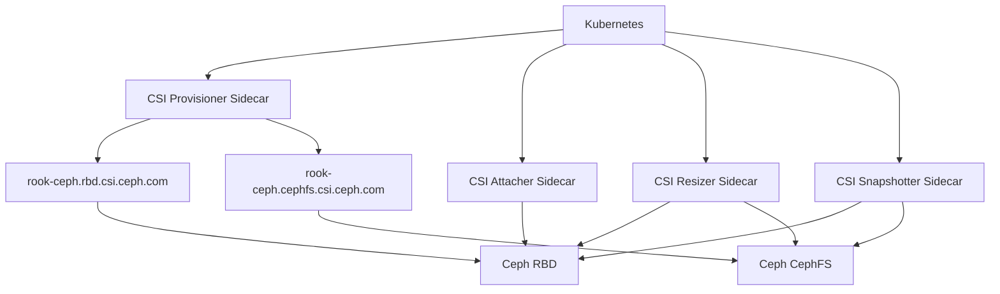

# How to Use Ceph CSI Driver Features in Rook

Author: [nawazdhandala](https://www.github.com/nawazdhandala)

Tags: Rook, Ceph, Kubernetes, CSI, Driver, Storage

Description: Explore Rook Ceph CSI driver features including topology awareness, read affinity, encryption, volume expansion, and cloning for production storage.

---

The Rook Ceph CSI driver exposes multiple advanced storage capabilities beyond basic volume provisioning. Understanding and enabling these features lets you build production-grade storage for Kubernetes workloads.

## CSI Driver Components



## Check Installed CSI Drivers

```bash
kubectl get csidrivers
```

Expected output:

```
NAME                            ATTACHREQUIRED   PODINFOONMOUNT   ...
rook-ceph.cephfs.csi.ceph.com   true             false
rook-ceph.rbd.csi.ceph.com      true             false
```

## Feature 1: Volume Expansion (Online Resize)

Enable in StorageClass and resize PVCs without downtime:

```yaml
apiVersion: storage.k8s.io/v1
kind: StorageClass
metadata:
  name: ceph-rbd-expandable
provisioner: rook-ceph.rbd.csi.ceph.com
parameters:
  clusterID: rook-ceph
  pool: replicapool
  imageFormat: "2"
  imageFeatures: layering
  csi.storage.k8s.io/provisioner-secret-name: rook-csi-rbd-provisioner
  csi.storage.k8s.io/provisioner-secret-namespace: rook-ceph
  csi.storage.k8s.io/controller-expand-secret-name: rook-csi-rbd-provisioner
  csi.storage.k8s.io/controller-expand-secret-namespace: rook-ceph
  csi.storage.k8s.io/node-stage-secret-name: rook-csi-rbd-node
  csi.storage.k8s.io/node-stage-secret-namespace: rook-ceph
reclaimPolicy: Delete
allowVolumeExpansion: true    # must be true for resize
```

Resize a PVC:

```bash
kubectl patch pvc my-pvc -p '{"spec":{"resources":{"requests":{"storage":"20Gi"}}}}'
kubectl describe pvc my-pvc | grep -A5 Conditions
```

## Feature 2: Topology-Aware Provisioning

Configure the CSI driver to provision volumes on nodes with matching topology labels:

```yaml
apiVersion: storage.k8s.io/v1
kind: StorageClass
metadata:
  name: ceph-rbd-topology
provisioner: rook-ceph.rbd.csi.ceph.com
parameters:
  clusterID: rook-ceph
  pool: replicapool
  imageFormat: "2"
  imageFeatures: layering
  csi.storage.k8s.io/provisioner-secret-name: rook-csi-rbd-provisioner
  csi.storage.k8s.io/provisioner-secret-namespace: rook-ceph
  csi.storage.k8s.io/controller-expand-secret-name: rook-csi-rbd-provisioner
  csi.storage.k8s.io/controller-expand-secret-namespace: rook-ceph
  csi.storage.k8s.io/node-stage-secret-name: rook-csi-rbd-node
  csi.storage.k8s.io/node-stage-secret-namespace: rook-ceph
reclaimPolicy: Delete
allowVolumeExpansion: true
volumeBindingMode: WaitForFirstConsumer    # topology-aware binding
```

## Feature 3: Encryption with KMS

Enable per-PVC encryption via Kubernetes Secrets or an external KMS:

```yaml
apiVersion: storage.k8s.io/v1
kind: StorageClass
metadata:
  name: ceph-rbd-encrypted
provisioner: rook-ceph.rbd.csi.ceph.com
parameters:
  clusterID: rook-ceph
  pool: replicapool
  imageFormat: "2"
  imageFeatures: layering
  encrypted: "true"
  # Use Kubernetes Secrets as KMS backend
  encryptionKMSID: rook-encryption-kms
  csi.storage.k8s.io/provisioner-secret-name: rook-csi-rbd-provisioner
  csi.storage.k8s.io/provisioner-secret-namespace: rook-ceph
  csi.storage.k8s.io/controller-expand-secret-name: rook-csi-rbd-provisioner
  csi.storage.k8s.io/controller-expand-secret-namespace: rook-ceph
  csi.storage.k8s.io/node-stage-secret-name: rook-csi-rbd-node
  csi.storage.k8s.io/node-stage-secret-namespace: rook-ceph
reclaimPolicy: Delete
allowVolumeExpansion: true
```

## Feature 4: Volume Cloning

Clone a PVC from an existing PVC:

```yaml
apiVersion: v1
kind: PersistentVolumeClaim
metadata:
  name: cloned-pvc
  namespace: default
spec:
  accessModes:
    - ReadWriteOnce
  resources:
    requests:
      storage: 10Gi
  storageClassName: ceph-rbd-expandable
  dataSource:
    name: source-pvc
    kind: PersistentVolumeClaim
```

## Feature 5: ReadAffinity for RBD

Reduce inter-node data transfer by reading from OSDs local to the pod's node:

```yaml
apiVersion: v1
kind: ConfigMap
metadata:
  name: rook-ceph-csi-config
  namespace: rook-ceph
data:
  config.json: |-
    [
      {
        "clusterID": "rook-ceph",
        "monitors": ["<mon-ip>:6789"],
        "readAffinity": {
          "enabled": true,
          "crushLocationLabels": [
            "topology.kubernetes.io/zone",
            "kubernetes.io/hostname"
          ]
        }
      }
    ]
```

## Feature 6: Snapshot and Restore

```bash
# Create a snapshot
cat <<EOF | kubectl apply -f -
apiVersion: snapshot.storage.k8s.io/v1
kind: VolumeSnapshot
metadata:
  name: rbd-snap
  namespace: default
spec:
  volumeSnapshotClassName: csi-rbdplugin-snapclass
  source:
    persistentVolumeClaimName: my-pvc
EOF

# Restore from snapshot
cat <<EOF | kubectl apply -f -
apiVersion: v1
kind: PersistentVolumeClaim
metadata:
  name: restored-pvc
  namespace: default
spec:
  accessModes:
    - ReadWriteOnce
  resources:
    requests:
      storage: 10Gi
  storageClassName: ceph-rbd-expandable
  dataSource:
    name: rbd-snap
    kind: VolumeSnapshot
    apiGroup: snapshot.storage.k8s.io
EOF
```

## Check CSI Driver Version

```bash
kubectl get pods -n rook-ceph -l app=csi-rbdplugin -o jsonpath=\
'{range .items[*]}{.metadata.name}: {range .spec.containers[*]}{.image}{"\n"}{end}{end}'
```

## Summary

The Rook Ceph CSI driver supports volume expansion, topology-aware provisioning, per-PVC encryption, PVC cloning, snapshots, and read affinity. Enable `allowVolumeExpansion: true` in StorageClasses for resize support, use `WaitForFirstConsumer` binding for topology awareness, and configure `readAffinity` in the CSI config for reduced inter-zone traffic. These features are activated through StorageClass parameters and the Rook CSI ConfigMap.
