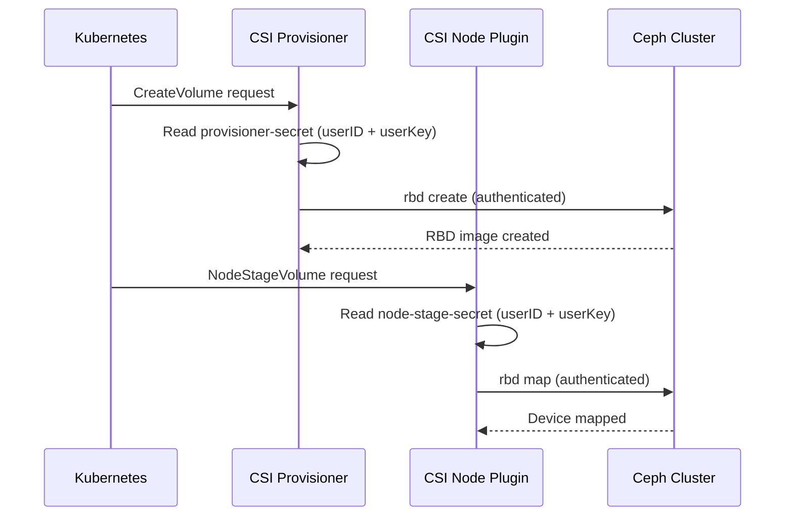

# How to Set Up CSI Provisioner Secrets for RBD in Rook

Author: [nawazdhandala](https://www.github.com/nawazdhandala)

Tags: Rook, Ceph, Kubernetes, Storage

Description: Create and configure the Kubernetes secrets required by the Rook CSI RBD provisioner and node plugin for dynamic volume provisioning and mounting.

---

## Introduction

The Rook CSI driver for RBD requires several Kubernetes secrets to authenticate with the Ceph cluster. There are distinct secrets for the provisioner (which creates and deletes RBD images), the node plugin (which mounts images on nodes), and the controller expand plugin (which resizes images). Understanding these secrets and their required fields is essential for setting up RBD provisioning correctly.

## Secret Roles in CSI Operations



## Prerequisites

- Rook Ceph operator installed
- Running CephBlockPool
- Ceph users created for CSI operations (see authentication guide for creation steps)

## Step 1: Create the RBD Provisioner Secret

This secret is used by the CSI provisioner to create, delete, and clone RBD images:

```yaml
# rbd-provisioner-secret.yaml
apiVersion: v1
kind: Secret
metadata:
  name: rook-csi-rbd-provisioner
  namespace: rook-ceph
type: kubernetes.io/rook
stringData:
  # Ceph user ID (without "client." prefix)
  userID: rook-csi-rbd-provisioner
  # The key for the Ceph user
  userKey: AQCxxxxxxxxxxxxxxxxxxxxxxxxxxxxxxxxxxxxxx==
  # Optional: encryption passphrase for encrypted volumes
  # encryptionPassphrase: my-secret-passphrase
```

```bash
# Get the key from your Ceph cluster
PROVISIONER_KEY=$(ceph auth get-key client.rook-csi-rbd-provisioner)

kubectl create secret generic rook-csi-rbd-provisioner \
  -n rook-ceph \
  --type="kubernetes.io/rook" \
  --from-literal=userID=rook-csi-rbd-provisioner \
  --from-literal=userKey="$PROVISIONER_KEY"
```

## Step 2: Create the RBD Node Secret

This secret is used by the CSI node plugin to map (attach) RBD images to nodes:

```yaml
# rbd-node-secret.yaml
apiVersion: v1
kind: Secret
metadata:
  name: rook-csi-rbd-node
  namespace: rook-ceph
type: kubernetes.io/rook
stringData:
  userID: rook-csi-rbd-node
  userKey: AQCxxxxxxxxxxxxxxxxxxxxxxxxxxxxxxxxxxxxxx==
```

```bash
NODE_KEY=$(ceph auth get-key client.rook-csi-rbd-node)

kubectl create secret generic rook-csi-rbd-node \
  -n rook-ceph \
  --type="kubernetes.io/rook" \
  --from-literal=userID=rook-csi-rbd-node \
  --from-literal=userKey="$NODE_KEY"
```

## Step 3: Reference Secrets in the StorageClass

Each CSI operation type requires referencing the correct secret:

```yaml
# storageclass-rbd.yaml
apiVersion: storage.k8s.io/v1
kind: StorageClass
metadata:
  name: rook-ceph-block
provisioner: rook-ceph.rbd.csi.ceph.com
parameters:
  clusterID: <ceph-cluster-fsid>
  pool: replicapool
  imageFormat: "2"
  imageFeatures: layering,fast-diff,object-map,deep-flatten,exclusive-lock

  # Secret for creating/deleting volumes (provisioner)
  csi.storage.k8s.io/provisioner-secret-name: rook-csi-rbd-provisioner
  csi.storage.k8s.io/provisioner-secret-namespace: rook-ceph

  # Secret for expanding volumes (must have same permissions as provisioner)
  csi.storage.k8s.io/controller-expand-secret-name: rook-csi-rbd-provisioner
  csi.storage.k8s.io/controller-expand-secret-namespace: rook-ceph

  # Secret for mounting volumes on nodes
  csi.storage.k8s.io/node-stage-secret-name: rook-csi-rbd-node
  csi.storage.k8s.io/node-stage-secret-namespace: rook-ceph

reclaimPolicy: Delete
allowVolumeExpansion: true
```

## Step 4: Set Up Secrets for VolumeSnapshot Operations

Snapshot operations require additional secret references on the VolumeSnapshotClass:

```yaml
# volumesnapshotclass-rbd.yaml
apiVersion: snapshot.storage.k8s.io/v1
kind: VolumeSnapshotClass
metadata:
  name: csi-rbdplugin-snapclass
driver: rook-ceph.rbd.csi.ceph.com
parameters:
  clusterID: <ceph-cluster-fsid>
  # Provisioner secret is used for snapshot create/delete
  csi.storage.k8s.io/volumesnapshot/secret-name: rook-csi-rbd-provisioner
  csi.storage.k8s.io/volumesnapshot/secret-namespace: rook-ceph
deletionPolicy: Delete
```

## Step 5: Minimum Required Ceph User Capabilities

On the Ceph admin host, create users with the minimum required capabilities:

```bash
# Provisioner user - needs to create/delete RBD images and manage pools
ceph auth get-or-create client.rook-csi-rbd-provisioner \
  mon 'profile rbd' \
  osd 'profile rbd' \
  mgr 'allow rw'

# Node user - only needs to map/unmap RBD images
ceph auth get-or-create client.rook-csi-rbd-node \
  mon 'profile rbd' \
  osd 'profile rbd'

# Verify capabilities
ceph auth get client.rook-csi-rbd-provisioner
ceph auth get client.rook-csi-rbd-node
```

## Step 6: Verify Secrets Are Accessible to CSI Pods

```bash
# Check if the CSI provisioner pod can read its secret
kubectl get secret rook-csi-rbd-provisioner -n rook-ceph -o yaml

# Check the provisioner deployment uses the correct service account
kubectl describe deploy csi-rbdplugin-provisioner -n rook-ceph | grep -A5 "Service Account"

# Verify RBAC allows the service account to read secrets
kubectl auth can-i get secrets \
  --namespace rook-ceph \
  --as=system:serviceaccount:rook-ceph:rook-csi-rbd-plugin-sa
```

## Step 7: Rotate CSI Secrets

To rotate secrets without disrupting existing volumes:

```bash
# 1. Create new Ceph user with new key
ceph auth get-or-create client.rook-csi-rbd-provisioner-new \
  mon 'profile rbd' \
  osd 'profile rbd' \
  mgr 'allow rw'

NEW_KEY=$(ceph auth get-key client.rook-csi-rbd-provisioner-new)

# 2. Update the Kubernetes secret in-place
kubectl patch secret rook-csi-rbd-provisioner -n rook-ceph \
  --type='json' \
  -p='[{"op":"replace","path":"/data/userKey","value":"'"$(echo -n $NEW_KEY | base64)"'"},{"op":"replace","path":"/data/userID","value":"'"$(echo -n rook-csi-rbd-provisioner-new | base64)"'"}]'

# 3. Restart the provisioner to use the new secret
kubectl rollout restart deployment/csi-rbdplugin-provisioner -n rook-ceph

# 4. Delete the old Ceph user after confirming success
ceph auth del client.rook-csi-rbd-provisioner
```

## Troubleshooting

```bash
# Check provisioner logs for authentication errors
kubectl logs -n rook-ceph deploy/csi-rbdplugin-provisioner -c csi-provisioner | \
  grep -E "error|auth|secret" | tail -20

# Check node plugin logs for mount failures
kubectl logs -n rook-ceph daemonset/csi-rbdplugin -c csi-rbdplugin | \
  grep -E "error|auth|secret" | tail -20

# Decode a secret to verify contents
kubectl get secret rook-csi-rbd-provisioner -n rook-ceph \
  -o jsonpath='{.data.userKey}' | base64 -d && echo

# Test authentication manually from the toolbox
kubectl -n rook-ceph exec -it deploy/rook-ceph-tools -- \
  ceph --id rook-csi-rbd-provisioner --key AQCxxxx== osd pool ls
```

## Summary

CSI provisioner secrets for RBD in Rook consist of two main secrets: `rook-csi-rbd-provisioner` (used for creating, deleting, and expanding volumes) and `rook-csi-rbd-node` (used for mapping volumes on nodes). Each secret contains a Ceph user ID and key. These are referenced in the StorageClass via the `csi.storage.k8s.io/provisioner-secret-name`, `csi.storage.k8s.io/controller-expand-secret-name`, and `csi.storage.k8s.io/node-stage-secret-name` parameters. Proper Ceph user capabilities must be set to ensure each operation succeeds with minimal privilege.
