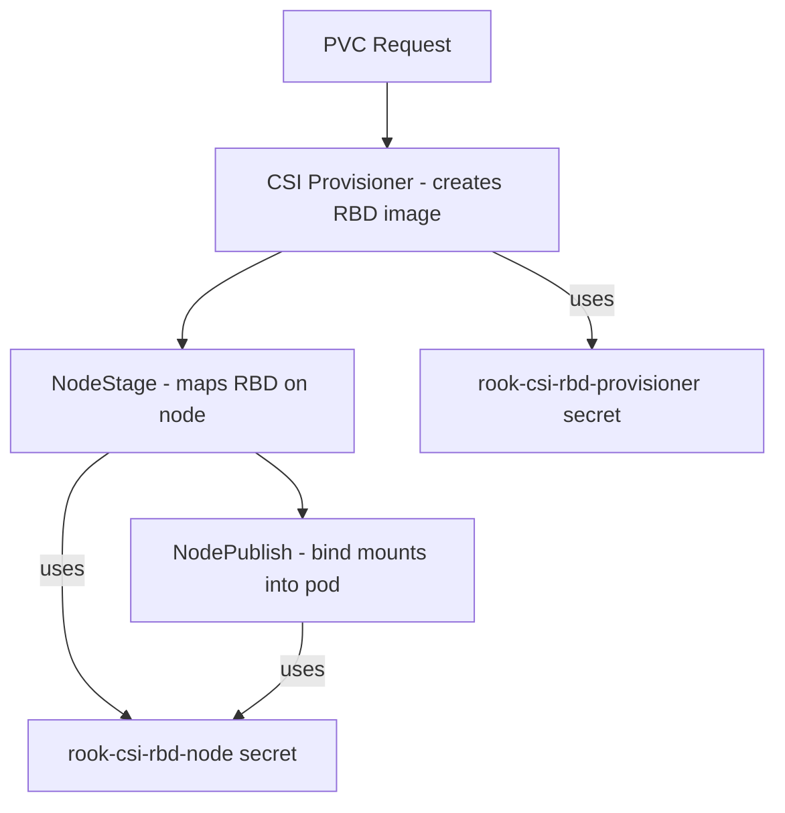

# How to Configure CSI RBD Node Stage Secret in Rook

Author: [nawazdhandala](https://www.github.com/nawazdhandala)

Tags: Rook, Ceph, Kubernetes, CSI, RBD, Secret

Description: Understand and configure the CSI RBD node stage secret in Rook for secure volume attachment and mounting on Kubernetes worker nodes.

---

The CSI RBD node stage secret (`rook-csi-rbd-node`) contains Ceph authentication credentials used by the CSI node plugin to map RBD images onto worker nodes. Properly understanding and managing this secret is essential for secure and reliable RBD volume mounting.

## Secret Roles in the CSI Workflow



| Secret | Used By | Purpose |
|---|---|---|
| `rook-csi-rbd-provisioner` | CSI controller | Create, delete, expand RBD images |
| `rook-csi-rbd-node` | CSI node plugin | Map (attach) RBD images to nodes |

## How Rook Creates the Secret

Rook automatically creates the node secret when the operator deploys. You can inspect it:

```bash
kubectl get secret rook-csi-rbd-node -n rook-ceph -o yaml
```

The secret contains:

```yaml
data:
  userID: <base64-encoded-ceph-username>
  userKey: <base64-encoded-ceph-keyring>
```

## Decode Existing Secret

```bash
# Get the Ceph user
kubectl get secret rook-csi-rbd-node -n rook-ceph \
  -o jsonpath='{.data.userID}' | base64 -d

# Get the Ceph key
kubectl get secret rook-csi-rbd-node -n rook-ceph \
  -o jsonpath='{.data.userKey}' | base64 -d
```

## Use in StorageClass

Every RBD StorageClass must reference the node stage secret:

```yaml
apiVersion: storage.k8s.io/v1
kind: StorageClass
metadata:
  name: ceph-rbd
provisioner: rook-ceph.rbd.csi.ceph.com
parameters:
  clusterID: rook-ceph
  pool: replicapool
  imageFormat: "2"
  imageFeatures: layering
  # Controller/provisioner secrets
  csi.storage.k8s.io/provisioner-secret-name: rook-csi-rbd-provisioner
  csi.storage.k8s.io/provisioner-secret-namespace: rook-ceph
  csi.storage.k8s.io/controller-expand-secret-name: rook-csi-rbd-provisioner
  csi.storage.k8s.io/controller-expand-secret-namespace: rook-ceph
  # Node stage secret - used for RBD map on worker nodes
  csi.storage.k8s.io/node-stage-secret-name: rook-csi-rbd-node
  csi.storage.k8s.io/node-stage-secret-namespace: rook-ceph
reclaimPolicy: Delete
allowVolumeExpansion: true
```

## Custom Ceph User for the Node Secret

For stricter access control, create a dedicated Ceph user with only the permissions needed for node operations:

```bash
kubectl exec -n rook-ceph deploy/rook-ceph-tools -- bash

# Create a limited Ceph user for node operations
ceph auth get-or-create client.rbd-node \
  mon 'profile rbd' \
  osd 'profile rbd pool=replicapool' \
  | tee /tmp/rbd-node.keyring

# Extract the key
cat /tmp/rbd-node.keyring
```

Create the Kubernetes secret with the custom user:

```bash
kubectl create secret generic rook-csi-rbd-node-custom \
  --from-literal=userID=rbd-node \
  --from-literal=userKey=<key-from-keyring> \
  -n rook-ceph
```

Reference it in a custom StorageClass:

```yaml
parameters:
  csi.storage.k8s.io/node-stage-secret-name: rook-csi-rbd-node-custom
  csi.storage.k8s.io/node-stage-secret-namespace: rook-ceph
```

## Troubleshoot Node Stage Failures

```bash
# Check CSI node plugin logs on the failing node
NODE_NAME=<node-where-pod-is-scheduled>
NODE_POD=$(kubectl get pods -n rook-ceph -l app=csi-rbdplugin \
  -o jsonpath="{.items[?(@.spec.nodeName=='${NODE_NAME}')].metadata.name}")
kubectl logs -n rook-ceph ${NODE_POD} -c csi-rbdplugin

# Check events for the PVC
kubectl describe pvc <pvc-name> -n <namespace>

# Verify secret exists and has correct keys
kubectl get secret rook-csi-rbd-node -n rook-ceph \
  -o jsonpath='{.data}' | python3 -m json.tool
```

Common errors:

```text
# Wrong credentials
GRPC error: rpc error: code = Internal desc = ... auth: unable to authenticate

# Missing key in secret
failed to get secret ... key "userKey" not found

# Network issue to Ceph monitors
failed to connect to mons: ...
```

## Rotate the Node Stage Secret

```bash
kubectl exec -n rook-ceph deploy/rook-ceph-tools -- bash

# Regenerate the key for the CSI node user
ceph auth get-or-create client.csi-rbd-node mon 'profile rbd' \
  osd 'profile rbd' mgr 'allow rw'

# Get the new key
NEW_KEY=$(ceph auth get-key client.csi-rbd-node)

# Update the Kubernetes secret
kubectl create secret generic rook-csi-rbd-node \
  --from-literal=userID=csi-rbd-node \
  --from-literal=userKey=${NEW_KEY} \
  -n rook-ceph \
  --dry-run=client -o yaml | kubectl apply -f -

# Restart CSI node plugin daemonset to pick up new credentials
kubectl rollout restart daemonset/csi-rbdplugin -n rook-ceph
```

## Summary

The CSI RBD node stage secret (`rook-csi-rbd-node`) holds the Ceph credentials used by the CSI node plugin to attach RBD images to worker nodes. Rook creates this secret automatically, and every RBD StorageClass must reference it via `csi.storage.k8s.io/node-stage-secret-name`. For tighter security, create a dedicated Ceph user with minimal permissions and reference a custom Kubernetes secret in your StorageClasses.
