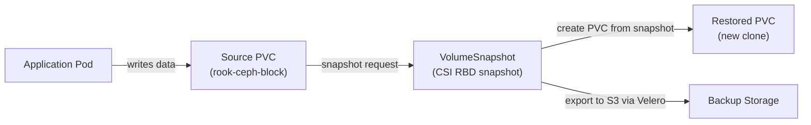

# How to Use Rook-Ceph CSI Snapshotter for Data Protection

Author: [nawazdhandala](https://www.github.com/nawazdhandala)

Tags: Rook, Ceph, Kubernetes, CSI, Snapshot, Data Protection, Storage

Description: Use the Rook-Ceph CSI snapshotter to create, manage, and restore VolumeSnapshots for RBD and CephFS volumes for application-consistent data protection.

---

## How CSI Snapshots Work with Rook-Ceph

The Kubernetes CSI snapshot framework allows taking point-in-time snapshots of persistent volumes. Rook-Ceph's CSI drivers for both RBD and CephFS support snapshots. An RBD snapshot is a lightweight COW (copy-on-write) point-in-time capture of an image. A CephFS snapshot freezes a subvolume's state. Snapshots can be used to create new PVCs (cloning) or as a basis for backups.



## Prerequisites

- CSI snapshotter components must be installed (separate from the core CSI driver)
- `snapshot.storage.k8s.io/v1` CRDs must be present

Install the snapshot controller and CRDs:

```bash
kubectl apply -f https://raw.githubusercontent.com/kubernetes-csi/external-snapshotter/release-8.0/client/config/crd/snapshot.storage.k8s.io_volumesnapshotclasses.yaml
kubectl apply -f https://raw.githubusercontent.com/kubernetes-csi/external-snapshotter/release-8.0/client/config/crd/snapshot.storage.k8s.io_volumesnapshotcontents.yaml
kubectl apply -f https://raw.githubusercontent.com/kubernetes-csi/external-snapshotter/release-8.0/client/config/crd/snapshot.storage.k8s.io_volumesnapshots.yaml
kubectl apply -f https://raw.githubusercontent.com/kubernetes-csi/external-snapshotter/release-8.0/deploy/kubernetes/snapshot-controller/rbac-snapshot-controller.yaml
kubectl apply -f https://raw.githubusercontent.com/kubernetes-csi/external-snapshotter/release-8.0/deploy/kubernetes/snapshot-controller/setup-snapshot-controller.yaml
```

Verify the snapshot controller is running:

```bash
kubectl -n kube-system get pods | grep snapshot-controller
```

## Step 1 - Create VolumeSnapshotClasses

Create a VolumeSnapshotClass for RBD:

```yaml
apiVersion: snapshot.storage.k8s.io/v1
kind: VolumeSnapshotClass
metadata:
  name: csi-rbdplugin-snapclass
driver: rook-ceph.rbd.csi.ceph.com
deletionPolicy: Delete
parameters:
  clusterID: rook-ceph
  csi.storage.k8s.io/volumesnapshot/secret-name: rook-csi-rbd-provisioner
  csi.storage.k8s.io/volumesnapshot/secret-namespace: rook-ceph
```

Create a VolumeSnapshotClass for CephFS:

```yaml
apiVersion: snapshot.storage.k8s.io/v1
kind: VolumeSnapshotClass
metadata:
  name: csi-cephfsplugin-snapclass
driver: rook-ceph.cephfs.csi.ceph.com
deletionPolicy: Delete
parameters:
  clusterID: rook-ceph
  csi.storage.k8s.io/volumesnapshot/secret-name: rook-csi-cephfs-provisioner
  csi.storage.k8s.io/volumesnapshot/secret-namespace: rook-ceph
```

Apply both:

```bash
kubectl apply -f volumesnapshotclass-rbd.yaml
kubectl apply -f volumesnapshotclass-cephfs.yaml
```

## Step 2 - Create a Source PVC

Create a PVC to snapshot:

```yaml
apiVersion: v1
kind: PersistentVolumeClaim
metadata:
  name: rbd-pvc
spec:
  accessModes:
    - ReadWriteOnce
  storageClassName: rook-ceph-block
  resources:
    requests:
      storage: 10Gi
```

Write some test data:

```bash
kubectl run writer --rm -it --image=alpine \
  --overrides='{"spec":{"volumes":[{"name":"data","persistentVolumeClaim":{"claimName":"rbd-pvc"}}],"containers":[{"name":"writer","image":"alpine","command":["sh","-c","echo test-data > /data/file.txt && cat /data/file.txt"],"volumeMounts":[{"mountPath":"/data","name":"data"}]}]}}' \
  --restart=Never
```

## Step 3 - Create a VolumeSnapshot

Take a snapshot of the PVC:

```yaml
apiVersion: snapshot.storage.k8s.io/v1
kind: VolumeSnapshot
metadata:
  name: rbd-pvc-snapshot
spec:
  volumeSnapshotClassName: csi-rbdplugin-snapclass
  source:
    persistentVolumeClaimName: rbd-pvc
```

Apply it:

```bash
kubectl apply -f volumesnapshot.yaml
```

Wait for the snapshot to be ready:

```bash
kubectl get volumesnapshot rbd-pvc-snapshot -w
```

The `readyToUse` field should become `true`:

```bash
kubectl get volumesnapshot rbd-pvc-snapshot -o jsonpath='{.status.readyToUse}'
```

## Step 4 - Inspect the Snapshot

Check the snapshot content:

```bash
kubectl describe volumesnapshot rbd-pvc-snapshot
```

The `VolumeSnapshotContent` contains the actual snapshot reference in Ceph:

```bash
kubectl get volumesnapshotcontent -o wide
```

Verify the snapshot in Ceph:

```bash
kubectl -n rook-ceph exec -it deploy/rook-ceph-tools -- \
  rbd snap ls replicapool/csi-vol-abc123
```

## Step 5 - Restore from Snapshot

Create a new PVC from the snapshot:

```yaml
apiVersion: v1
kind: PersistentVolumeClaim
metadata:
  name: rbd-pvc-restored
spec:
  storageClassName: rook-ceph-block
  dataSource:
    name: rbd-pvc-snapshot
    kind: VolumeSnapshot
    apiGroup: snapshot.storage.k8s.io
  accessModes:
    - ReadWriteOnce
  resources:
    requests:
      storage: 10Gi
```

Apply:

```bash
kubectl apply -f restored-pvc.yaml
kubectl get pvc rbd-pvc-restored
```

Verify the data is present in the restored PVC:

```bash
kubectl run reader --rm -it --image=alpine \
  --overrides='{"spec":{"volumes":[{"name":"data","persistentVolumeClaim":{"claimName":"rbd-pvc-restored"}}],"containers":[{"name":"reader","image":"alpine","command":["sh","-c","cat /data/file.txt"],"volumeMounts":[{"mountPath":"/data","name":"data"}]}]}}' \
  --restart=Never
```

## Step 6 - Clone a Volume

Volume cloning creates a new PVC from an existing PVC without going through a snapshot:

```yaml
apiVersion: v1
kind: PersistentVolumeClaim
metadata:
  name: rbd-pvc-clone
spec:
  storageClassName: rook-ceph-block
  dataSource:
    name: rbd-pvc
    kind: PersistentVolumeClaim
  accessModes:
    - ReadWriteOnce
  resources:
    requests:
      storage: 10Gi
```

## Scheduling Regular Snapshots

Use a CronJob to take application-consistent snapshots on a schedule:

```yaml
apiVersion: batch/v1
kind: CronJob
metadata:
  name: pvc-snapshot-cron
spec:
  schedule: "0 1 * * *"
  jobTemplate:
    spec:
      template:
        spec:
          serviceAccountName: snapshot-sa
          restartPolicy: OnFailure
          containers:
            - name: snapshot
              image: bitnami/kubectl:latest
              command:
                - sh
                - -c
                - |
                  DATE=$(date +%Y%m%d%H%M)
                  cat <<EOF | kubectl apply -f -
                  apiVersion: snapshot.storage.k8s.io/v1
                  kind: VolumeSnapshot
                  metadata:
                    name: rbd-pvc-snapshot-${DATE}
                  spec:
                    volumeSnapshotClassName: csi-rbdplugin-snapclass
                    source:
                      persistentVolumeClaimName: rbd-pvc
                  EOF
```

## Summary

Rook-Ceph CSI snapshotters for RBD and CephFS enable point-in-time data protection through the standard Kubernetes VolumeSnapshot API. Install the CSI snapshotter components and CRDs, create VolumeSnapshotClasses for RBD and CephFS, then use VolumeSnapshot resources to capture and restore PVC data. Snapshots can be restored to new PVCs for data recovery or used as source data for application testing. Schedule automated snapshots with CronJobs and set retention policies to manage snapshot lifecycle.
