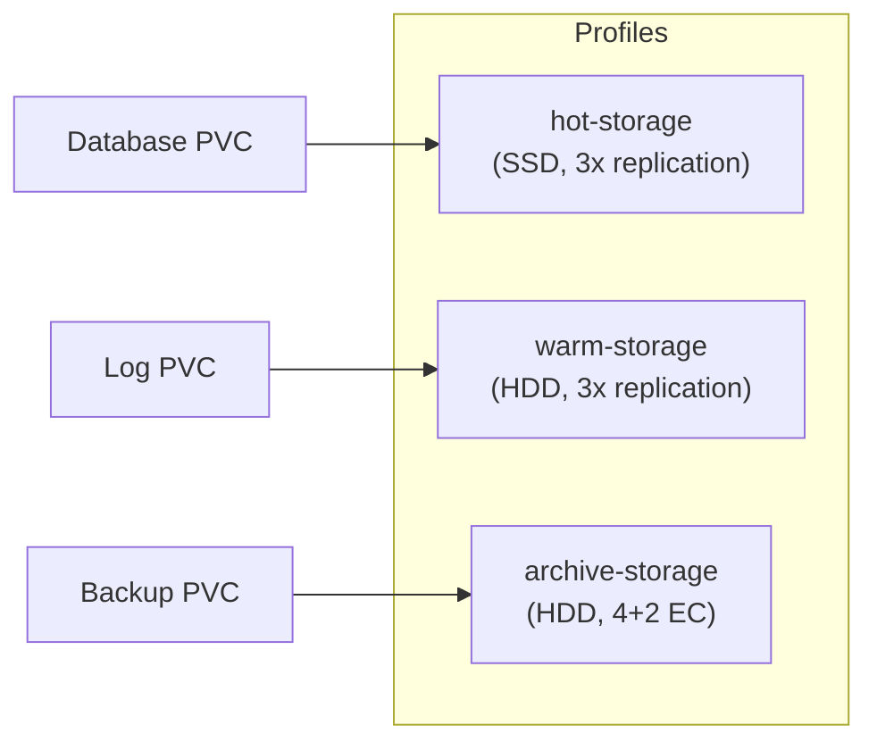

# How to Configure Rook-Ceph with Custom Storage Profiles

Author: [nawazdhandala](https://www.github.com/nawazdhandala)

Tags: Rook, Ceph, Kubernetes, Storage Profile, StorageClass, Configuration, Performance

Description: Create custom Rook-Ceph storage profiles with different replication factors, device classes, erasure coding, and compression settings for varied workload requirements.

---

## What Are Rook-Ceph Storage Profiles?

A "storage profile" in Rook-Ceph is a combination of a CephBlockPool (or CephFilesystem data pool) and a StorageClass, configured with specific settings for a target workload type. By creating multiple profiles - for example, a high-performance SSD profile, a high-capacity HDD profile, and an archival erasure-coded profile - you give application teams the flexibility to choose the right storage type for each workload.



## Profile 1 - High-Performance SSD Storage

For latency-sensitive workloads (databases, message queues):

```yaml
apiVersion: ceph.rook.io/v1
kind: CephBlockPool
metadata:
  name: hot-pool
  namespace: rook-ceph
spec:
  failureDomain: host
  deviceClass: ssd
  replicated:
    size: 3
    requireSafeReplicaSize: true
  parameters:
    compression_mode: none
---
apiVersion: storage.k8s.io/v1
kind: StorageClass
metadata:
  name: rook-ceph-hot
  annotations:
    storageclass.kubernetes.io/description: "High performance SSD storage (3x replication)"
provisioner: rook-ceph.rbd.csi.ceph.com
parameters:
  clusterID: rook-ceph
  pool: hot-pool
  imageFormat: "2"
  imageFeatures: layering
  csi.storage.k8s.io/fstype: xfs
  csi.storage.k8s.io/provisioner-secret-name: rook-csi-rbd-provisioner
  csi.storage.k8s.io/provisioner-secret-namespace: rook-ceph
  csi.storage.k8s.io/controller-expand-secret-name: rook-csi-rbd-provisioner
  csi.storage.k8s.io/controller-expand-secret-namespace: rook-ceph
  csi.storage.k8s.io/node-stage-secret-name: rook-csi-rbd-node
  csi.storage.k8s.io/node-stage-secret-namespace: rook-ceph
reclaimPolicy: Retain
allowVolumeExpansion: true
```

## Profile 2 - Standard HDD Storage

For general-purpose workloads that prioritize capacity over peak performance:

```yaml
apiVersion: ceph.rook.io/v1
kind: CephBlockPool
metadata:
  name: warm-pool
  namespace: rook-ceph
spec:
  failureDomain: host
  deviceClass: hdd
  replicated:
    size: 3
    requireSafeReplicaSize: true
  parameters:
    compression_mode: passive
---
apiVersion: storage.k8s.io/v1
kind: StorageClass
metadata:
  name: rook-ceph-warm
  annotations:
    storageclass.kubernetes.io/description: "Standard HDD storage (3x replication)"
provisioner: rook-ceph.rbd.csi.ceph.com
parameters:
  clusterID: rook-ceph
  pool: warm-pool
  imageFormat: "2"
  imageFeatures: layering
  csi.storage.k8s.io/fstype: xfs
  csi.storage.k8s.io/provisioner-secret-name: rook-csi-rbd-provisioner
  csi.storage.k8s.io/provisioner-secret-namespace: rook-ceph
  csi.storage.k8s.io/controller-expand-secret-name: rook-csi-rbd-provisioner
  csi.storage.k8s.io/controller-expand-secret-namespace: rook-ceph
  csi.storage.k8s.io/node-stage-secret-name: rook-csi-rbd-node
  csi.storage.k8s.io/node-stage-secret-namespace: rook-ceph
reclaimPolicy: Delete
allowVolumeExpansion: true
```

## Profile 3 - Erasure-Coded Archival Storage

For large, infrequently-accessed data where storage efficiency is paramount (4+2 EC = 1.5x overhead vs 3x for replicated):

```yaml
apiVersion: ceph.rook.io/v1
kind: CephBlockPool
metadata:
  name: archive-pool
  namespace: rook-ceph
spec:
  failureDomain: host
  deviceClass: hdd
  erasureCoded:
    dataChunks: 4
    codingChunks: 2
  parameters:
    compression_mode: aggressive
    compression_algorithm: zstd
---
apiVersion: storage.k8s.io/v1
kind: StorageClass
metadata:
  name: rook-ceph-archive
  annotations:
    storageclass.kubernetes.io/description: "Erasure coded archival HDD storage (4+2 EC, compressed)"
provisioner: rook-ceph.rbd.csi.ceph.com
parameters:
  clusterID: rook-ceph
  pool: archive-pool
  dataPool: archive-pool
  imageFormat: "2"
  imageFeatures: layering
  csi.storage.k8s.io/fstype: ext4
  csi.storage.k8s.io/provisioner-secret-name: rook-csi-rbd-provisioner
  csi.storage.k8s.io/provisioner-secret-namespace: rook-ceph
  csi.storage.k8s.io/controller-expand-secret-name: rook-csi-rbd-provisioner
  csi.storage.k8s.io/controller-expand-secret-namespace: rook-ceph
  csi.storage.k8s.io/node-stage-secret-name: rook-csi-rbd-node
  csi.storage.k8s.io/node-stage-secret-namespace: rook-ceph
reclaimPolicy: Retain
allowVolumeExpansion: true
```

## Profile 4 - Shared Filesystem Profile (ReadWriteMany)

For workloads needing shared access across multiple pods:

```yaml
apiVersion: ceph.rook.io/v1
kind: CephFilesystem
metadata:
  name: shared-fs
  namespace: rook-ceph
spec:
  metadataPool:
    replicated:
      size: 3
  dataPools:
    - name: hot
      deviceClass: ssd
      replicated:
        size: 3
    - name: warm
      deviceClass: hdd
      replicated:
        size: 3
---
apiVersion: storage.k8s.io/v1
kind: StorageClass
metadata:
  name: rook-cephfs-hot
  annotations:
    storageclass.kubernetes.io/description: "Shared CephFS on SSD (ReadWriteMany)"
provisioner: rook-ceph.cephfs.csi.ceph.com
parameters:
  clusterID: rook-ceph
  fsName: shared-fs
  pool: shared-fs-hot
  csi.storage.k8s.io/provisioner-secret-name: rook-csi-cephfs-provisioner
  csi.storage.k8s.io/provisioner-secret-namespace: rook-ceph
  csi.storage.k8s.io/controller-expand-secret-name: rook-csi-cephfs-provisioner
  csi.storage.k8s.io/controller-expand-secret-namespace: rook-ceph
  csi.storage.k8s.io/node-stage-secret-name: rook-csi-cephfs-node
  csi.storage.k8s.io/node-stage-secret-namespace: rook-ceph
reclaimPolicy: Delete
allowVolumeExpansion: true
```

## Profile 5 - Encrypted Block Storage

For workloads requiring compliance with data-at-rest encryption:

```yaml
apiVersion: storage.k8s.io/v1
kind: StorageClass
metadata:
  name: rook-ceph-encrypted
  annotations:
    storageclass.kubernetes.io/description: "Encrypted block storage (LUKS per-volume)"
provisioner: rook-ceph.rbd.csi.ceph.com
parameters:
  clusterID: rook-ceph
  pool: hot-pool
  imageFormat: "2"
  imageFeatures: layering
  encrypted: "true"
  csi.storage.k8s.io/provisioner-secret-name: rook-csi-rbd-provisioner
  csi.storage.k8s.io/provisioner-secret-namespace: rook-ceph
  csi.storage.k8s.io/controller-expand-secret-name: rook-csi-rbd-provisioner
  csi.storage.k8s.io/controller-expand-secret-namespace: rook-ceph
  csi.storage.k8s.io/node-stage-secret-name: rook-csi-rbd-node
  csi.storage.k8s.io/node-stage-secret-namespace: rook-ceph
reclaimPolicy: Retain
allowVolumeExpansion: true
```

## Applying All Profiles

Deploy all storage profiles at once:

```bash
kubectl apply -f hot-pool.yaml
kubectl apply -f warm-pool.yaml
kubectl apply -f archive-pool.yaml
kubectl apply -f shared-fs.yaml
```

Verify all pools and StorageClasses are created:

```bash
kubectl -n rook-ceph get cephblockpool
kubectl -n rook-ceph get cephfilesystem
kubectl get storageclass | grep rook
```

## Documenting Storage Profiles for Teams

Use StorageClass annotations to document each profile:

```bash
kubectl annotate storageclass rook-ceph-hot \
  storageclass.kubernetes.io/description="SSD, 3x replication, xfs, no compression. Use for: databases, caches. Cost: high"
kubectl annotate storageclass rook-ceph-archive \
  storageclass.kubernetes.io/description="HDD, 4+2 EC, zstd compression. Use for: backups, logs, archives. Cost: low"
```

## Testing Profile Performance

Quick IOPS comparison across profiles:

```bash
for profile in rook-ceph-hot rook-ceph-warm rook-ceph-archive; do
  echo "=== Testing ${profile} ==="
  kubectl run fio-test --rm -it --image=nixery.dev/shell/fio \
    --overrides="{\"spec\":{\"volumes\":[{\"name\":\"data\",\"persistentVolumeClaim\":{\"claimName\":\"${profile}-test\"}}],\"containers\":[{\"name\":\"fio\",\"image\":\"nixery.dev/shell/fio\",\"volumeMounts\":[{\"mountPath\":\"/data\",\"name\":\"data\"}]}]}}" \
    -- fio --name=test --ioengine=libaio --direct=1 --rw=randread \
       --bs=4k --numjobs=4 --iodepth=32 --runtime=30 \
       --filename=/data/testfile --size=1G
done
```

## Summary

Custom Rook-Ceph storage profiles are created by combining CephBlockPool or CephFilesystem resources with matching StorageClass configurations. Create dedicated pools with the appropriate device class (ssd/hdd), replication or erasure coding strategy, and compression settings for each workload category. Expose each profile as a named StorageClass with descriptive annotations so application teams can choose the right storage tier. This self-service model reduces the operational burden on storage administrators while giving developers appropriate storage options.
