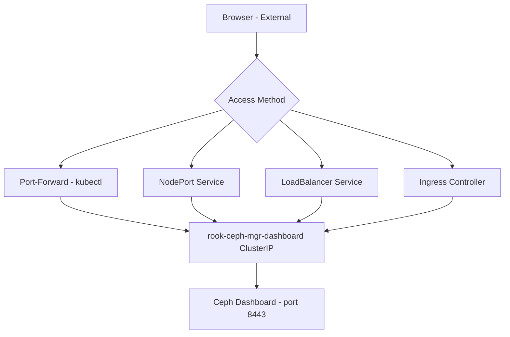

# How to Access the Rook-Ceph Dashboard from Outside the Cluster

Author: [nawazdhandala](https://www.github.com/nawazdhandala)

Tags: Rook, Ceph, Kubernetes, Dashboard, Ingress, LoadBalancer, Networking

Description: Learn how to expose the Rook-Ceph Dashboard externally using Ingress, NodePort, or LoadBalancer services for access from outside your Kubernetes cluster.

---

## Why External Dashboard Access Requires Extra Configuration

The Ceph Dashboard service created by Rook is a `ClusterIP` service, accessible only within the cluster. To reach it from a browser outside the cluster, you need to expose it using one of three methods: port-forward (for local development), NodePort (for simple external access), or Ingress (for production with proper DNS and TLS).



## Method 1 - Port-Forward (Development/Testing)

The fastest way to access the dashboard without changing any Kubernetes resources:

```bash
kubectl -n rook-ceph port-forward svc/rook-ceph-mgr-dashboard 8443:8443
```

Open `https://localhost:8443` in your browser. This method only works while the `kubectl port-forward` command is running.

For HTTP (non-SSL dashboard):

```bash
kubectl -n rook-ceph port-forward svc/rook-ceph-mgr-dashboard 7000:7000
```

## Method 2 - NodePort Service

Create a NodePort service to expose the dashboard on every cluster node:

```yaml
apiVersion: v1
kind: Service
metadata:
  name: rook-ceph-dashboard-nodeport
  namespace: rook-ceph
  labels:
    app: rook-ceph-mgr
spec:
  type: NodePort
  selector:
    app: rook-ceph-mgr
    rook_cluster: rook-ceph
  ports:
    - name: https-dashboard
      port: 8443
      targetPort: 8443
      # NodePort in range 30000-32767 (optional, auto-assigned if omitted)
      nodePort: 30443
```

```bash
kubectl apply -f dashboard-nodeport.yaml
```

Access at `https://<any-node-ip>:30443`.

## Method 3 - LoadBalancer Service

For clusters with a cloud load balancer or MetalLB:

```yaml
apiVersion: v1
kind: Service
metadata:
  name: rook-ceph-dashboard-lb
  namespace: rook-ceph
  labels:
    app: rook-ceph-mgr
  annotations:
    # MetalLB annotation (if applicable)
    metallb.universe.tf/address-pool: default
spec:
  type: LoadBalancer
  selector:
    app: rook-ceph-mgr
    rook_cluster: rook-ceph
  ports:
    - name: https-dashboard
      port: 443
      targetPort: 8443
```

```bash
kubectl apply -f dashboard-lb.yaml

# Get the assigned external IP
kubectl -n rook-ceph get svc rook-ceph-dashboard-lb
```

## Method 4 - Ingress with NGINX

For production access with proper TLS termination at the Ingress and a friendly hostname, use an Ingress resource. The dashboard uses HTTPS internally, so configure the Ingress to use SSL passthrough or backend protocol annotation.

### Option A - SSL Passthrough (Ingress passes TLS directly to dashboard)

```yaml
apiVersion: networking.k8s.io/v1
kind: Ingress
metadata:
  name: rook-ceph-dashboard
  namespace: rook-ceph
  annotations:
    nginx.ingress.kubernetes.io/backend-protocol: "HTTPS"
    nginx.ingress.kubernetes.io/ssl-passthrough: "true"
    nginx.ingress.kubernetes.io/ssl-redirect: "true"
spec:
  ingressClassName: nginx
  rules:
    - host: ceph-dashboard.example.com
      http:
        paths:
          - path: /
            pathType: Prefix
            backend:
              service:
                name: rook-ceph-mgr-dashboard
                port:
                  number: 8443
  tls:
    - hosts:
        - ceph-dashboard.example.com
      secretName: ceph-dashboard-tls
```

### Option B - TLS Termination at Ingress (HTTP to dashboard backend)

First, disable SSL on the dashboard and switch to HTTP:

```bash
kubectl -n rook-ceph patch cephcluster rook-ceph \
  --type=merge \
  -p '{"spec":{"dashboard":{"ssl":false,"port":7000}}}'
```

Then create an Ingress that terminates TLS and forwards HTTP:

```yaml
apiVersion: networking.k8s.io/v1
kind: Ingress
metadata:
  name: rook-ceph-dashboard
  namespace: rook-ceph
  annotations:
    nginx.ingress.kubernetes.io/ssl-redirect: "true"
spec:
  ingressClassName: nginx
  rules:
    - host: ceph-dashboard.example.com
      http:
        paths:
          - path: /
            pathType: Prefix
            backend:
              service:
                name: rook-ceph-mgr-dashboard
                port:
                  number: 7000
  tls:
    - hosts:
        - ceph-dashboard.example.com
      secretName: ceph-dashboard-tls
```

## Adding DNS

Point your domain at the Ingress controller's external IP:

```bash
# Get Ingress controller external IP
kubectl -n ingress-nginx get svc ingress-nginx-controller

# Add DNS record (example with kubectl-style documentation)
# A record: ceph-dashboard.example.com -> <ingress-external-ip>
```

## Securing Dashboard Access

For production, restrict who can access the dashboard:

### Change the Admin Password

```bash
kubectl -n rook-ceph exec deploy/rook-ceph-tools -- \
  ceph dashboard ac-user-set-password admin --force-password 'StrongPassword!2026'
```

### Create a Read-Only User

```bash
kubectl -n rook-ceph exec deploy/rook-ceph-tools -- bash -c "
  ceph dashboard ac-user-create readonly-viewer \
    --force-password 'ReadOnlyPass!123' \
    -i /dev/stdin <<< ''
  ceph dashboard ac-user-set-roles readonly-viewer read-only
"
```

### Restrict by Source IP (Ingress)

```yaml
metadata:
  annotations:
    nginx.ingress.kubernetes.io/whitelist-source-range: "10.0.0.0/8,192.168.0.0/16"
```

## Summary

Exposing the Rook-Ceph Dashboard externally requires changing the default ClusterIP Service to NodePort, LoadBalancer, or routing through an Ingress controller. For development, use `kubectl port-forward`. For production, use an Ingress with TLS termination and a proper hostname. When using NGINX Ingress, either use SSL passthrough (to keep end-to-end TLS) or disable SSL on the dashboard and terminate TLS at the Ingress. Always change the default admin password and consider creating read-only users for operators who only need monitoring access.
