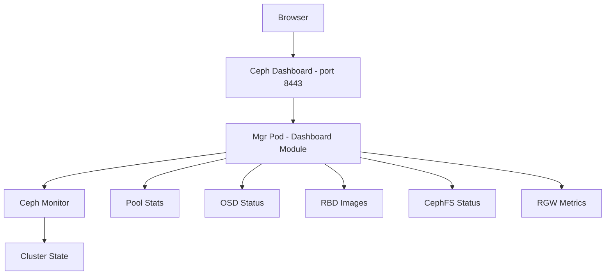

# How to Use the Rook-Ceph Dashboard for Cluster Monitoring

Author: [nawazdhandala](https://www.github.com/nawazdhandala)

Tags: Rook, Ceph, Kubernetes, Dashboard, Monitoring, Observability

Description: Learn how to navigate and use the Ceph Dashboard deployed by Rook for real-time cluster monitoring, OSD management, and pool inspection.

---

## What the Ceph Dashboard Provides

The Ceph Dashboard is a web-based management interface built into the Ceph Manager. When enabled in Rook, it runs as part of the `rook-ceph-mgr` pod and provides real-time visibility into cluster health, OSD status, pool utilization, RBD images, CephFS filesystems, and object store activity.



## Dashboard Sections Overview

### Cluster Dashboard (Home)

The home screen shows:
- Overall cluster health (HEALTH_OK / HEALTH_WARN / HEALTH_ERR)
- Capacity used vs. available
- IOPS and throughput metrics
- Active alerts and recent log entries

### OSD Management

Navigate to Cluster > OSDs to see:
- Each OSD's state (up/down, in/out)
- Per-OSD disk usage and performance metrics
- The CRUSH map hierarchy
- OSD flags (norebalance, noout, etc.)

### Pools

Navigate to Pools to see:
- All storage pools with usage, PG count, and replication factor
- Read/write throughput per pool
- PG health status for each pool

### Block Storage (RBD)

Navigate to Block > Images to:
- List all RBD images across pools
- View image details (size, features, snapshots)
- Create and delete snapshots
- Enable/disable image features

### Filesystems (CephFS)

Navigate to File > File Systems to see:
- Active and standby MDS daemons
- Client count and active paths
- Per-filesystem data and metadata usage

### Object Storage (RGW)

Navigate to Object > Gateways to see:
- Active RGW daemons and their zones
- Object storage performance metrics

## Accessing the Dashboard

Enable the dashboard in your CephCluster CR:

```yaml
spec:
  dashboard:
    enabled: true
    ssl: true
```

Get the dashboard service:

```bash
kubectl -n rook-ceph get svc rook-ceph-mgr-dashboard
```

The dashboard runs on port 8443 (HTTPS) or 7000 (HTTP) by default. Access it via port-forward:

```bash
kubectl -n rook-ceph port-forward svc/rook-ceph-mgr-dashboard 8443:8443
```

Open `https://localhost:8443` in your browser (accept the self-signed certificate).

## Logging In

Get the auto-generated admin password:

```bash
kubectl -n rook-ceph get secret rook-ceph-dashboard-password \
  -o jsonpath='{.data.password}' | base64 --decode
echo ""
```

Log in with username `admin` and the password from above.

## Setting a Custom Admin Password

Change the dashboard admin password from the toolbox:

```bash
kubectl -n rook-ceph exec deploy/rook-ceph-tools -- \
  ceph dashboard ac-user-set-password admin --force-password 'MyNewSecurePassword!'
```

## Key Monitoring Views

### Cluster Health Detail

From the dashboard home, click on any health warning to see the detailed explanation and recommended action. For example, a `PG_DEGRADED` warning shows:
- How many PGs are degraded
- Which OSDs are affected
- Estimated recovery time

### Capacity Planning

The dashboard's capacity chart shows:
- Raw capacity vs. available capacity
- Usage trends over time
- Per-pool breakdown of storage consumption

This helps you predict when you need to add OSDs.

### Performance Monitoring

The dashboard shows cluster-wide and per-OSD performance metrics:
- Read/write IOPS
- Throughput (MB/s)
- Latency (average and 99th percentile)
- Active clients

## Creating Objects from the Dashboard

The dashboard allows administrative operations beyond read-only monitoring:

**Create a Pool:**
1. Go to Pools > Create
2. Set name, type (replicated/erasure), and PG count
3. Click Create

**Take an RBD Snapshot:**
1. Go to Block > Images
2. Select an image
3. Click Snapshots > Create Snapshot
4. Enter snapshot name and click Create

**Set OSD Flags:**
1. Go to Cluster > OSDs
2. Click Cluster-wide configuration
3. Enable flags like `norebalance` or `noout`

## Dashboard API Access

The dashboard exposes a REST API that you can use for automation:

```bash
# Get an auth token
TOKEN=$(curl -sk -X POST \
  https://localhost:8443/api/auth \
  -H "Content-Type: application/json" \
  -d '{"username": "admin", "password": "yourpassword"}' \
  | jq -r '.token')

# Check cluster health via API
curl -sk -H "Authorization: Bearer $TOKEN" \
  https://localhost:8443/api/health/minimal | jq
```

## Summary

The Ceph Dashboard provides a comprehensive visual interface for cluster management and monitoring. Enable it in the CephCluster CR with `dashboard.enabled: true`, access it via port-forward, and log in with the `admin` credentials from the `rook-ceph-dashboard-password` Secret. The dashboard covers OSD health, pool utilization, RBD image management, CephFS monitoring, and RGW metrics in a single interface. The built-in REST API also allows you to integrate dashboard data into external monitoring systems.
