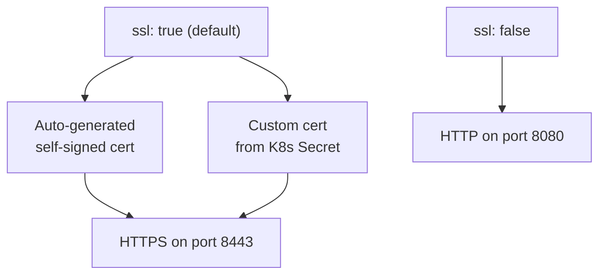

# How to Enable SSL for the Ceph Dashboard in Rook

Author: [nawazdhandala](https://www.github.com/nawazdhandala)

Tags: Rook, Ceph, Kubernetes, Dashboard, SSL, TLS, Security

Description: Enable and configure SSL for the Ceph Dashboard in Rook-Ceph, including self-signed certificates, custom TLS secrets, and certificate rotation procedures.

---

## Dashboard SSL Options

The Ceph Dashboard can run with or without SSL. By default, Rook enables SSL with a self-signed certificate generated by Ceph. You can also provide your own certificate via a Kubernetes TLS Secret.



## Enabling SSL with Auto-Generated Certificate

The simplest SSL setup uses the default Ceph-generated self-signed certificate:

```yaml
apiVersion: ceph.rook.io/v1
kind: CephCluster
metadata:
  name: rook-ceph
  namespace: rook-ceph
spec:
  cephVersion:
    image: quay.io/ceph/ceph:v19.2.0
  dataDirHostPath: /var/lib/rook
  dashboard:
    enabled: true
    ssl: true
    port: 8443
```

The certificate is automatically generated when the Dashboard module is enabled. Access it at `https://<service-ip>:8443` and accept the browser warning about the self-signed cert.

## Disabling SSL (HTTP Only)

For internal-only clusters behind a TLS-terminating proxy:

```yaml
spec:
  dashboard:
    enabled: true
    ssl: false
    port: 8080
```

This simplifies debugging and removes the need to deal with self-signed certificate warnings.

## Using a Custom TLS Certificate

To avoid certificate warnings, create a Kubernetes TLS Secret with your certificate:

```bash
# With cert-manager generated cert, or manually:
kubectl -n rook-ceph create secret tls dashboard-tls \
  --cert=dashboard.crt \
  --key=dashboard.key
```

Or using Let's Encrypt via cert-manager:

```yaml
apiVersion: cert-manager.io/v1
kind: Certificate
metadata:
  name: rook-ceph-dashboard
  namespace: rook-ceph
spec:
  secretName: dashboard-tls
  issuerRef:
    name: letsencrypt-prod
    kind: ClusterIssuer
  dnsNames:
    - ceph.example.com
```

Then reference the TLS secret in the Ingress:

```yaml
apiVersion: networking.k8s.io/v1
kind: Ingress
metadata:
  name: rook-ceph-dashboard
  namespace: rook-ceph
  annotations:
    nginx.ingress.kubernetes.io/backend-protocol: "HTTPS"
spec:
  ingressClassName: nginx
  tls:
    - hosts:
        - ceph.example.com
      secretName: dashboard-tls
  rules:
    - host: ceph.example.com
      http:
        paths:
          - path: /
            pathType: Prefix
            backend:
              service:
                name: rook-ceph-mgr-dashboard
                port:
                  number: 8443
```

## Configuring Ceph to Use a Custom Certificate

To replace the self-signed Ceph certificate with your own, use the Ceph CLI via the toolbox:

```bash
kubectl -n rook-ceph exec -it deploy/rook-ceph-tools -- bash

# Store the cert and key in Ceph configuration
ceph dashboard set-ssl-certificate -i /tmp/dashboard.crt
ceph dashboard set-ssl-certificate-key -i /tmp/dashboard.key
ceph mgr module disable dashboard
ceph mgr module enable dashboard
```

Or inject the cert via a Kubernetes Secret and configure Ceph during startup using an init container or operator hook.

## Rotating Certificates

To rotate an expired or compromised certificate:

```bash
# Replace the secret
kubectl -n rook-ceph create secret tls dashboard-tls \
  --cert=new-dashboard.crt \
  --key=new-dashboard.key \
  --dry-run=client -o yaml | kubectl apply -f -

# Restart the MGR pod to pick up new cert
kubectl -n rook-ceph rollout restart deploy/rook-ceph-mgr
```

## Verifying the Certificate

Check the certificate used by the dashboard:

```bash
kubectl -n rook-ceph port-forward svc/rook-ceph-mgr-dashboard 8443:8443 &
openssl s_client -connect localhost:8443 -showcerts 2>/dev/null | \
  openssl x509 -noout -dates -subject
```

This shows the certificate expiry and subject.

## Summary

Rook-Ceph enables SSL for the Ceph Dashboard by default using a Ceph-generated self-signed certificate when `spec.dashboard.ssl: true`. For production, use cert-manager or a manual TLS Secret with a CA-signed certificate and expose the dashboard through a TLS-enabled Ingress. The Ingress handles external TLS termination or re-encryption to the backend HTTPS service. Rotate certificates by updating the Kubernetes Secret and restarting the MGR deployment.
