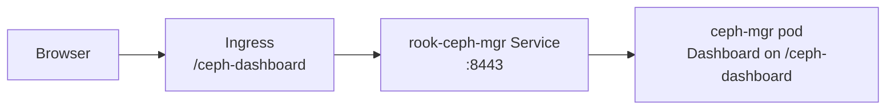

# How to Configure Dashboard URL Prefix and Port in Rook

Author: [nawazdhandala](https://www.github.com/nawazdhandala)

Tags: Rook, Ceph, Kubernetes, Dashboard, Storage, Configuration

Description: Configure the Ceph Dashboard URL prefix and port settings in the CephCluster CRD to customize how the dashboard is exposed through reverse proxies and Ingress controllers.

---

## Dashboard URL Prefix and Port Overview

The Ceph Dashboard runs inside the `rook-ceph-mgr` pod and is exposed as a Kubernetes Service. By default it listens on port 8443 (HTTPS) or 8080 (HTTP). When placed behind a reverse proxy or Kubernetes Ingress with a non-root path prefix, you must configure both the prefix and port to match the external routing.



## Default Dashboard Service

The Rook operator creates a service named `rook-ceph-mgr-dashboard`:

```bash
kubectl -n rook-ceph get svc rook-ceph-mgr-dashboard
```

By default:
- Port: 8443 (with SSL) or 8080 (without SSL)
- Protocol: TCP
- Service type: ClusterIP

## Configuring Port and URL Prefix in the CephCluster CRD

```yaml
apiVersion: ceph.rook.io/v1
kind: CephCluster
metadata:
  name: rook-ceph
  namespace: rook-ceph
spec:
  cephVersion:
    image: quay.io/ceph/ceph:v19.2.0
  dataDirHostPath: /var/lib/rook
  dashboard:
    enabled: true
    ssl: true
    port: 8443
    urlPrefix: /ceph-dashboard
```

The `urlPrefix` setting tells the Ceph Dashboard to serve all its assets and API endpoints under the specified path prefix. This is required when the Ingress routes requests from `/ceph-dashboard/*` to the dashboard service.

## Exposing with Kubernetes Ingress

Create an Ingress that routes based on the URL prefix:

```yaml
apiVersion: networking.k8s.io/v1
kind: Ingress
metadata:
  name: rook-ceph-dashboard
  namespace: rook-ceph
  annotations:
    nginx.ingress.kubernetes.io/backend-protocol: "HTTPS"
    nginx.ingress.kubernetes.io/rewrite-target: /$2
    nginx.ingress.kubernetes.io/ssl-redirect: "true"
spec:
  ingressClassName: nginx
  rules:
    - host: k8s.example.com
      http:
        paths:
          - path: /ceph-dashboard(/|$)(.*)
            pathType: Prefix
            backend:
              service:
                name: rook-ceph-mgr-dashboard
                port:
                  number: 8443
  tls:
    - hosts:
        - k8s.example.com
      secretName: k8s-tls
```

## Changing the Port

To expose the dashboard on a non-default port, set `port` in the dashboard spec:

```yaml
spec:
  dashboard:
    enabled: true
    ssl: false
    port: 7000
```

After applying, verify the Service reflects the new port:

```bash
kubectl -n rook-ceph get svc rook-ceph-mgr-dashboard \
  -o jsonpath='{.spec.ports[0].port}'
```

## Port-Forward for Quick Access (No Ingress)

Without an Ingress, use port-forwarding for local access:

```bash
kubectl -n rook-ceph port-forward svc/rook-ceph-mgr-dashboard 8443:8443
```

Then open `https://localhost:8443` in a browser (accept the self-signed certificate).

## Retrieving the Dashboard Password

The dashboard admin password is stored in a Kubernetes Secret:

```bash
kubectl -n rook-ceph get secret rook-ceph-dashboard-password \
  -o jsonpath='{.data.password}' | base64 --decode
```

## Exposing via NodePort

If you prefer NodePort over Ingress:

```yaml
apiVersion: v1
kind: Service
metadata:
  name: rook-ceph-dashboard-nodeport
  namespace: rook-ceph
spec:
  type: NodePort
  selector:
    app: rook-ceph-mgr
    rook_cluster: rook-ceph
  ports:
    - name: dashboard
      port: 8443
      targetPort: 8443
      nodePort: 30443
      protocol: TCP
```

Access at `https://<node-ip>:30443`.

## Summary

Configure the Ceph Dashboard URL prefix and port via the `spec.dashboard.port` and `spec.dashboard.urlPrefix` fields in the CephCluster CRD. The `urlPrefix` is essential when placing the dashboard behind a reverse proxy that routes based on path. Set `port` to match your network policies or Ingress configuration. The dashboard service is created automatically as `rook-ceph-mgr-dashboard` in the Rook namespace and can be exposed via NodePort, LoadBalancer, or Ingress.
