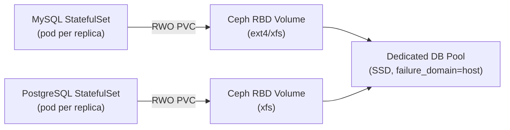

# How to Set Up Rook-Ceph for Database Workloads (MySQL, PostgreSQL)

Author: [nawazdhandala](https://www.github.com/nawazdhandala)

Tags: Rook, Ceph, Kubernetes, MySQL, PostgreSQL, Database, Storage

Description: Configure Rook-Ceph block storage for MySQL and PostgreSQL on Kubernetes with performance-optimized StorageClasses, StatefulSets, and data protection settings.

---

## Why Rook-Ceph Works for Databases

Databases require low-latency random I/O, durable writes (fsync support), and independent storage per replica. Rook-Ceph's RBD (RADOS Block Device) satisfies all three requirements: each database pod gets a dedicated RBD volume with full POSIX filesystem semantics, Ceph's write journal ensures durability, and BlueStore's write path supports direct I/O for maximum performance.



## Step 1 - Create a Dedicated Database Pool

Create a separate Ceph pool for databases to isolate their I/O from other workloads:

```yaml
apiVersion: ceph.rook.io/v1
kind: CephBlockPool
metadata:
  name: db-pool
  namespace: rook-ceph
spec:
  failureDomain: host
  deviceClass: ssd
  replicated:
    size: 3
    requireSafeReplicaSize: true
  parameters:
    compression_mode: none
    pg_num: "128"
```

Apply it:

```bash
kubectl apply -f cephblockpool-db.yaml
```

Verify the pool was created on SSD devices:

```bash
kubectl -n rook-ceph exec -it deploy/rook-ceph-tools -- \
  ceph osd pool get db-pool crush_rule
```

## Step 2 - Create a Database StorageClass

Create a StorageClass pointing to the database pool with `xfs` filesystem (preferred for both MySQL and PostgreSQL):

```yaml
apiVersion: storage.k8s.io/v1
kind: StorageClass
metadata:
  name: rook-ceph-db
provisioner: rook-ceph.rbd.csi.ceph.com
parameters:
  clusterID: rook-ceph
  pool: db-pool
  imageFormat: "2"
  imageFeatures: layering
  csi.storage.k8s.io/fstype: xfs
  csi.storage.k8s.io/provisioner-secret-name: rook-csi-rbd-provisioner
  csi.storage.k8s.io/provisioner-secret-namespace: rook-ceph
  csi.storage.k8s.io/controller-expand-secret-name: rook-csi-rbd-provisioner
  csi.storage.k8s.io/controller-expand-secret-namespace: rook-ceph
  csi.storage.k8s.io/node-stage-secret-name: rook-csi-rbd-node
  csi.storage.k8s.io/node-stage-secret-namespace: rook-ceph
reclaimPolicy: Retain
allowVolumeExpansion: true
```

Using `xfs` provides better performance for database I/O patterns. Using `Retain` reclaim policy prevents accidental data loss.

## Step 3 - Deploy MySQL with Rook-Ceph

Deploy a MySQL StatefulSet using the database StorageClass:

```yaml
apiVersion: apps/v1
kind: StatefulSet
metadata:
  name: mysql
spec:
  serviceName: mysql
  replicas: 1
  selector:
    matchLabels:
      app: mysql
  template:
    metadata:
      labels:
        app: mysql
    spec:
      containers:
        - name: mysql
          image: mysql:8.0
          env:
            - name: MYSQL_ROOT_PASSWORD
              valueFrom:
                secretKeyRef:
                  name: mysql-secret
                  key: root-password
          args:
            - --innodb-flush-log-at-trx-commit=1
            - --sync-binlog=1
            - --innodb-buffer-pool-size=1G
          ports:
            - containerPort: 3306
          volumeMounts:
            - name: data
              mountPath: /var/lib/mysql
          resources:
            requests:
              cpu: "1"
              memory: "2Gi"
            limits:
              cpu: "4"
              memory: "8Gi"
  volumeClaimTemplates:
    - metadata:
        name: data
      spec:
        accessModes:
          - ReadWriteOnce
        storageClassName: rook-ceph-db
        resources:
          requests:
            storage: 100Gi
---
apiVersion: v1
kind: Service
metadata:
  name: mysql
spec:
  clusterIP: None
  selector:
    app: mysql
  ports:
    - port: 3306
```

Create the MySQL secret:

```bash
kubectl create secret generic mysql-secret \
  --from-literal=root-password="$(openssl rand -base64 16)"
```

Apply:

```bash
kubectl apply -f mysql-statefulset.yaml
```

## Step 4 - Deploy PostgreSQL with Rook-Ceph

Deploy a PostgreSQL StatefulSet with performance tuning for Rook-Ceph RBD:

```yaml
apiVersion: apps/v1
kind: StatefulSet
metadata:
  name: postgresql
spec:
  serviceName: postgresql
  replicas: 1
  selector:
    matchLabels:
      app: postgresql
  template:
    metadata:
      labels:
        app: postgresql
    spec:
      containers:
        - name: postgresql
          image: postgres:16
          env:
            - name: POSTGRES_PASSWORD
              valueFrom:
                secretKeyRef:
                  name: postgresql-secret
                  key: password
            - name: PGDATA
              value: /var/lib/postgresql/data/pgdata
          args:
            - -c
            - shared_buffers=256MB
            - -c
            - max_connections=200
            - -c
            - effective_cache_size=1GB
            - -c
            - wal_buffers=16MB
            - -c
            - checkpoint_completion_target=0.9
            - -c
            - random_page_cost=1.5
          ports:
            - containerPort: 5432
          volumeMounts:
            - name: data
              mountPath: /var/lib/postgresql/data
          resources:
            requests:
              cpu: "1"
              memory: "2Gi"
            limits:
              cpu: "4"
              memory: "8Gi"
  volumeClaimTemplates:
    - metadata:
        name: data
      spec:
        accessModes:
          - ReadWriteOnce
        storageClassName: rook-ceph-db
        resources:
          requests:
            storage: 100Gi
---
apiVersion: v1
kind: Service
metadata:
  name: postgresql
spec:
  clusterIP: None
  selector:
    app: postgresql
  ports:
    - port: 5432
```

Create the PostgreSQL secret:

```bash
kubectl create secret generic postgresql-secret \
  --from-literal=password="$(openssl rand -base64 16)"
```

## Step 5 - Set random_page_cost for Ceph RBD

PostgreSQL's `random_page_cost` defaults to 4.0 (for rotating disks). Since Ceph RBD over network storage has similar random access costs to SSDs but with added network latency, set it lower:

Connect to PostgreSQL and update the setting:

```bash
kubectl exec -it postgresql-0 -- psql -U postgres \
  -c "ALTER SYSTEM SET random_page_cost = 1.5;"
kubectl exec -it postgresql-0 -- psql -U postgres \
  -c "SELECT pg_reload_conf();"
```

## Step 6 - Configure Pool Flags for Database Performance

Disable compression on the database pool (databases already compress their data):

```bash
kubectl -n rook-ceph exec -it deploy/rook-ceph-tools -- \
  ceph osd pool set db-pool compression_mode none
```

Set the pool application:

```bash
kubectl -n rook-ceph exec -it deploy/rook-ceph-tools -- \
  ceph osd pool application enable db-pool rbd
```

## Step 7 - Setting Up Regular Backups

Use a CronJob with mysqldump or pg_dump to back up databases to Rook-Ceph object storage:

```yaml
apiVersion: batch/v1
kind: CronJob
metadata:
  name: postgres-backup
spec:
  schedule: "0 2 * * *"
  jobTemplate:
    spec:
      template:
        spec:
          restartPolicy: OnFailure
          containers:
            - name: backup
              image: postgres:16
              env:
                - name: PGPASSWORD
                  valueFrom:
                    secretKeyRef:
                      name: postgresql-secret
                      key: password
              command:
                - sh
                - -c
                - |
                  DATE=$(date +%Y%m%d_%H%M%S)
                  pg_dump -h postgresql -U postgres mydb | \
                  aws s3 cp - s3://backups/postgres/backup_${DATE}.sql \
                    --endpoint-url http://rook-ceph-rgw-my-store.rook-ceph.svc \
                    --no-sign-request
```

## Summary

Rook-Ceph provides excellent block storage for MySQL and PostgreSQL on Kubernetes through dedicated CephBlockPools on SSD device classes, `xfs`-formatted RBD volumes, and per-replica PVCs via StatefulSet `volumeClaimTemplates`. Key optimizations include disabling pool compression, using `reclaimPolicy: Retain`, and tuning PostgreSQL's `random_page_cost` to 1.5 for network-attached block storage. Combine with Velero or custom backup CronJobs using Rook-Ceph RGW for complete data protection.
