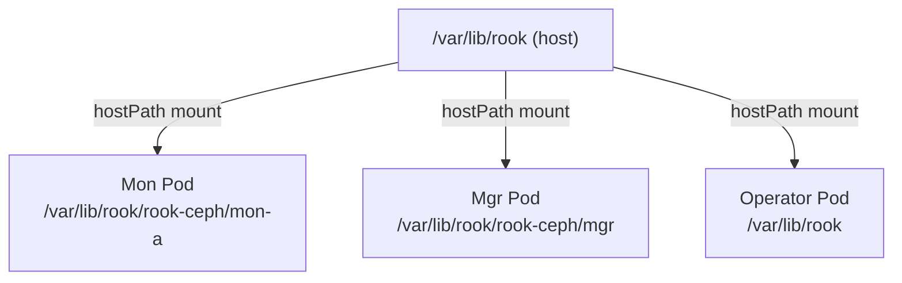

# How to Configure dataDirHostPath in Rook CephCluster CRD

Author: [nawazdhandala](https://www.github.com/nawazdhandala)

Tags: Rook, Ceph, Kubernetes, Storage, Configuration, CRD

Description: Understand and configure the dataDirHostPath field in the CephCluster CRD, including default values, permission requirements, and best practices for production deployments.

---

## What dataDirHostPath Controls

The `dataDirHostPath` field in the CephCluster spec specifies the path on the host node where Rook stores its configuration and state data for Ceph daemons. This directory is mounted into Mon, OSD, and MGR pods as a hostPath volume. The data persists across pod restarts because it lives on the host filesystem, not inside the container.



## Default Value

If omitted, `dataDirHostPath` has no default and Rook requires it to be explicitly set. You must provide a path. The conventional value is:

```yaml
spec:
  dataDirHostPath: /var/lib/rook
```

This tells Rook to write Mon keyring files, OSD bootstrap credentials, and operator state under `/var/lib/rook` on each node.

## What Gets Stored Under dataDirHostPath

After deploying a CephCluster with `dataDirHostPath: /var/lib/rook`, the directory structure on Mon nodes looks like this:

```bash
/var/lib/rook/
  rook-ceph/
    mon-a/
      keyring
      config
    mon-b/
      keyring
      config
    mon-c/
      keyring
      config
    client.admin.keyring
    rook-ceph.config
```

OSD nodes also store bootstrap credentials here before handing off to Ceph's own data store.

## Configuration in CephCluster CRD

A minimal configuration specifying the path:

```yaml
apiVersion: ceph.rook.io/v1
kind: CephCluster
metadata:
  name: rook-ceph
  namespace: rook-ceph
spec:
  cephVersion:
    image: quay.io/ceph/ceph:v19.2.0
  dataDirHostPath: /var/lib/rook
  mon:
    count: 3
    allowMultiplePerNode: false
  storage:
    useAllNodes: true
    useAllDevices: true
```

## Changing dataDirHostPath on an Existing Cluster

Changing `dataDirHostPath` on a running cluster requires a full cluster rebuild. The Mon keyrings and configuration stored in the old path are not migrated automatically. Never change this value in production without a migration plan.

To migrate safely:

1. Back up all Mon keyring files from the old path
2. Delete the CephCluster resource
3. Wait for all Ceph pods to terminate
4. Recreate the CephCluster with the new path
5. Rook will bootstrap a fresh cluster

## Host Permissions

The Rook operator creates this directory automatically with the required permissions. If you pre-create it, ensure it is owned by root:

```bash
mkdir -p /var/lib/rook
chmod 0755 /var/lib/rook
```

On SELinux-enforcing systems (RHEL, CentOS), the directory needs the correct context:

```bash
chcon -Rt svirt_sandbox_file_t /var/lib/rook
```

Or use a persistent SELinux policy:

```bash
semanage fcontext -a -t svirt_sandbox_file_t "/var/lib/rook(/.*)?"
restorecon -Rv /var/lib/rook
```

## Using a Non-Default Path

Some environments pre-partition a dedicated logical volume for Rook state data. For example, if `/dev/sdc` is mounted at `/data/rook`:

```bash
mkfs.ext4 /dev/sdc
mkdir -p /data/rook
echo '/dev/sdc /data/rook ext4 defaults 0 2' >> /etc/fstab
mount /data/rook
```

Then set:

```yaml
spec:
  dataDirHostPath: /data/rook
```

This separates operator state from the OS partition, preventing the OS disk from filling up.

## Considerations for Immutable OS Nodes

On nodes with immutable filesystems (Talos Linux, Flatcar, CoreOS), `/var/lib/rook` may not persist across OS upgrades unless it is mounted from a separate partition. Always verify that the path you choose survives a node reboot and OS update cycle.

## Summary

`dataDirHostPath` is a required CephCluster field that tells Rook where to store Mon keyrings, OSD bootstrap credentials, and operator state on the host filesystem. The conventional value is `/var/lib/rook`. The directory is mounted as a hostPath into Ceph daemon pods, so data persists across pod restarts. On SELinux nodes, apply the correct file context to this directory. On immutable OS nodes, ensure the path survives OS upgrades by mounting it from a dedicated partition. Never change this field on a running cluster without a full rebuild plan.
