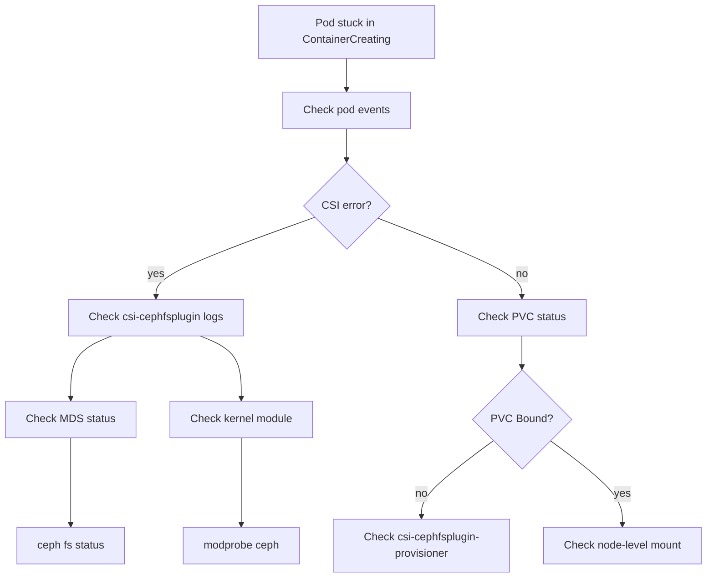

# How to Debug CephFilesystem Mount Issues in Rook

Author: [nawazdhandala](https://www.github.com/nawazdhandala)

Tags: Rook, Ceph, Kubernetes, CephFS, Debug, Troubleshoot, CSI, Mount

Description: A systematic guide to diagnosing and resolving CephFS PVC mount failures in Rook, covering CSI logs, MDS status, kernel module checks, and common error patterns.

---

CephFS mount failures in Rook manifest as pods stuck in `ContainerCreating` or PVCs stuck in `Pending`. Debugging requires checking the CSI node driver, MDS health, kernel modules, and Ceph cluster state.

## Debug Flow



## Step 1: Check Pod Events

```bash
kubectl describe pod <pod-name> -n <namespace>

# Common error patterns:
# "MountVolume.MountDevice failed"
# "rpc error: code = Internal desc = an error occurred while running"
# "failed to mount: exit status 22"
```

## Step 2: Check PVC and PV Status

```bash
# Check PVC is bound
kubectl get pvc -n <namespace>

# If Pending, check StorageClass
kubectl describe pvc <pvc-name> -n <namespace>

# Check PV
kubectl get pv | grep <pvc-name>
kubectl describe pv <pv-name>
```

## Step 3: Check CSI Plugin Logs

```bash
# List CSI node plugin pods (one per node)
kubectl get pods -n rook-ceph -l app=csi-cephfsplugin

# Check logs for the node where the pod is scheduled
NODE=$(kubectl get pod <pod-name> -n <namespace> -o jsonpath='{.spec.nodeName}')
CSI_POD=$(kubectl get pods -n rook-ceph -l app=csi-cephfsplugin \
  --field-selector spec.nodeName=$NODE \
  -o jsonpath='{.items[0].metadata.name}')

kubectl logs -n rook-ceph $CSI_POD -c csi-cephfsplugin --tail=100

# Check provisioner logs (for PVC creation issues)
kubectl logs -n rook-ceph \
  deploy/csi-cephfsplugin-provisioner \
  -c csi-cephfsplugin --tail=100
```

## Step 4: Check MDS Status

```bash
# Check MDS pods
kubectl get pods -n rook-ceph -l app=rook-ceph-mds

# Check filesystem and MDS state via toolbox
kubectl exec -n rook-ceph deploy/rook-ceph-tools -- ceph fs ls
kubectl exec -n rook-ceph deploy/rook-ceph-tools -- ceph fs status myfs
kubectl exec -n rook-ceph deploy/rook-ceph-tools -- ceph mds stat

# Expected output: 1 active, 1 standby
# Problem output: 0 active, MDS_FAILED
```

## Step 5: Check Cluster Health

```bash
kubectl exec -n rook-ceph deploy/rook-ceph-tools -- ceph status
kubectl exec -n rook-ceph deploy/rook-ceph-tools -- ceph health detail

# Check for HEALTH_WARN or HEALTH_ERR
# Common: MON_CLOCK_SKEW, OSD_DOWN, PG_DEGRADED
```

## Step 6: Check Kernel Module on the Node

CephFS mounts require the `ceph` kernel module:

```bash
# SSH or exec into the node
kubectl debug node/<node-name> -it --image=busybox -- chroot /host bash

lsmod | grep ceph
# Should show: ceph  ...  1

# If missing:
modprobe ceph
lsmod | grep ceph
```

## Step 7: Common Error Patterns and Fixes

### Error: "mount: mounting ... on ... failed: No such file or directory"

```bash
# The mount path does not exist or kernel module is missing
kubectl debug node/<node-name> -it --image=ubuntu -- chroot /host bash
apt-get install -y ceph-common
modprobe ceph
```

### Error: "connection timeout"

```bash
# Network connectivity from node to MON/MDS
kubectl exec -n rook-ceph deploy/rook-ceph-tools -- \
  ceph mon stat

# Check if MON IPs are reachable from the node
kubectl debug node/<node-name> -it --image=busybox -- chroot /host bash
ping <mon-ip>
```

### Error: "authentication error"

```bash
# Check CSI secrets exist
kubectl get secret rook-csi-cephfs-provisioner -n rook-ceph
kubectl get secret rook-csi-cephfs-node -n rook-ceph

# Verify they contain the correct keys
kubectl describe secret rook-csi-cephfs-node -n rook-ceph
```

### MDS Not Active

```bash
# Check MDS pod logs
kubectl logs -n rook-ceph -l app=rook-ceph-mds --tail=50

# Restart MDS deployment
kubectl rollout restart deployment -n rook-ceph -l app=rook-ceph-mds

# Wait for active MDS
kubectl exec -n rook-ceph deploy/rook-ceph-tools -- \
  ceph mds stat
```

## Step 8: Enable CSI Debug Logging

```bash
kubectl patch configmap rook-ceph-operator-config -n rook-ceph \
  --type merge \
  -p '{"data":{"CSI_LOG_LEVEL":"5"}}'

# Restart CSI pods to pick up new log level
kubectl rollout restart daemonset csi-cephfsplugin -n rook-ceph
kubectl rollout restart deployment csi-cephfsplugin-provisioner -n rook-ceph
```

## Summary

Debug CephFS mount issues in Rook by first checking pod events, then CSI plugin logs on the affected node, MDS health, and kernel module availability. The most common causes are: missing `ceph` kernel module on the node, unhealthy MDS daemons, network connectivity issues to Ceph monitors, and missing or incorrect CSI authentication secrets. Use the Ceph toolbox for cluster-level diagnostics and the CSI log level setting for deeper CSI tracing.
