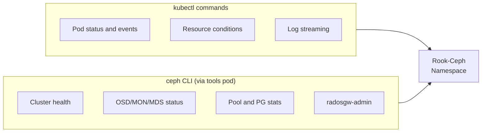

# How to Debug Rook-Ceph with kubectl and ceph CLI

Author: [nawazdhandala](https://www.github.com/nawazdhandala)

Tags: Rook, Ceph, Kubernetes, Debugging, kubectl, CLI, Troubleshooting

Description: Master debugging techniques for Rook-Ceph using kubectl commands and the ceph CLI toolkit, covering cluster health, log analysis, and diagnostic commands.

---

## Setting Up the Debugging Environment

Effective Rook-Ceph debugging requires two primary interfaces: `kubectl` for Kubernetes resource inspection and the `ceph` CLI inside the `rook-ceph-tools` pod for cluster-level diagnostics. Together they cover the full stack from Kubernetes events to raw RADOS operations.



## Accessing the Ceph CLI

The `rook-ceph-tools` pod provides the full `ceph` CLI:

```bash
kubectl -n rook-ceph exec -it deploy/rook-ceph-tools -- bash
```

Or run single commands directly:

```bash
kubectl -n rook-ceph exec -it deploy/rook-ceph-tools -- ceph status
```

If the tools pod is not deployed, apply it:

```bash
kubectl apply -f https://raw.githubusercontent.com/rook/rook/release-1.16/deploy/examples/toolbox.yaml
```

## kubectl-Based Debugging Commands

List all Rook-Ceph pods and their status:

```bash
kubectl -n rook-ceph get pods -o wide
```

Find all non-Running pods:

```bash
kubectl -n rook-ceph get pods --field-selector=status.phase!=Running
```

Get events sorted by timestamp:

```bash
kubectl -n rook-ceph get events --sort-by='.lastTimestamp'
```

Describe a specific pod for full event history and resource details:

```bash
kubectl -n rook-ceph describe pod rook-ceph-osd-0-<hash>
```

Stream logs from all pods with a label selector:

```bash
kubectl -n rook-ceph logs -l app=rook-ceph-osd -f --max-log-requests=10
```

Get previous container logs (for crashed pods):

```bash
kubectl -n rook-ceph logs rook-ceph-osd-0-<hash> --previous
```

Check Rook CRD statuses:

```bash
kubectl -n rook-ceph get cephcluster,cephblockpool,cephfilesystem,cephobjectstore
```

Get the full CephCluster status with conditions:

```bash
kubectl -n rook-ceph get cephcluster rook-ceph -o jsonpath='{.status.conditions}' \
  | python3 -c "import sys,json; [print(c['type'],c['status'],c.get('message','')) for c in json.load(sys.stdin)]"
```

## Ceph CLI Health and Status Commands

Top-level cluster status:

```bash
kubectl -n rook-ceph exec -it deploy/rook-ceph-tools -- ceph status
```

Detailed health messages:

```bash
kubectl -n rook-ceph exec -it deploy/rook-ceph-tools -- ceph health detail
```

Cluster disk usage:

```bash
kubectl -n rook-ceph exec -it deploy/rook-ceph-tools -- ceph df
```

Pool-level usage:

```bash
kubectl -n rook-ceph exec -it deploy/rook-ceph-tools -- ceph df detail
```

## OSD Debugging

Show all OSD states:

```bash
kubectl -n rook-ceph exec -it deploy/rook-ceph-tools -- ceph osd stat
```

Show OSD tree with node assignments:

```bash
kubectl -n rook-ceph exec -it deploy/rook-ceph-tools -- ceph osd tree
```

Show OSD utilization (fill levels):

```bash
kubectl -n rook-ceph exec -it deploy/rook-ceph-tools -- ceph osd df tree
```

Show BlueStore device info for an OSD:

```bash
kubectl -n rook-ceph exec -it deploy/rook-ceph-tools -- \
  ceph device ls
```

Check OSD performance counters:

```bash
kubectl -n rook-ceph exec -it deploy/rook-ceph-tools -- \
  ceph osd perf
```

Show recent OSD crashes:

```bash
kubectl -n rook-ceph exec -it deploy/rook-ceph-tools -- ceph crash ls
```

Get details of a specific crash:

```bash
kubectl -n rook-ceph exec -it deploy/rook-ceph-tools -- ceph crash info <crash-id>
```

Archive a crash after reviewing:

```bash
kubectl -n rook-ceph exec -it deploy/rook-ceph-tools -- ceph crash archive <crash-id>
```

## MON Debugging

Check MON quorum:

```bash
kubectl -n rook-ceph exec -it deploy/rook-ceph-tools -- ceph mon stat
```

Show quorum status in detail:

```bash
kubectl -n rook-ceph exec -it deploy/rook-ceph-tools -- ceph quorum_status | python3 -m json.tool
```

## PG (Placement Group) Debugging

Show PG summary statistics:

```bash
kubectl -n rook-ceph exec -it deploy/rook-ceph-tools -- ceph pg stat
```

Find unhealthy PGs:

```bash
kubectl -n rook-ceph exec -it deploy/rook-ceph-tools -- ceph pg dump_stuck
```

Show detail of a specific PG:

```bash
kubectl -n rook-ceph exec -it deploy/rook-ceph-tools -- ceph pg <pgid> query
```

## Pool Debugging

List pools with their configuration:

```bash
kubectl -n rook-ceph exec -it deploy/rook-ceph-tools -- ceph osd pool ls detail
```

Get a specific pool parameter:

```bash
kubectl -n rook-ceph exec -it deploy/rook-ceph-tools -- \
  ceph osd pool get replicapool all
```

Show pool statistics:

```bash
kubectl -n rook-ceph exec -it deploy/rook-ceph-tools -- \
  ceph osd pool stats replicapool
```

## CSI Driver Debugging

Check CSI plugin logs on a specific node (useful for mount failures):

```bash
NODE=<node-name>
POD=$(kubectl -n rook-ceph get pods -l app=csi-rbdplugin --field-selector=spec.nodeName=$NODE -o name)
kubectl -n rook-ceph logs $POD -c csi-rbdplugin --tail=50
```

Check CSI driver registration:

```bash
kubectl -n rook-ceph get csidrivers
```

List CSI nodes:

```bash
kubectl get csinodes
```

## Object Store Debugging

Check RGW service endpoints:

```bash
kubectl -n rook-ceph exec -it deploy/rook-ceph-tools -- \
  radosgw-admin period get-current | python3 -m json.tool
```

Check bucket stats:

```bash
kubectl -n rook-ceph exec -it deploy/rook-ceph-tools -- \
  radosgw-admin bucket stats
```

## Performance Monitoring

View I/O performance in real time:

```bash
kubectl -n rook-ceph exec -it deploy/rook-ceph-tools -- \
  ceph -w
```

Show MDS (CephFS metadata) performance:

```bash
kubectl -n rook-ceph exec -it deploy/rook-ceph-tools -- \
  ceph mds perf dump
```

## Summary

Debugging Rook-Ceph effectively combines kubectl for Kubernetes-level inspection (pod status, events, CRD conditions, logs) with the ceph CLI via the toolbox pod for storage-level diagnostics (cluster health, OSD/PG status, pool stats, crash reports). Start with `ceph status` and `ceph health detail` for the current state, then narrow down to specific OSD, MON, or PG issues. Use `kubectl logs --previous` for crashed containers and `ceph crash ls` for daemon crash reports.
