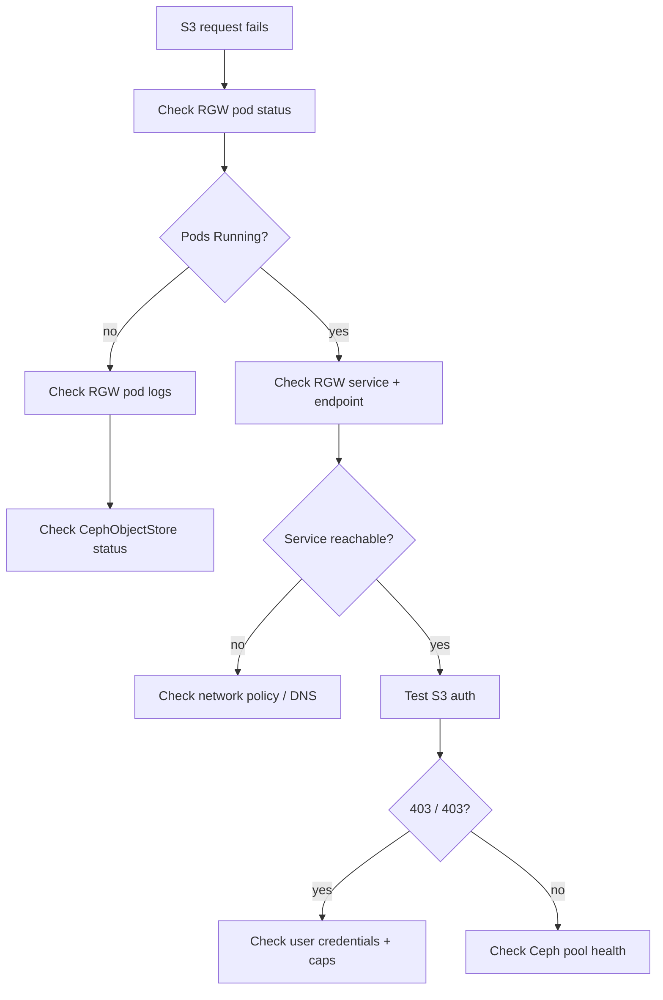

# How to Debug CephObjectStore Connectivity Issues in Rook

Author: [nawazdhandala](https://www.github.com/nawazdhandala)

Tags: Rook, Ceph, Kubernetes, ObjectStore, RGW, Debug, Troubleshoot, S3

Description: A systematic guide to diagnosing CephObjectStore and RGW connectivity problems in Rook, covering service checks, RGW logs, Ceph pool health, and S3 endpoint testing.

---

CephObjectStore connectivity issues range from RGW pods crashing to S3 requests timing out or returning 503 errors. This guide provides a structured debugging approach for each layer of the stack.

## Debug Flow



## Step 1: Check CephObjectStore Status

```bash
kubectl get cephobjectstore -n rook-ceph
kubectl describe cephobjectstore my-store -n rook-ceph

# Expected phase: Ready
# Check conditions for error messages
```

## Step 2: Check RGW Pods

```bash
# Check pod status
kubectl get pods -n rook-ceph -l app=rook-ceph-rgw

# If pods are CrashLoopBackOff or Error:
kubectl logs -n rook-ceph <rgw-pod-name> --tail=100
kubectl logs -n rook-ceph <rgw-pod-name> --previous --tail=100
```

## Step 3: Check RGW Service

```bash
# Get the service details
kubectl get svc -n rook-ceph -l app=rook-ceph-rgw
kubectl describe svc rook-ceph-rgw-my-store -n rook-ceph

# Verify endpoints are populated
kubectl get endpoints rook-ceph-rgw-my-store -n rook-ceph
# At least one IP should appear under ENDPOINTS
```

## Step 4: Test Connectivity to RGW

```bash
# From inside the cluster (debug pod)
kubectl run test-s3 --rm -it --image=curlimages/curl --restart=Never -- \
  curl -v http://rook-ceph-rgw-my-store.rook-ceph.svc:80/

# Expected: HTTP/1.1 403 Forbidden (or 200) -- NOT connection refused
# Connection refused = service not routing to pods
```

## Step 5: Check S3 Credentials

```bash
# Get user credentials from CephObjectStoreUser secret
kubectl get secret rook-ceph-object-user-my-store-my-user \
  -n rook-ceph -o yaml

ACCESS_KEY=$(kubectl get secret rook-ceph-object-user-my-store-my-user \
  -n rook-ceph -o jsonpath='{.data.AccessKey}' | base64 -d)
SECRET_KEY=$(kubectl get secret rook-ceph-object-user-my-store-my-user \
  -n rook-ceph -o jsonpath='{.data.SecretKey}' | base64 -d)

# Test with AWS CLI
aws s3 ls \
  --endpoint-url http://rook-ceph-rgw-my-store.rook-ceph.svc:80 \
  --no-verify-ssl 2>&1
```

## Step 6: Check RGW User

```bash
# Verify user exists
kubectl exec -n rook-ceph deploy/rook-ceph-tools -- \
  radosgw-admin user list

kubectl exec -n rook-ceph deploy/rook-ceph-tools -- \
  radosgw-admin user info --uid=my-user

# Check user keys
kubectl exec -n rook-ceph deploy/rook-ceph-tools -- \
  radosgw-admin user info --uid=my-user \
  | python3 -c "import json,sys; u=json.load(sys.stdin); print(u['keys'])"
```

## Step 7: Check Ceph Pool Health

```bash
# Check overall cluster health
kubectl exec -n rook-ceph deploy/rook-ceph-tools -- ceph status

# Check RGW-related pools
kubectl exec -n rook-ceph deploy/rook-ceph-tools -- ceph osd pool ls | grep my-store

# Check pool stats
kubectl exec -n rook-ceph deploy/rook-ceph-tools -- \
  ceph df detail | grep my-store
```

## Step 8: Common Errors and Fixes

### 503 Service Unavailable

```bash
# Increase RGW instances
kubectl patch cephobjectstore my-store -n rook-ceph \
  --type merge \
  -p '{"spec":{"gateway":{"instances":3}}}'
```

### 403 AccessDenied on all requests

```bash
# Regenerate user keys
kubectl exec -n rook-ceph deploy/rook-ceph-tools -- \
  radosgw-admin key create --uid=my-user --key-type=s3 --gen-access-key

# Update the Kubernetes secret with new keys
```

### RGW pod CrashLoop - "failed to read rgw configuration"

```bash
# Check operator logs
kubectl logs -n rook-ceph deploy/rook-ceph-operator --tail=100 | grep -i rgw

# Check Ceph config
kubectl exec -n rook-ceph deploy/rook-ceph-tools -- \
  ceph config dump | grep rgw
```

### DNS resolution failure (from app pods)

```bash
# Verify DNS resolves the RGW service
kubectl run dns-test --rm -it --image=busybox --restart=Never -- \
  nslookup rook-ceph-rgw-my-store.rook-ceph.svc.cluster.local
```

## Step 9: Enable RGW Debug Logging

```bash
kubectl exec -n rook-ceph deploy/rook-ceph-tools -- \
  ceph config set client.rgw debug_rgw 20

# Watch RGW logs
kubectl logs -n rook-ceph -l app=rook-ceph-rgw -f --tail=0

# Disable after debugging
kubectl exec -n rook-ceph deploy/rook-ceph-tools -- \
  ceph config rm client.rgw debug_rgw
```

## Summary

Debug Rook CephObjectStore issues layer by layer: start with pod status and logs, verify the Kubernetes service has endpoints, test raw HTTP connectivity, validate S3 credentials, and check Ceph pool health. The most common issues are RGW pods in CrashLoop due to misconfigured zone settings, 403 errors from stale credentials, and 503s from insufficient RGW instances. Use `radosgw-admin` commands from the toolbox for user and bucket-level diagnostics.
