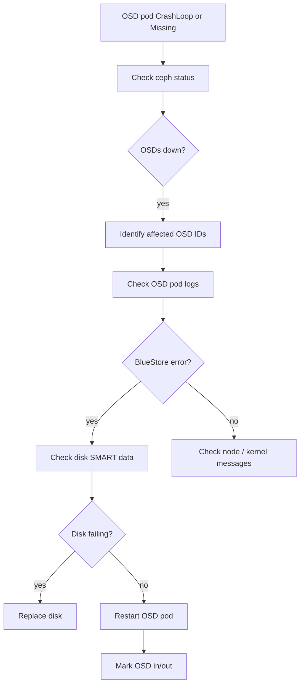

# How to Debug OSD Failures and Disk Errors in Rook

Author: [nawazdhandala](https://www.github.com/nawazdhandala)

Tags: Rook, Ceph, Kubernetes, OSD, Debug, Disk, Troubleshoot, BlueStore

Description: A comprehensive guide to diagnosing OSD failures and disk errors in Rook-Ceph, covering pod logs, BlueStore health, SMART data, and recovery steps.

---

OSD failures are among the most common and impactful issues in a Rook-Ceph cluster. Identifying whether the failure is a soft error (daemon crash) or a hard disk failure requires checking multiple layers.

## OSD Debug Flow



## Step 1: Check Cluster OSD Status

```bash
# Overall cluster health
kubectl exec -n rook-ceph deploy/rook-ceph-tools -- ceph status

# Detailed OSD status
kubectl exec -n rook-ceph deploy/rook-ceph-tools -- ceph osd stat
kubectl exec -n rook-ceph deploy/rook-ceph-tools -- ceph osd tree

# List all OSDs and their state (in/out, up/down)
kubectl exec -n rook-ceph deploy/rook-ceph-tools -- ceph osd dump | grep -E "^osd\."
```

## Step 2: Identify Failed OSD Pods

```bash
# Check OSD pods
kubectl get pods -n rook-ceph -l app=rook-ceph-osd

# Find pods not in Running state
kubectl get pods -n rook-ceph -l app=rook-ceph-osd \
  --field-selector=status.phase!=Running

# Check which OSD ID a pod represents
kubectl get pod -n rook-ceph <osd-pod-name> \
  -o jsonpath='{.metadata.labels.ceph-osd-id}'
```

## Step 3: Check OSD Pod Logs

```bash
# Get logs from crashed OSD
kubectl logs -n rook-ceph <osd-pod-name> --tail=100

# Previous container logs (before last crash)
kubectl logs -n rook-ceph <osd-pod-name> --previous --tail=100

# Look for these error patterns:
# "bluestore: backend_read failed"
# "EIO" (I/O Error)
# "disk read error"
# "flock: locked by another process"
```

## Step 4: Check BlueStore Diagnostics

```bash
# Check BlueStore consistency
kubectl exec -n rook-ceph deploy/rook-ceph-tools -- \
  ceph tell osd.<id> bluestore.fsck

# Check osd-specific health
kubectl exec -n rook-ceph deploy/rook-ceph-tools -- \
  ceph osd health osd.<id>

# Check BlueStore stats
kubectl exec -n rook-ceph deploy/rook-ceph-tools -- \
  ceph tell osd.<id> perf dump | python3 -m json.tool | grep -i "error\|slow\|timeout"
```

## Step 5: Check Node Kernel Messages

```bash
# Access the node's kernel log
kubectl debug node/<node-name> -it --image=ubuntu -- chroot /host bash

dmesg | grep -i "error\|fail\|EIO\|blk\|sd[a-z]" | tail -50
journalctl -k | grep -i "error\|fail\|EIO" | tail -50
```

## Step 6: Check Disk SMART Data

```bash
# SSH or debug into the node
kubectl debug node/<node-name> -it --image=ubuntu -- chroot /host bash
apt-get install -y smartmontools

# Find the disk device (e.g., /dev/sdb)
lsblk

# Run SMART check
smartctl -a /dev/sdb
smartctl -H /dev/sdb  # Quick health check

# Look for:
# SMART overall-health self-assessment test result: FAILED
# Reallocated_Sector_Ct: > 0 (bad)
# Current_Pending_Sector: > 0 (concerning)
# Offline_Uncorrectable: > 0 (bad)
```

## Step 7: Mark OSD Out and Back In

For transient failures (daemon restart, node reboot):

```bash
# Mark OSD out to trigger data backfill away from it
kubectl exec -n rook-ceph deploy/rook-ceph-tools -- \
  ceph osd out osd.<id>

# Wait for data to migrate
kubectl exec -n rook-ceph deploy/rook-ceph-tools -- \
  ceph status

# Restart the OSD pod
kubectl delete pod -n rook-ceph -l ceph-osd-id=<id>

# Mark OSD back in after it comes up
kubectl exec -n rook-ceph deploy/rook-ceph-tools -- \
  ceph osd in osd.<id>
```

## Step 8: Check PG Status After OSD Failure

```bash
# Check placement group health
kubectl exec -n rook-ceph deploy/rook-ceph-tools -- ceph pg stat

# Find degraded or unfound PGs
kubectl exec -n rook-ceph deploy/rook-ceph-tools -- \
  ceph health detail | grep -E "degraded|unfound|incomplete"

# Check specific PG
kubectl exec -n rook-ceph deploy/rook-ceph-tools -- \
  ceph pg <pgid> query
```

## Step 9: Scrub for Silent Errors

```bash
# Initiate a deep scrub to find checksum errors
kubectl exec -n rook-ceph deploy/rook-ceph-tools -- \
  ceph osd deep-scrub osd.<id>

# Check scrub errors
kubectl exec -n rook-ceph deploy/rook-ceph-tools -- \
  ceph pg dump | grep scrub_errors
```

## Summary

Debug OSD failures in Rook by first checking cluster status and identifying which OSD IDs are affected. Examine pod logs for BlueStore I/O errors, then escalate to node kernel messages and SMART disk diagnostics. For soft failures, mark the OSD out, restart the pod, and mark it back in. For hard disk failures confirmed by SMART data, follow the OSD disk replacement procedure. Always verify PG health after any OSD intervention.
