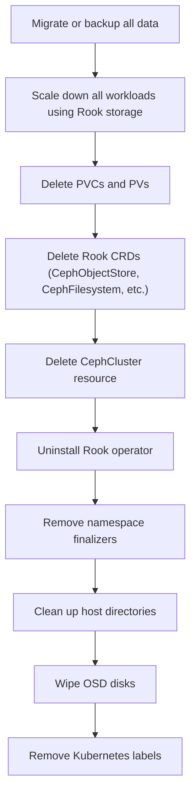

# How to Decommission a Rook-Ceph Cluster Safely

Author: [nawazdhandala](https://www.github.com/nawazdhandala)

Tags: Rook, Ceph, Kubernetes, Decommission, Storage, Cleanup

Description: Safely decommission a Rook-Ceph cluster by migrating data, removing workloads, deleting Rook resources, and cleaning up host directories and disk metadata.

---

## Overview of the Decommission Process

Decommissioning a Rook-Ceph cluster requires careful ordering to avoid data loss and ensure clean host-level cleanup. The process involves migrating or backing up data, removing workloads, deleting Rook CRDs, uninstalling the operator, and cleaning up node-level artifacts (disk labels, LVM metadata, host directories).



## Step 0 - Migrate or Backup Data

Before starting, ensure all critical data is backed up or migrated to another storage system.

Verify no important PVCs remain:

```bash
kubectl get pvc --all-namespaces
```

For any PVCs that must be preserved, either:
- Migrate data to another storage class (see the migration guide)
- Use Velero to back up namespaces with PVC data

## Step 1 - Scale Down Applications Using Rook Storage

Scale down all deployments and statefulsets using Rook-backed PVCs:

```bash
kubectl get deployments --all-namespaces -o json | \
  jq -r '.items[] | select(.spec.template.spec.volumes[]?.persistentVolumeClaim.claimName != null) | "\(.metadata.namespace) \(.metadata.name)"' | \
  while read ns dep; do
    kubectl -n $ns scale deployment $dep --replicas=0
  done
```

## Step 2 - Delete PVCs and PVs

Delete all PVCs backed by Rook-Ceph StorageClasses:

```bash
for SC in rook-ceph-block rook-cephfs rook-ceph-bucket; do
  kubectl get pvc --all-namespaces -o json | \
    jq -r --arg sc "$SC" '.items[] | select(.spec.storageClassName == $sc) | "\(.metadata.namespace) \(.metadata.name)"' | \
    while read ns pvc; do
      kubectl -n $ns delete pvc $pvc
    done
done
```

After PVCs are deleted, PVs with `reclaimPolicy: Retain` will remain in `Released` state. Delete them:

```bash
kubectl get pv | grep Released | awk '{print $1}' | xargs kubectl delete pv
```

## Step 3 - Delete Object Bucket Claims

Delete all ObjectBucketClaims:

```bash
kubectl delete obc --all --all-namespaces
```

## Step 4 - Remove Rook CRD Resources (Non-Cluster)

Delete high-level resources first, before removing the cluster:

```bash
kubectl -n rook-ceph delete cephobjectstore --all
kubectl -n rook-ceph delete cephfilesystem --all
kubectl -n rook-ceph delete cephblockpool --all
kubectl -n rook-ceph delete cephnfs --all
```

Wait for all pods associated with these resources to terminate:

```bash
kubectl -n rook-ceph get pods
```

## Step 5 - Delete the CephCluster Resource

Edit the CephCluster to allow deletion by setting `cleanupPolicy`:

```bash
kubectl -n rook-ceph patch cephcluster rook-ceph --type merge \
  -p '{"spec":{"cleanupPolicy":{"confirmation":"yes-really-destroy-data"}}}'
```

Now delete the CephCluster:

```bash
kubectl -n rook-ceph delete cephcluster rook-ceph
```

Wait for the cleanup job to complete:

```bash
kubectl -n rook-ceph get jobs | grep cleanup
kubectl -n rook-ceph wait --for=condition=complete job/rook-ceph-cleanup-<node>
```

## Step 6 - Uninstall the Rook Operator

Delete the operator deployment:

```bash
kubectl -n rook-ceph delete deployment rook-ceph-operator
```

If installed via Helm:

```bash
helm uninstall rook-ceph -n rook-ceph
helm uninstall rook-ceph-cluster -n rook-ceph
```

Delete the common resources:

```bash
kubectl delete -f https://raw.githubusercontent.com/rook/rook/release-1.16/deploy/examples/common.yaml
```

Delete the CRDs:

```bash
kubectl delete -f https://raw.githubusercontent.com/rook/rook/release-1.16/deploy/examples/crds.yaml
```

## Step 7 - Remove Finalizers from Stuck Resources

Resources stuck in `Terminating` state have finalizers. Remove them:

```bash
for resource in cephcluster cephblockpool cephfilesystem cephobjectstore; do
  kubectl -n rook-ceph get $resource -o name | while read res; do
    kubectl -n rook-ceph patch $res -p '{"metadata":{"finalizers":[]}}' --type=merge
  done
done
```

## Step 8 - Delete the Namespace

Delete the rook-ceph namespace. If it is stuck, remove its finalizer:

```bash
kubectl delete namespace rook-ceph
```

If stuck in `Terminating`:

```bash
kubectl get namespace rook-ceph -o json | \
  python3 -c "import sys,json; d=json.load(sys.stdin); d['spec']['finalizers']=[]; print(json.dumps(d))" | \
  kubectl replace --raw /api/v1/namespaces/rook-ceph/finalize -f -
```

## Step 9 - Clean Up Host Directories

Rook stores data in `/var/lib/rook` on each node. Run a cleanup DaemonSet to remove these directories:

```yaml
apiVersion: apps/v1
kind: DaemonSet
metadata:
  name: rook-cleanup
  namespace: default
spec:
  selector:
    matchLabels:
      app: rook-cleanup
  template:
    metadata:
      labels:
        app: rook-cleanup
    spec:
      hostPID: true
      containers:
        - name: cleanup
          image: alpine
          securityContext:
            privileged: true
          command:
            - sh
            - -c
            - |
              rm -rf /rootfs/var/lib/rook
              echo "Rook host directory removed"
              sleep infinity
          volumeMounts:
            - name: rootfs
              mountPath: /rootfs
      volumes:
        - name: rootfs
          hostPath:
            path: /
```

Apply, wait for it to run on all nodes, then delete it:

```bash
kubectl apply -f rook-cleanup-ds.yaml
kubectl get pods -l app=rook-cleanup
kubectl delete daemonset rook-cleanup
```

## Step 10 - Wipe OSD Disks

OSD disks have LVM, GPT, or BlueStore metadata that must be wiped before reuse.

Run disk wipe commands on each storage node for each OSD disk:

```bash
# Replace /dev/sdX with your OSD disk device
sgdisk --zap-all /dev/sdX
dd if=/dev/zero of=/dev/sdX bs=1M count=100 oflag=direct
blkdiscard /dev/sdX
```

Remove any LVM volume groups created by Rook:

```bash
vgdisplay | grep ceph
vgremove <ceph-vg-name>
pvremove /dev/sdX
```

## Step 11 - Remove Kubernetes Labels

Remove storage-related labels from nodes:

```bash
kubectl label nodes --all \
  role- \
  topology.kubernetes.io/zone-
```

## Verifying Complete Cleanup

Confirm no Rook resources remain:

```bash
kubectl get all --all-namespaces | grep rook
kubectl get pv | grep rook
kubectl get storageclass | grep rook
kubectl get crd | grep rook
kubectl get crd | grep ceph
```

All of these should return empty results.

## Summary

Safely decommissioning Rook-Ceph requires a strict ordering: migrate data first, then scale down workloads, delete PVCs/PVs, remove Rook CRDs (object store, filesystem, block pools), set the cleanup policy on CephCluster, delete the CephCluster resource, uninstall the operator, and finally clean up host directories and wipe OSD disks. Skipping host-level cleanup leaves disk metadata that prevents the disks from being used by other software. Always back up data before starting the decommission process.
