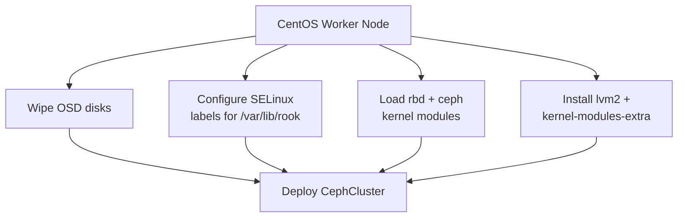

# How to Deploy Rook-Ceph on CentOS Kubernetes Nodes

Author: [nawazdhandala](https://www.github.com/nawazdhandala)

Tags: Rook, Ceph, Kubernetes, Storage, CentOS, RHEL

Description: Prepare CentOS and RHEL Kubernetes worker nodes for Rook-Ceph by installing required packages, configuring SELinux, loading kernel modules, and deploying the cluster.

---

## CentOS-Specific Considerations

CentOS and RHEL nodes have SELinux enforcing by default and may be missing kernel modules required by the Rook-Ceph CSI drivers. This guide covers the additional preparation steps needed before deploying Rook on CentOS 8/9 or RHEL 8/9 nodes.



## Step 1 - Install Required Packages

On every CentOS/RHEL worker node that will run Rook-Ceph components:

```bash
dnf install -y lvm2 util-linux e2fsprogs xfsprogs
dnf install -y kernel-modules-extra-$(uname -r)
```

The `kernel-modules-extra` package provides the `rbd` and `ceph` modules that are not included in the base kernel package.

## Step 2 - Load Kernel Modules

```bash
modprobe rbd
modprobe ceph

# Persist across reboots
cat <<EOF > /etc/modules-load.d/rook-ceph.conf
rbd
ceph
EOF

# Verify
lsmod | grep -E "^rbd|^ceph"
```

## Step 3 - Configure SELinux for dataDirHostPath

Rook mounts `/var/lib/rook` into pods as a hostPath volume. SELinux blocks this unless the directory has the correct context:

```bash
mkdir -p /var/lib/rook
chcon -Rt svirt_sandbox_file_t /var/lib/rook

# Make persistent with semanage
semanage fcontext -a -t svirt_sandbox_file_t "/var/lib/rook(/.*)?"
restorecon -Rv /var/lib/rook
```

Also set the context for the Ceph data partition on each OSD disk (if pre-partitioning):

```bash
semanage fcontext -a -t fixed_disk_device_t "/dev/sdb"
restorecon -v /dev/sdb
```

## Step 4 - Configure Firewall Rules

Open the required Ceph ports on each node:

```bash
firewall-cmd --permanent --add-port=6789/tcp   # Mon
firewall-cmd --permanent --add-port=3300/tcp   # Msgr2 Mon
firewall-cmd --permanent --add-port=6800-7300/tcp  # OSD
firewall-cmd --permanent --add-port=8443/tcp   # Dashboard
firewall-cmd --permanent --add-port=9283/tcp   # Metrics
firewall-cmd --reload
```

## Step 5 - Prepare OSD Disks

```bash
# Wipe disks
wipefs -a /dev/sdb
wipefs -a /dev/sdc

# Verify clean
blkid /dev/sdb
blkid /dev/sdc
```

## Step 6 - Deploy Rook Operator

```bash
git clone --single-branch --branch v1.15.0 \
  https://github.com/rook/rook.git
cd rook/deploy/examples

kubectl apply --server-side -f crds.yaml
kubectl apply -f common.yaml
kubectl apply -f operator.yaml

kubectl -n rook-ceph rollout status deploy/rook-ceph-operator
```

## Step 7 - CephCluster for CentOS Nodes

CentOS nodes work well with explicit node/device lists to avoid accidentally claiming OS partitions:

```yaml
apiVersion: ceph.rook.io/v1
kind: CephCluster
metadata:
  name: rook-ceph
  namespace: rook-ceph
spec:
  cephVersion:
    image: quay.io/ceph/ceph:v19.2.0
  dataDirHostPath: /var/lib/rook
  mon:
    count: 3
    allowMultiplePerNode: false
  mgr:
    count: 1
  dashboard:
    enabled: true
    ssl: true
  storage:
    useAllNodes: false
    useAllDevices: false
    nodes:
      - name: centos-node-1
        devices:
          - name: sdb
          - name: sdc
      - name: centos-node-2
        devices:
          - name: sdb
          - name: sdc
      - name: centos-node-3
        devices:
          - name: sdb
          - name: sdc
```

## Step 8 - Verify the Cluster

```bash
kubectl -n rook-ceph exec -it deploy/rook-ceph-tools -- ceph status
kubectl -n rook-ceph exec -it deploy/rook-ceph-tools -- ceph osd tree
```

## Troubleshooting SELinux Denials

If pods fail to start or CSI mounts fail on CentOS, check for SELinux denials:

```bash
ausearch -m AVC -ts recent | grep rook
```

If denials are found, allow them temporarily to confirm SELinux is the cause:

```bash
setenforce 0
# Test if pods start
setenforce 1
```

Then create a proper SELinux policy rather than leaving SELinux permissive in production.

## Summary

CentOS and RHEL nodes require `kernel-modules-extra` for the `rbd` and `ceph` kernel modules, `lvm2` for OSD preparation, and correct SELinux file contexts on `/var/lib/rook` before Rook-Ceph can function. Configure firewall rules to allow Mon, OSD, dashboard, and metrics ports. Use explicit node and device lists in the CephCluster spec to prevent Rook from claiming OS or swap partitions.
