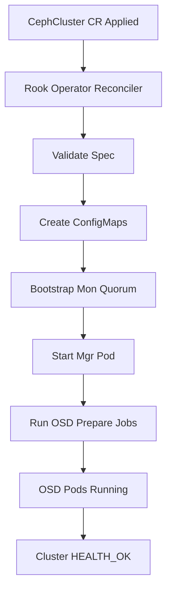

# How to Deploy Rook-Ceph with a CephCluster Custom Resource

Author: [nawazdhandala](https://www.github.com/nawazdhandala)

Tags: Rook, Ceph, Kubernetes, CephCluster, CustomResource, Storage

Description: A detailed guide to authoring and applying the CephCluster custom resource that tells the Rook operator how to configure your Ceph storage cluster.

---

## How the CephCluster CR Works

The CephCluster custom resource is the central configuration object that describes your entire Ceph cluster. When you apply a CephCluster CR, the Rook operator reads it and reconciles the desired state - creating monitors, a manager, and OSD pods matching the specification. Every aspect of the cluster topology, disk selection, networking, and daemon resources is controlled through this single resource.



## Minimal CephCluster for Development

The simplest possible CephCluster CR for a single-node development environment:

```yaml
apiVersion: ceph.rook.io/v1
kind: CephCluster
metadata:
  name: rook-ceph
  namespace: rook-ceph
spec:
  cephVersion:
    image: quay.io/ceph/ceph:v18.2.0
  dataDirHostPath: /var/lib/rook
  mon:
    count: 1
    allowMultiplePerNode: true
  storage:
    useAllNodes: true
    useAllDevices: true
```

This is not suitable for production because a single monitor is not fault-tolerant.

## Production CephCluster Configuration

A production-ready CephCluster CR with three monitors, a redundant manager, and full resource specifications:

```yaml
apiVersion: ceph.rook.io/v1
kind: CephCluster
metadata:
  name: rook-ceph
  namespace: rook-ceph
spec:
  cephVersion:
    image: quay.io/ceph/ceph:v18.2.0
    allowUnsupported: false

  # Directory on the host where Rook stores cluster state
  dataDirHostPath: /var/lib/rook

  # Skip upgrade pre-flight checks (set false for production)
  skipUpgradeChecks: false
  continueUpgradeAfterChecksEvenIfNotHealthy: false

  # Wait for a PG health check before removing an OSD
  waitTimeoutForHealthyOSDInMinutes: 10

  mon:
    count: 3
    allowMultiplePerNode: false

  mgr:
    count: 2
    allowMultiplePerNode: false
    modules:
      - name: pg_autoscaler
        enabled: true
      - name: rook
        enabled: true

  dashboard:
    enabled: true
    ssl: true

  monitoring:
    enabled: true
    interval: 10s

  network:
    # Use host networking for improved performance (optional)
    provider: ""
    connections:
      # Require the msgr2 protocol for all daemon connections
      requireMsgr2: true

  crashCollector:
    disable: false
    daysToRetain: 30

  logCollector:
    enabled: true
    periodicity: daily
    maxLogSize: 500M

  cleanupPolicy:
    # Set confirmation to "yes-really-destroy-data" to allow cluster deletion
    confirmation: ""
    sanitizeDisks:
      method: quick
      dataSource: zero
      iteration: 1
    allowUninstallWithVolumes: false

  storage:
    useAllNodes: true
    useAllDevices: false
    # Only use devices matching this pattern
    deviceFilter: "^sd[b-z]"
    config:
      osdsPerDevice: "1"

  placement:
    all:
      nodeAffinity:
        requiredDuringSchedulingIgnoredDuringExecution:
          nodeSelectorTerms:
            - matchExpressions:
                - key: role
                  operator: In
                  values:
                    - storage-node
      podAntiAffinity:
        requiredDuringSchedulingIgnoredDuringExecution:
          - labelSelector:
              matchExpressions:
                - key: app
                  operator: In
                  values:
                    - rook-ceph-osd
            topologyKey: kubernetes.io/hostname
    mon:
      podAntiAffinity:
        requiredDuringSchedulingIgnoredDuringExecution:
          - labelSelector:
              matchExpressions:
                - key: app
                  operator: In
                  values:
                    - rook-ceph-mon
            topologyKey: kubernetes.io/hostname

  resources:
    mgr:
      requests:
        cpu: 500m
        memory: 512Mi
      limits:
        cpu: "1"
        memory: 1Gi
    mon:
      requests:
        cpu: 500m
        memory: 512Mi
      limits:
        cpu: "1"
        memory: 1Gi
    osd:
      requests:
        cpu: "1"
        memory: 2Gi
      limits:
        cpu: "2"
        memory: 4Gi
    prepareosd:
      requests:
        cpu: 500m
        memory: 50Mi
      limits:
        cpu: "1"
        memory: 800Mi
    mgr-sidecar:
      requests:
        cpu: 100m
        memory: 40Mi
      limits:
        cpu: 200m
        memory: 100Mi
    crashcollector:
      requests:
        cpu: 15m
        memory: 60Mi
      limits:
        cpu: 500m
        memory: 60Mi
    logcollector:
      requests:
        cpu: 100m
        memory: 100Mi
      limits:
        cpu: "1"
        memory: 1Gi
    cleanup:
      requests:
        cpu: 500m
        memory: 100Mi
      limits:
        cpu: "1"
        memory: 1Gi
```

## Key Spec Fields Explained

### cephVersion

Specifies the Ceph container image. Use a specific version tag rather than `latest`:

```yaml
cephVersion:
  image: quay.io/ceph/ceph:v18.2.0
  # Set to true only for testing unreleased versions
  allowUnsupported: false
```

### dataDirHostPath

The path on the host node where Rook stores Ceph monitor data and cluster configuration. This directory must survive node reboots:

```yaml
dataDirHostPath: /var/lib/rook
```

### mon

Three monitors are required for quorum in production. Setting `allowMultiplePerNode: false` ensures each monitor runs on a distinct node for fault tolerance:

```yaml
mon:
  count: 3
  allowMultiplePerNode: false
```

### cleanupPolicy

The `confirmation` field prevents accidental cluster deletion. Only set it to `yes-really-destroy-data` when you intentionally want to wipe the cluster:

```yaml
cleanupPolicy:
  confirmation: ""
```

## Applying the CephCluster

Apply the manifest and watch the cluster bootstrap:

```bash
kubectl apply -f ceph-cluster.yaml

# Stream operator logs during bootstrap
kubectl -n rook-ceph logs -f deployment/rook-ceph-operator

# Watch pods come up
kubectl -n rook-ceph get pods -w
```

## Checking CephCluster Status

The Rook operator updates the CephCluster status as it progresses:

```bash
kubectl -n rook-ceph get cephcluster rook-ceph -o yaml | grep -A 20 "status:"
```

A fully operational cluster shows:

```text
status:
  ceph:
    health: HEALTH_OK
    lastChecked: "2026-03-31T10:00:00Z"
  conditions:
  - message: Cluster created successfully
    reason: ClusterCreated
    status: "True"
    type: Ready
  phase: Ready
  state: Created
```

## Summary

The CephCluster CR is the authoritative configuration for your entire Rook-Ceph deployment. The minimal version requires just `cephVersion`, `dataDirHostPath`, `mon`, and `storage` fields. Production deployments should add `placement` rules to spread monitors and OSDs across nodes, explicit `resources` to cap daemon consumption, and a `deviceFilter` to prevent accidental OS disk usage. Once applied, the operator continuously reconciles the actual state against this CR - meaning you can modify it at runtime to scale monitors, add OSDs, or change resource limits without manual intervention.
