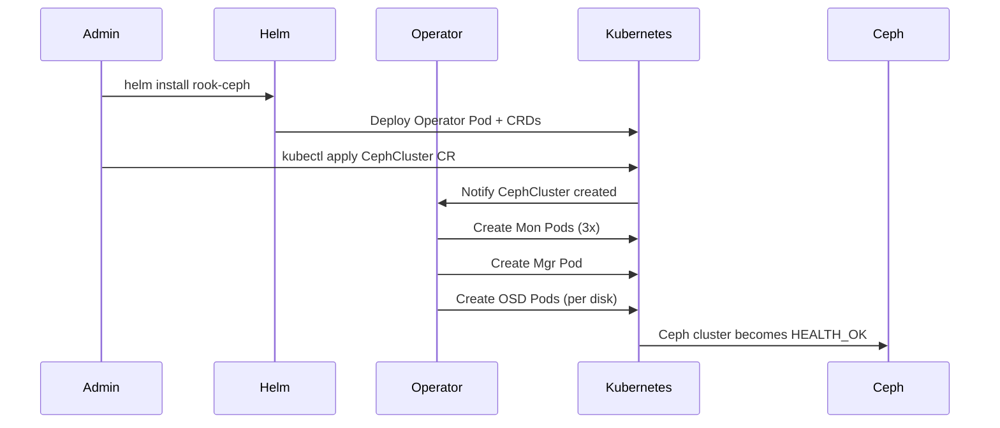
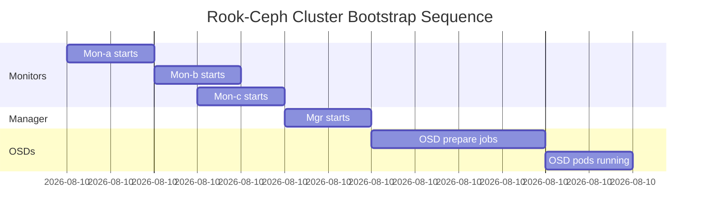

# How to Deploy a Rook-Ceph Cluster from Scratch on Kubernetes

Author: [nawazdhandala](https://www.github.com/nawazdhandala)

Tags: Rook, Ceph, Kubernetes, Cluster, Storage, Deployment

Description: Complete walkthrough for deploying a Rook-Ceph storage cluster from scratch on Kubernetes, from operator installation through cluster verification.

---

## How a Rook-Ceph Cluster Deployment Works

Deploying a Rook-Ceph cluster involves two distinct phases: first installing the Rook operator (the control plane), and then creating a CephCluster custom resource (the data plane). The operator watches for the CephCluster CR and immediately begins provisioning Ceph monitors, managers, and OSDs as Kubernetes pods.



## Prerequisites

Prepare your Kubernetes environment before starting:

- Kubernetes 1.22 or later with `kubectl` access
- Helm 3.x installed locally
- At least 3 nodes with raw, unformatted block devices (or directories for testing)
- Nodes must not have LVM or filesystem signatures on the intended disks
- Minimum 2 GB RAM per OSD node, 4 GB recommended
- Cluster admin RBAC permissions

Verify node readiness:

```bash
kubectl get nodes -o wide
```

## Step 1 - Install the Rook Operator

Add the Rook Helm repository and install the operator:

```bash
helm repo add rook-release https://charts.rook.io/release
helm repo update

helm install --create-namespace \
  --namespace rook-ceph \
  rook-ceph rook-release/rook-ceph \
  --version v1.14.0
```

Wait for the operator to be ready:

```bash
kubectl -n rook-ceph rollout status deployment/rook-ceph-operator
```

## Step 2 - Install the Rook-Ceph Cluster Chart

The `rook-ceph-cluster` Helm chart deploys the CephCluster CR and associated configuration. Install it referencing the operator namespace:

```bash
helm install --create-namespace \
  --namespace rook-ceph \
  rook-ceph-cluster rook-release/rook-ceph-cluster \
  --version v1.14.0 \
  --set operatorNamespace=rook-ceph
```

## Step 3 - Define a CephCluster Custom Resource

For production deployments, create a custom CephCluster manifest instead of relying on chart defaults. This gives you full control over disk selection, replica counts, and network settings.

The following manifest deploys a three-monitor, three-OSD cluster using all available raw devices:

```yaml
apiVersion: ceph.rook.io/v1
kind: CephCluster
metadata:
  name: rook-ceph
  namespace: rook-ceph
spec:
  cephVersion:
    image: quay.io/ceph/ceph:v18.2.0
    allowUnsupported: false
  dataDirHostPath: /var/lib/rook
  skipUpgradeChecks: false
  continueUpgradeAfterChecksEvenIfNotHealthy: false
  mon:
    count: 3
    allowMultiplePerNode: false
  mgr:
    count: 1
    modules:
      - name: pg_autoscaler
        enabled: true
  dashboard:
    enabled: true
    ssl: true
  monitoring:
    enabled: false
  network:
    connections:
      requireMsgr2: true
  storage:
    useAllNodes: true
    useAllDevices: true
    config:
      osdsPerDevice: "1"
  placement:
    all:
      nodeAffinity:
        requiredDuringSchedulingIgnoredDuringExecution:
          nodeSelectorTerms:
            - matchExpressions:
                - key: role
                  operator: In
                  values:
                    - storage-node
  resources:
    mgr:
      requests:
        cpu: 500m
        memory: 512Mi
    mon:
      requests:
        cpu: 500m
        memory: 512Mi
    osd:
      requests:
        cpu: 500m
        memory: 2Gi
```

Apply the manifest:

```bash
kubectl apply -f ceph-cluster.yaml
```

## Step 4 - Monitor Cluster Bootstrap

Watch the operator spin up Ceph components:

```bash
kubectl -n rook-ceph get pods -w
```

The startup sequence is: monitors first, then the manager, and finally OSDs. The full process typically takes 3-10 minutes depending on the number of disks.



## Step 5 - Verify Cluster Health

Check cluster status using the Rook toolbox:

```bash
kubectl -n rook-ceph exec -it deploy/rook-ceph-tools -- ceph status
```

A healthy cluster shows output similar to:

```text
  cluster:
    id:     a0ce9d95-xxxx-xxxx-xxxx-xxxxxxxxxxxx
    health: HEALTH_OK

  services:
    mon: 3 daemons, quorum a,b,c (age 5m)
    mgr: a(active, since 3m)
    osd: 3 osds: 3 up, 3 in

  data:
    pools:   1 pools, 1 pgs
    objects: 0 objects, 0 B
    usage:   3 GiB used, 297 GiB / 300 GiB avail
    pgs:     1 active+clean
```

## Step 6 - Create Storage Classes

After the cluster is healthy, create storage classes so applications can request persistent volumes. Deploy a block pool and RBD storage class:

```yaml
apiVersion: ceph.rook.io/v1
kind: CephBlockPool
metadata:
  name: replicapool
  namespace: rook-ceph
spec:
  failureDomain: host
  replicated:
    size: 3
---
apiVersion: storage.k8s.io/v1
kind: StorageClass
metadata:
  name: rook-ceph-block
provisioner: rook-ceph.rbd.csi.ceph.com
parameters:
  clusterID: rook-ceph
  pool: replicapool
  imageFormat: "2"
  imageFeatures: layering
  csi.storage.k8s.io/provisioner-secret-name: rook-csi-rbd-provisioner
  csi.storage.k8s.io/provisioner-secret-namespace: rook-ceph
  csi.storage.k8s.io/controller-expand-secret-name: rook-csi-rbd-provisioner
  csi.storage.k8s.io/controller-expand-secret-namespace: rook-ceph
  csi.storage.k8s.io/node-stage-secret-name: rook-csi-rbd-node
  csi.storage.k8s.io/node-stage-secret-namespace: rook-ceph
reclaimPolicy: Delete
allowVolumeExpansion: true
```

```bash
kubectl apply -f block-pool-storageclass.yaml
```

## Summary

Deploying a Rook-Ceph cluster from scratch requires installing the Rook operator via Helm, then applying a CephCluster custom resource that defines your storage topology. The operator handles all Ceph bootstrapping automatically - creating monitor quorum, starting the manager, and provisioning OSD pods for each disk. Once the cluster reaches HEALTH_OK status, you can create CephBlockPool and StorageClass resources to expose persistent storage to your Kubernetes workloads. The entire process from operator installation to a usable storage class typically takes under 15 minutes on a prepared cluster.
