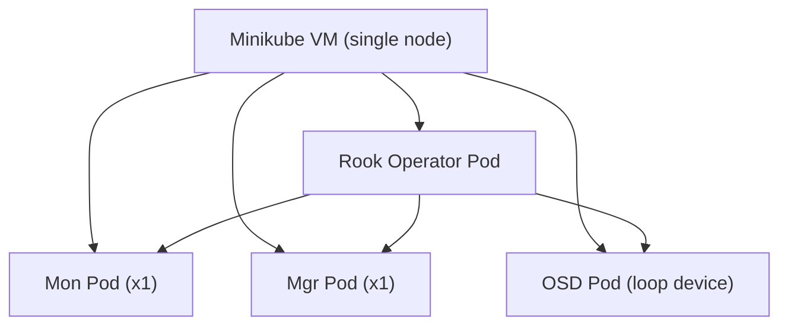

# How to Deploy Rook-Ceph on a Minikube Test Cluster

Author: [nawazdhandala](https://www.github.com/nawazdhandala)

Tags: Rook, Ceph, Kubernetes, Minikube, Storage, Testing

Description: Deploy a functional Rook-Ceph cluster inside Minikube for local testing and development, using loop devices or hostPath volumes to simulate block storage.

---

## Why Test Rook-Ceph on Minikube

Minikube runs a single-node Kubernetes cluster locally and is ideal for testing Rook-Ceph operator behavior, CRD configurations, and CSI driver interactions before deploying to production. Because Minikube is a single node, the cluster will use `allowMultiplePerNode: true` and a single monitor.



## Prerequisites

- Minikube 1.30+ installed
- kubectl configured
- At least 4 CPU and 8 GB RAM allocated to Minikube
- 20 GB of free disk space

## Step 1 - Start Minikube with Sufficient Resources

```bash
minikube start \
  --cpus=4 \
  --memory=8192 \
  --disk-size=40g \
  --driver=virtualbox
```

Or with the Docker driver (Linux only, for better performance):

```bash
minikube start \
  --cpus=4 \
  --memory=8192 \
  --disk-size=40g \
  --driver=docker
```

Verify the cluster is running:

```bash
kubectl cluster-info
kubectl get nodes
```

## Step 2 - Create a Loop Device for OSD Storage

Minikube VMs do not have spare block devices. Create a loop-backed file to simulate a raw disk:

```bash
minikube ssh -- sudo dd if=/dev/zero of=/mnt/disk.img bs=1M count=10240
minikube ssh -- sudo losetup -f --show /mnt/disk.img
```

This creates a 10 GB loop device, usually at `/dev/loop2` or similar. Note the device path returned.

## Step 3 - Install Rook-Ceph Operator

Clone the Rook repository and install from the example manifests:

```bash
git clone --single-branch --branch v1.15.0 \
  https://github.com/rook/rook.git
cd rook/deploy/examples
```

Apply CRDs, common resources, and the operator:

```bash
kubectl apply --server-side -f crds.yaml
kubectl apply -f common.yaml
kubectl apply -f operator.yaml
```

Wait for the operator to become ready:

```bash
kubectl -n rook-ceph rollout status deploy/rook-ceph-operator
```

## Step 4 - Deploy a Single-Node CephCluster

Create a minimal CephCluster manifest for Minikube, referencing the loop device:

```yaml
apiVersion: ceph.rook.io/v1
kind: CephCluster
metadata:
  name: rook-ceph
  namespace: rook-ceph
spec:
  cephVersion:
    image: quay.io/ceph/ceph:v19.2.0
    allowUnsupported: true
  dataDirHostPath: /var/lib/rook
  skipUpgradeChecks: false
  continueUpgradeAfterChecksEvenIfNotHealthy: false
  mon:
    count: 1
    allowMultiplePerNode: true
  mgr:
    count: 1
    modules:
      - name: pg_autoscaler
        enabled: true
  dashboard:
    enabled: true
    ssl: true
  monitoring:
    enabled: false
  storage:
    useAllNodes: false
    useAllDevices: false
    nodes:
      - name: minikube
        devices:
          - name: loop2   # adjust to your loop device number
  resources:
    osd:
      requests:
        cpu: "200m"
        memory: "512Mi"
    mon:
      requests:
        cpu: "100m"
        memory: "256Mi"
    mgr:
      requests:
        cpu: "100m"
        memory: "256Mi"
```

Apply it:

```bash
kubectl apply -f cluster-minikube.yaml
```

## Step 5 - Wait for the Cluster to Become Healthy

Watch pod status:

```bash
kubectl -n rook-ceph get pods -w
```

Check cluster health from the toolbox:

```bash
kubectl apply -f toolbox.yaml
kubectl -n rook-ceph exec -it deploy/rook-ceph-tools -- ceph status
```

A healthy Minikube cluster shows `HEALTH_OK` with 1 mon, 1 mgr, and 1+ OSD.

## Step 6 - Create a Test StorageClass and PVC

Deploy the RBD block pool and StorageClass:

```bash
kubectl apply -f pool.yaml
kubectl apply -f storageclass.yaml
```

Test by creating a PVC:

```yaml
apiVersion: v1
kind: PersistentVolumeClaim
metadata:
  name: test-pvc
spec:
  storageClassName: rook-ceph-block
  accessModes:
    - ReadWriteOnce
  resources:
    requests:
      storage: 1Gi
```

```bash
kubectl apply -f test-pvc.yaml
kubectl get pvc test-pvc
```

The PVC should reach `Bound` status.

## Cleaning Up

Delete all Rook resources before destroying Minikube:

```bash
kubectl delete -f cluster-minikube.yaml
kubectl delete -f common.yaml
kubectl delete -f operator.yaml
kubectl delete -f crds.yaml
minikube stop
minikube delete
```

## Summary

Deploying Rook-Ceph on Minikube requires starting the VM with at least 4 CPU and 8 GB RAM, creating a loop device to simulate block storage, installing the Rook operator from the example manifests, and configuring a single-node CephCluster with `mon.count: 1` and `allowMultiplePerNode: true`. This setup is suitable for validating CRD changes, testing operator behavior, and experimenting with StorageClass configurations without needing physical block devices.
