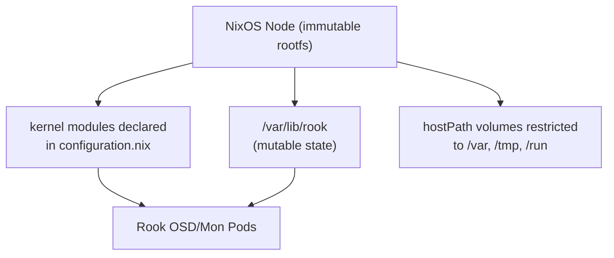

# How to Deploy Rook-Ceph on NixOS Kubernetes Nodes

Author: [nawazdhandala](https://www.github.com/nawazdhandala)

Tags: Rook, Ceph, Kubernetes, Storage, NixOS, Linux

Description: Configure NixOS Kubernetes worker nodes for Rook-Ceph by enabling the required kernel modules, setting up the dataDirHostPath, and handling NixOS-specific filesystem constraints.

---

## NixOS-Specific Challenges

NixOS uses an immutable filesystem layout with read-only paths for system binaries and a declarative configuration model. This creates unique challenges for Rook-Ceph:

- `/usr`, `/bin`, `/lib` are read-only
- Kernel modules must be explicitly declared in the NixOS configuration
- `dataDirHostPath` must point to a mutable directory like `/var/lib/rook`
- The Rook operator image references host binaries that may not exist at expected paths



## Step 1 - Enable Kernel Modules in NixOS Configuration

Add the required Ceph kernel modules to your NixOS configuration:

```nix
# /etc/nixos/configuration.nix
{ config, pkgs, ... }:
{
  boot.kernelModules = [ "rbd" "ceph" ];

  # Ensure kernel extras are included
  boot.extraModulePackages = with config.boot.kernelPackages; [
    # Add any out-of-tree modules here if needed
  ];
}
```

Apply the configuration:

```bash
nixos-rebuild switch
```

Verify modules loaded after rebuild:

```bash
lsmod | grep -E "^rbd|^ceph"
```

## Step 2 - Configure mutable dataDirHostPath

NixOS allows writes to `/var` and its subdirectories. Configure Rook to use this path:

```nix
# Create the directory and set permissions
systemd.tmpfiles.rules = [
  "d /var/lib/rook 0755 root root -"
];
```

Or create it manually:

```bash
mkdir -p /var/lib/rook
chmod 0755 /var/lib/rook
```

## Step 3 - Install lvm2 for OSD Preparation

```nix
environment.systemPackages = with pkgs; [
  lvm2
  util-linux
  e2fsprogs
  xfsprogs
];
```

After rebuilding, verify `lvm2` is available:

```bash
lvs --version
```

## Step 4 - Prepare OSD Disks

```bash
wipefs -a /dev/sdb
blkid /dev/sdb
# Clean device returns no output
```

## Step 5 - Deploy Rook Operator

```bash
git clone --single-branch --branch v1.15.0 \
  https://github.com/rook/rook.git
cd rook/deploy/examples

kubectl apply --server-side -f crds.yaml
kubectl apply -f common.yaml
kubectl apply -f operator.yaml
```

## Step 6 - CephCluster for NixOS

Set `dataDirHostPath` to a mutable NixOS directory and use explicit node/device selection:

```yaml
apiVersion: ceph.rook.io/v1
kind: CephCluster
metadata:
  name: rook-ceph
  namespace: rook-ceph
spec:
  cephVersion:
    image: quay.io/ceph/ceph:v19.2.0
  dataDirHostPath: /var/lib/rook
  mon:
    count: 3
    allowMultiplePerNode: false
  mgr:
    count: 1
  dashboard:
    enabled: true
    ssl: true
  storage:
    useAllNodes: false
    useAllDevices: false
    nodes:
      - name: nixos-node-1
        devices:
          - name: sdb
      - name: nixos-node-2
        devices:
          - name: sdb
      - name: nixos-node-3
        devices:
          - name: sdb
```

## Step 7 - Handle NixOS-Specific CSI Issues

NixOS uses non-standard paths for system utilities. If CSI pods fail because they cannot find tools like `mount` or `blkid`, you need to create a symlink or use the Rook container-specific configuration.

Check if mounts succeed:

```bash
kubectl -n rook-ceph logs ds/csi-rbdplugin -c csi-rbdplugin 2>&1 | tail -20
```

If there are path errors, verify the Rook operator config:

```bash
kubectl -n rook-ceph get configmap rook-ceph-operator-config -o yaml | grep -i path
```

## Step 8 - Persist Configuration Across NixOS Rebuilds

Add a systemd service to ensure modules are loaded and the directory exists after every NixOS rebuild:

```nix
systemd.services.rook-ceph-prep = {
  description = "Prepare Rook-Ceph requirements";
  wantedBy = [ "multi-user.target" ];
  after = [ "network.target" ];
  script = ''
    modprobe rbd || true
    modprobe ceph || true
    mkdir -p /var/lib/rook
    chmod 0755 /var/lib/rook
  '';
  serviceConfig.Type = "oneshot";
  serviceConfig.RemainAfterExit = true;
};
```

## Summary

NixOS nodes for Rook-Ceph require declaring `rbd` and `ceph` in `boot.kernelModules` within `configuration.nix` and rebuilding the system. Set `dataDirHostPath: /var/lib/rook` since only `/var` is mutable on NixOS. Add `lvm2` and disk utilities to `environment.systemPackages`. Use a systemd tmpfiles rule to ensure the Rook data directory is created automatically after every NixOS rebuild.
