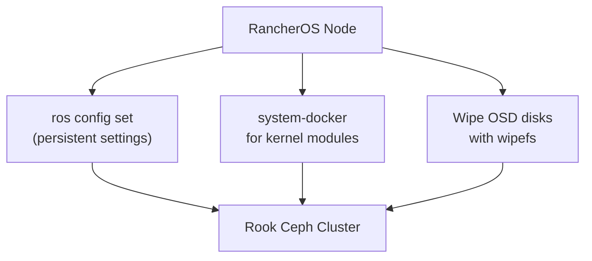

# How to Deploy Rook-Ceph on RancherOS Kubernetes Nodes

Author: [nawazdhandala](https://www.github.com/nawazdhandala)

Tags: Rook, Ceph, Kubernetes, Storage, RancherOS, Rancher

Description: Configure RancherOS Kubernetes worker nodes for Rook-Ceph, covering kernel module loading, persistent configuration with ros, and OSD disk preparation on the container-optimized OS.

---

## RancherOS Considerations

RancherOS is a minimalist, container-focused Linux distribution where the OS runs inside Docker. It uses `ros` (RancherOS CLI) for configuration and has a different approach to persistent configuration compared to traditional Linux distributions. Modern deployments more commonly use RKE2 or k3s on standard Linux, but if you are running RancherOS, Rook-Ceph requires specific setup steps.



## Step 1 - Check RancherOS Version and Kernel

```bash
ros os list
uname -r
```

Rook-Ceph requires kernel 4.1+ for CephFS and 3.10+ for RBD. Most RancherOS versions ship with a 4.x or 5.x kernel.

## Step 2 - Load Kernel Modules on RancherOS

RancherOS does not use `/etc/modules-load.d`. Load modules using the `modprobe` service or a cloud-init configuration:

```bash
# Load immediately
sudo modprobe rbd
sudo modprobe ceph

# Verify
lsmod | grep rbd
lsmod | grep ceph
```

To persist modules across reboots on RancherOS, add them to the cloud-config:

```yaml
# /var/lib/rancher/conf/cloud-config.d/rook-modules.yml
rancher:
  modules:
    - rbd
    - ceph
```

Apply the configuration:

```bash
ros config merge /var/lib/rancher/conf/cloud-config.d/rook-modules.yml
```

## Step 3 - Configure dataDirHostPath

On RancherOS, `/var/lib/rook` is a valid writable path:

```bash
sudo mkdir -p /var/lib/rook
sudo chmod 0755 /var/lib/rook
```

To make this directory persistent across reboots via cloud-config:

```yaml
rancher:
  services:
    rook-prep:
      image: alpine
      command:
        - /bin/sh
        - -c
        - "mkdir -p /host/var/lib/rook && chmod 755 /host/var/lib/rook"
      volumes:
        - /:/host
      restart: no
```

## Step 4 - Install lvm2 via System Docker

RancherOS installs packages via system-docker containers rather than a package manager:

```bash
# Enter the system-docker environment
sudo system-docker run --rm --privileged -v /:/host ubuntu:20.04 \
  apt-get install -y lvm2

# Or using a dedicated console
ros console switch ubuntu
```

After switching the console, you gain access to `apt-get`:

```bash
apt-get install -y lvm2 util-linux
```

## Step 5 - Prepare OSD Disks

```bash
# List available disks
lsblk -d -o NAME,SIZE,TYPE

# Wipe OSD disks
sudo wipefs -a /dev/sdb
sudo wipefs -a /dev/sdc

# Verify clean
blkid /dev/sdb
```

## Step 6 - Deploy Rook Operator

Rook on RancherOS deploys the same way as on any other Kubernetes cluster:

```bash
git clone --single-branch --branch v1.15.0 \
  https://github.com/rook/rook.git
cd rook/deploy/examples

kubectl apply --server-side -f crds.yaml
kubectl apply -f common.yaml
kubectl apply -f operator.yaml

kubectl -n rook-ceph rollout status deploy/rook-ceph-operator
```

## Step 7 - CephCluster for RancherOS

```yaml
apiVersion: ceph.rook.io/v1
kind: CephCluster
metadata:
  name: rook-ceph
  namespace: rook-ceph
spec:
  cephVersion:
    image: quay.io/ceph/ceph:v19.2.0
  dataDirHostPath: /var/lib/rook
  mon:
    count: 3
    allowMultiplePerNode: false
  mgr:
    count: 1
  dashboard:
    enabled: true
    ssl: true
  storage:
    useAllNodes: false
    useAllDevices: false
    nodes:
      - name: rancheros-node-1
        devices:
          - name: sdb
      - name: rancheros-node-2
        devices:
          - name: sdb
      - name: rancheros-node-3
        devices:
          - name: sdb
  resources:
    osd:
      requests:
        cpu: "300m"
        memory: "1Gi"
    mon:
      requests:
        cpu: "100m"
        memory: "256Mi"
```

## Step 8 - Verify

```bash
kubectl -n rook-ceph exec -it deploy/rook-ceph-tools -- ceph status
```

## Migration Recommendation

RancherOS has reached end-of-life. Rancher recommends migrating to RKE2 (Rancher Kubernetes Engine 2) on a standard supported OS like Ubuntu 22.04 or RHEL 9. RKE2 nodes follow the same Rook-Ceph preparation steps as standard Ubuntu or CentOS nodes.

## Summary

RancherOS nodes for Rook-Ceph require loading `rbd` and `ceph` kernel modules via `modprobe` and persisting them in the cloud-config. Use `ros console switch ubuntu` to access a package manager for installing `lvm2`. Set `dataDirHostPath: /var/lib/rook` and wipe OSD disks before deployment. Given that RancherOS is end-of-life, consider migrating to RKE2 on a supported OS for new deployments.
