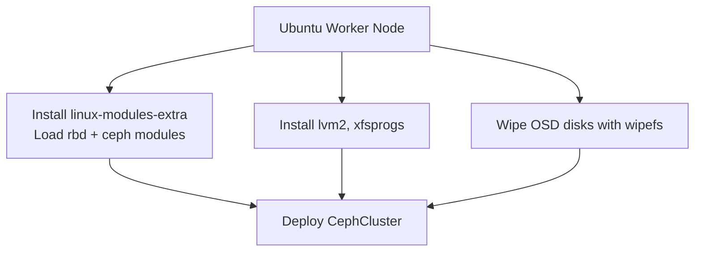

# How to Deploy Rook-Ceph on Ubuntu Kubernetes Nodes

Author: [nawazdhandala](https://www.github.com/nawazdhandala)

Tags: Rook, Ceph, Kubernetes, Storage, Ubuntu, Linux

Description: Prepare Ubuntu Kubernetes worker nodes for Rook-Ceph by installing kernel extras, loading RBD and CephFS modules, preparing OSD disks, and deploying the CephCluster CRD.

---

## Ubuntu-Specific Preparation

Ubuntu is one of the most common Kubernetes node operating systems. The default Ubuntu kernel includes many Ceph-related modules, but you may need `linux-modules-extra` for the full set, especially on minimized cloud images.



## Step 1 - Install Required Packages

On every Ubuntu worker node:

```bash
apt-get update
apt-get install -y lvm2 util-linux xfsprogs e2fsprogs

# Install kernel extras for RBD and CephFS modules
apt-get install -y linux-modules-extra-$(uname -r)
```

On Ubuntu 22.04+ with HWE kernels:

```bash
apt-get install -y linux-modules-extra-$(uname -r)-generic
```

## Step 2 - Load Kernel Modules

```bash
modprobe rbd
modprobe ceph

# Persist across reboots
cat <<EOF > /etc/modules-load.d/rook-ceph.conf
rbd
ceph
EOF

# Verify loaded
lsmod | grep -E "^rbd|^ceph"
```

Expected output includes lines starting with `rbd` and `ceph`.

## Step 3 - Configure UFW Firewall (if enabled)

If UFW is active on Ubuntu nodes, allow Ceph traffic:

```bash
ufw allow 6789/tcp comment "Ceph Mon"
ufw allow 3300/tcp comment "Ceph Msgr2"
ufw allow 6800:7300/tcp comment "Ceph OSD"
ufw allow 8443/tcp comment "Ceph Dashboard"
ufw allow 9283/tcp comment "Ceph Metrics"
ufw reload
```

## Step 4 - Prepare OSD Disks

Identify spare disks:

```bash
lsblk -d -o NAME,SIZE,TYPE,MOUNTPOINT
```

Wipe each OSD disk:

```bash
wipefs -a /dev/sdb
wipefs -a /dev/sdc

# For NVMe devices
wipefs -a /dev/nvme1n1

# Verify clean
blkid /dev/sdb
```

## Step 5 - Install Rook Operator

```bash
git clone --single-branch --branch v1.15.0 \
  https://github.com/rook/rook.git
cd rook/deploy/examples

kubectl apply --server-side -f crds.yaml
kubectl apply -f common.yaml
kubectl apply -f operator.yaml

kubectl -n rook-ceph rollout status deploy/rook-ceph-operator
```

## Step 6 - CephCluster Manifest for Ubuntu Nodes

```yaml
apiVersion: ceph.rook.io/v1
kind: CephCluster
metadata:
  name: rook-ceph
  namespace: rook-ceph
spec:
  cephVersion:
    image: quay.io/ceph/ceph:v19.2.0
    allowUnsupported: false
  dataDirHostPath: /var/lib/rook
  skipUpgradeChecks: false
  mon:
    count: 3
    allowMultiplePerNode: false
  mgr:
    count: 2
    modules:
      - name: pg_autoscaler
        enabled: true
  dashboard:
    enabled: true
    ssl: true
  monitoring:
    enabled: true
  storage:
    useAllNodes: false
    useAllDevices: false
    nodes:
      - name: ubuntu-node-1
        devices:
          - name: sdb
          - name: sdc
      - name: ubuntu-node-2
        devices:
          - name: sdb
          - name: sdc
      - name: ubuntu-node-3
        devices:
          - name: sdb
          - name: sdc
  resources:
    osd:
      requests:
        cpu: "500m"
        memory: "2Gi"
    mon:
      requests:
        cpu: "200m"
        memory: "512Mi"
```

Apply it:

```bash
kubectl apply -f cluster-ubuntu.yaml
```

## Step 7 - Deploy Toolbox and Verify

```bash
kubectl apply -f toolbox.yaml
kubectl -n rook-ceph exec -it deploy/rook-ceph-tools -- ceph status
kubectl -n rook-ceph exec -it deploy/rook-ceph-tools -- ceph osd tree
```

## Troubleshooting on Ubuntu

If OSD prepare jobs fail with `rbd: module not found`, install modules and reload:

```bash
apt-get install -y linux-modules-extra-$(uname -r)
modprobe rbd
# Restart OSD prepare jobs by deleting failed pods
kubectl -n rook-ceph delete pods -l app=rook-ceph-osd-prepare
```

On Ubuntu 20.04 with AppArmor enabled, you may see mount failures in CSI pods. Check AppArmor logs:

```bash
dmesg | grep DENIED | grep ceph
```

If needed, set the `apparmor.security.beta.kubernetes.io/pod: runtime/default` annotation on CSI pods, or create an AppArmor profile that allows `rbd map` and `mount` syscalls.

## Summary

Ubuntu nodes for Rook-Ceph require `linux-modules-extra` for the `rbd` and `ceph` kernel modules, `lvm2` for OSD preparation, and wiped block devices for OSD storage. If UFW is enabled, open the Mon, OSD, dashboard, and metrics ports. On Ubuntu 20.04, check for AppArmor denials if CSI mounts fail. Use explicit node and device lists in the CephCluster spec to prevent accidental OS disk consumption.
