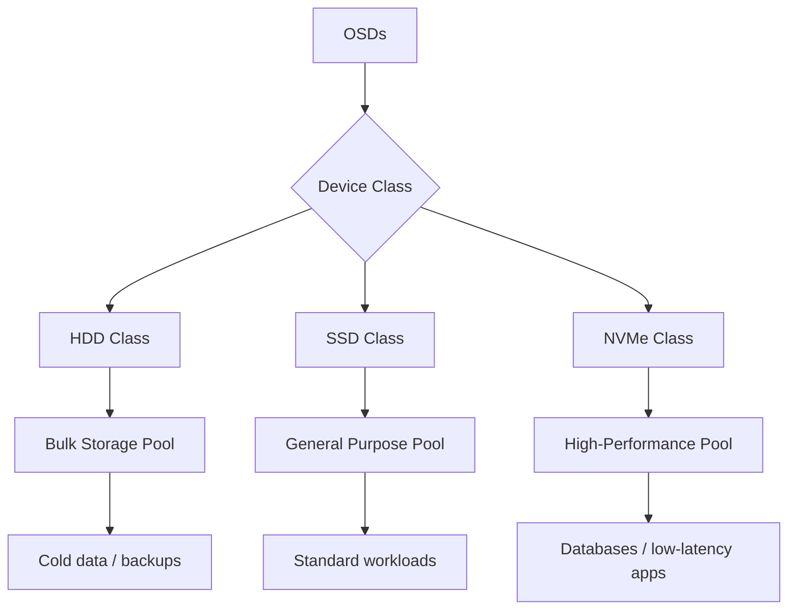

# How to Use Device Classes (HDD, SSD, NVMe) in Rook-Ceph

Author: [nawazdhandala](https://www.github.com/nawazdhandala)

Tags: Rook, Ceph, Kubernetes, OSD, DeviceClass, Performance

Description: Learn how to configure and use Ceph device classes (HDD, SSD, NVMe) in Rook to create tiered storage pools and direct workloads to the right storage tier.

---

Ceph device classes allow you to group OSDs by disk type and create storage pools that target specific tiers. This enables tiered storage where fast NVMe/SSD disks serve latency-sensitive workloads while HDDs handle bulk capacity.

## Device Class Architecture



## How Ceph Auto-Detects Device Classes

Ceph automatically classifies OSDs by querying the rotational flag:
- Spinning disks: `hdd`
- Non-spinning: `ssd`
- NVMe: `nvme`

Rook passes through these device class assignments to the CRUSH map.

## Verify Auto-Detected Classes

```bash
kubectl exec -n rook-ceph deploy/rook-ceph-tools -- ceph osd tree
```

Example output:

```
ID  CLASS  WEIGHT    TYPE NAME        STATUS
-1         6.00000   root default
-3         2.00000       host node-1
 0    hdd  1.00000           osd.0    up
 1    ssd  1.00000           osd.1    up
-5         2.00000       host node-2
 2    hdd  1.00000           osd.2    up
 3    ssd  1.00000           osd.3    up
```

## Override Device Class in Rook

If auto-detection is incorrect, override the device class via the `crushDeviceClass` annotation on PVC templates or node config:

```yaml
apiVersion: ceph.rook.io/v1
kind: CephCluster
metadata:
  name: rook-ceph
  namespace: rook-ceph
spec:
  storage:
    storageClassDeviceSets:
      - name: nvme-set
        count: 3
        portable: true
        volumeClaimTemplates:
          - metadata:
              name: data
              annotations:
                crushDeviceClass: nvme    # override detected class
            spec:
              resources:
                requests:
                  storage: 200Gi
              storageClassName: nvme-block
              volumeMode: Block
              accessModes:
                - ReadWriteOnce
      - name: hdd-set
        count: 6
        portable: true
        volumeClaimTemplates:
          - metadata:
              name: data
              annotations:
                crushDeviceClass: hdd
            spec:
              resources:
                requests:
                  storage: 2Ti
              storageClassName: hdd-block
              volumeMode: Block
              accessModes:
                - ReadWriteOnce
```

## Create Device Class-Specific CRUSH Rules

```bash
kubectl exec -n rook-ceph deploy/rook-ceph-tools -- bash

# Create CRUSH rule for SSD-only pool
ceph osd crush rule create-replicated ssd-rule default host ssd

# Create CRUSH rule for HDD-only pool
ceph osd crush rule create-replicated hdd-rule default host hdd

# Create CRUSH rule for NVMe-only pool
ceph osd crush rule create-replicated nvme-rule default host nvme

# Verify rules
ceph osd crush rule list
```

## Create Pools Targeting Device Classes

```yaml
apiVersion: ceph.rook.io/v1
kind: CephBlockPool
metadata:
  name: ssd-pool
  namespace: rook-ceph
spec:
  replicated:
    size: 3
    requireSafeReplicaSize: true
  deviceClass: ssd     # target SSD OSDs only
---
apiVersion: ceph.rook.io/v1
kind: CephBlockPool
metadata:
  name: nvme-pool
  namespace: rook-ceph
spec:
  replicated:
    size: 3
    requireSafeReplicaSize: true
  deviceClass: nvme    # target NVMe OSDs only
---
apiVersion: ceph.rook.io/v1
kind: CephBlockPool
metadata:
  name: hdd-pool
  namespace: rook-ceph
spec:
  replicated:
    size: 3
    requireSafeReplicaSize: true
  deviceClass: hdd     # target HDD OSDs only
```

## Create StorageClasses per Tier

```yaml
apiVersion: storage.k8s.io/v1
kind: StorageClass
metadata:
  name: ceph-rbd-nvme
provisioner: rook-ceph.rbd.csi.ceph.com
parameters:
  clusterID: rook-ceph
  pool: nvme-pool
  imageFormat: "2"
  imageFeatures: layering
  csi.storage.k8s.io/provisioner-secret-name: rook-csi-rbd-provisioner
  csi.storage.k8s.io/provisioner-secret-namespace: rook-ceph
  csi.storage.k8s.io/controller-expand-secret-name: rook-csi-rbd-provisioner
  csi.storage.k8s.io/controller-expand-secret-namespace: rook-ceph
  csi.storage.k8s.io/node-stage-secret-name: rook-csi-rbd-node
  csi.storage.k8s.io/node-stage-secret-namespace: rook-ceph
reclaimPolicy: Delete
allowVolumeExpansion: true
---
apiVersion: storage.k8s.io/v1
kind: StorageClass
metadata:
  name: ceph-rbd-hdd
provisioner: rook-ceph.rbd.csi.ceph.com
parameters:
  clusterID: rook-ceph
  pool: hdd-pool
  imageFormat: "2"
  imageFeatures: layering
  csi.storage.k8s.io/provisioner-secret-name: rook-csi-rbd-provisioner
  csi.storage.k8s.io/provisioner-secret-namespace: rook-ceph
  csi.storage.k8s.io/controller-expand-secret-name: rook-csi-rbd-provisioner
  csi.storage.k8s.io/controller-expand-secret-namespace: rook-ceph
  csi.storage.k8s.io/node-stage-secret-name: rook-csi-rbd-node
  csi.storage.k8s.io/node-stage-secret-namespace: rook-ceph
reclaimPolicy: Delete
allowVolumeExpansion: true
```

## Validate OSD Device Classes

```bash
# List OSDs and their device classes
kubectl exec -n rook-ceph deploy/rook-ceph-tools -- ceph osd crush class ls

# Show OSDs in a specific class
kubectl exec -n rook-ceph deploy/rook-ceph-tools -- ceph osd crush class ls-osd ssd

# Check which CRUSH rule a pool uses
kubectl exec -n rook-ceph deploy/rook-ceph-tools -- ceph osd pool get nvme-pool crush_rule
```

## Summary

Ceph device classes (HDD, SSD, NVMe) in Rook let you build tiered storage with separate pools for different disk types. Auto-detection handles most cases, but annotations like `crushDeviceClass` allow overrides when needed. Pairing device-class-specific pools with dedicated StorageClasses gives application teams a simple way to select the right storage tier for their workloads.
