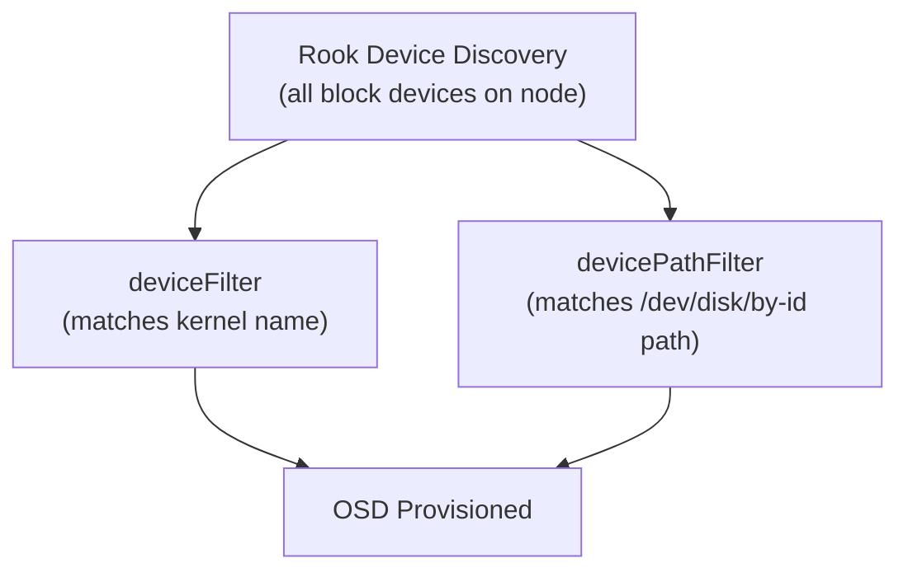

# How to Use Device Filters and Path Filters in Rook-Ceph

Author: [nawazdhandala](https://www.github.com/nawazdhandala)

Tags: Rook, Ceph, Kubernetes, Storage, OSD, Configuration

Description: Use deviceFilter and devicePathFilter regex patterns in Rook-Ceph to select OSD devices by kernel name or full device path, preventing accidental use of OS or system disks.

---

## Two Filter Types

Rook-Ceph provides two regex-based filters for device selection:

1. **deviceFilter** - Matches against the kernel device name (e.g., `sdb`, `nvme1n1`)
2. **devicePathFilter** - Matches against the full device path (e.g., `/dev/disk/by-id/...`)

Both filters use Go regular expressions and are applied per node or globally.



## deviceFilter - Name-Based Filtering

Set a global device filter for all nodes:

```yaml
spec:
  storage:
    useAllNodes: true
    useAllDevices: false
    deviceFilter: "^sd[b-z]"
```

This matches `sdb`, `sdc`, `sdd`, etc., but not `sda` (typically the OS disk).

Additional common patterns:

```yaml
# NVMe - skip nvme0n1 (OS disk)
deviceFilter: "^nvme[1-9]n1"

# VirtIO - skip vda (OS disk)
deviceFilter: "^vd[b-z]"

# Match specific disk models (requires udev naming)
deviceFilter: "^sd[b-f]"

# Only disks of specific size via symlink name
deviceFilter: "data-disk-[0-9]+"
```

## devicePathFilter - Path-Based Filtering

`devicePathFilter` matches against the full `/dev/` path or symlinks in `/dev/disk/by-id/`, `/dev/disk/by-path/`, etc. This is more stable than kernel names which can change across reboots.

```yaml
spec:
  storage:
    useAllNodes: true
    useAllDevices: false
    devicePathFilter: "/dev/disk/by-id/.*samsung.*"
```

This claims only Samsung disks (by manufacturer in the by-id name).

Filter by interface type:

```yaml
# Only NVMe disks by path
devicePathFilter: "/dev/disk/by-path/.*nvme.*"

# Only SAS disks
devicePathFilter: "/dev/disk/by-path/.*sas.*"

# Specific by-id pattern
devicePathFilter: "/dev/disk/by-id/wwn-0x5000c500.*"
```

## Per-Node Filters

Apply different filters on different nodes:

```yaml
spec:
  storage:
    useAllNodes: false
    useAllDevices: false
    nodes:
      - name: storage-node-1
        deviceFilter: "^nvme[1-9]n1"
      - name: storage-node-2
        deviceFilter: "^sd[b-z]"
      - name: storage-node-3
        devicePathFilter: "/dev/disk/by-id/.*seagate.*"
```

## Combining Filters with Explicit Devices

You can mix filter-based and explicit device selection across nodes:

```yaml
spec:
  storage:
    useAllNodes: false
    useAllDevices: false
    nodes:
      - name: node-with-homogeneous-disks
        deviceFilter: "^nvme[1-9]n1"
      - name: node-with-mixed-disks
        devices:
          - name: nvme1n1
          - name: nvme2n1
```

## Testing a Filter Before Applying

The filter is a Go regex. Test it locally:

```bash
echo "sdb sdc nvme0n1 nvme1n1" | \
  tr ' ' '\n' | \
  grep -E "^nvme[1-9]n1"
# Expected: nvme1n1
```

Or use the Rook toolbox to list devices and verify which ones match:

```bash
kubectl -n rook-ceph exec -it deploy/rook-ceph-tools -- \
  ceph-volume inventory
```

## Verifying Filter Application

After applying the CephCluster, check which OSDs were created:

```bash
kubectl -n rook-ceph exec -it deploy/rook-ceph-tools -- \
  ceph osd tree
```

Each OSD shows its host and device. Verify only the intended disks are included.

Check OSD prepare job logs to see which devices were considered:

```bash
kubectl -n rook-ceph logs -l app=rook-ceph-osd-prepare --tail=50 | \
  grep -E "device|filter|skip"
```

## Escaping Special Regex Characters

Device paths contain characters with special regex meaning. Escape them:

```yaml
# Match exact NVMe path (dot in nvme0n1 must be escaped for strict match)
deviceFilter: "^nvme[1-9]n1$"

# Match by-id path with dots escaped
devicePathFilter: "/dev/disk/by-id/ata-Samsung_SSD_870_EVO_.*"
```

## Summary

Rook-Ceph `deviceFilter` matches OSD candidates by kernel device name using Go regex, while `devicePathFilter` matches against the full `/dev/` path including persistent symlinks in `/dev/disk/by-id/` or `/dev/disk/by-path/`. Use `deviceFilter: "^sd[b-z]"` to exclude the OS disk (`sda`) or `deviceFilter: "^nvme[1-9]n1"` to skip the first NVMe. Use `devicePathFilter` for stable disk identification across reboots using WWN or serial-number-based paths. Apply different filters per node in the `nodes` array for heterogeneous hardware configurations.
