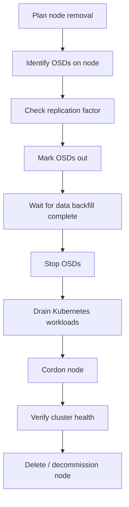

# How to Drain a Node Before Removal from Rook-Ceph

Author: [nawazdhandala](https://www.github.com/nawazdhandala)

Tags: Rook, Ceph, Kubernetes, Node, Drain, Maintenance, OSD, Decommission

Description: Learn how to safely drain a Kubernetes node hosting Rook-Ceph OSDs before removal, including OSD migration, pod eviction, and verification steps.

---

Draining a node that hosts Rook-Ceph OSDs requires more care than a standard Kubernetes node drain. You must migrate OSD data out of the node before evicting pods to prevent data loss or extended degradation windows.

## Drain Sequence



## Step 1: Identify OSDs on the Target Node

```bash
NODE=worker-03

# Find OSD pods on the node
kubectl get pods -n rook-ceph -l app=rook-ceph-osd \
  --field-selector spec.nodeName=$NODE

# Get OSD IDs
kubectl get pods -n rook-ceph -l app=rook-ceph-osd \
  --field-selector spec.nodeName=$NODE \
  -o jsonpath='{.items[*].metadata.labels.ceph-osd-id}'
```

## Step 2: Check Replication Factor

Ensure you have enough OSDs remaining to maintain the replication factor:

```bash
# Get pool sizes
kubectl exec -n rook-ceph deploy/rook-ceph-tools -- \
  ceph osd dump | grep "^pool" | grep "size"

# Count total OSDs
kubectl exec -n rook-ceph deploy/rook-ceph-tools -- \
  ceph osd stat

# With replication=3, you need at least 3 OSDs remaining after removal
```

## Step 3: Mark OSDs Out

```bash
# Mark all OSDs on the node out
for OSD_ID in 2 5 8; do
  kubectl exec -n rook-ceph deploy/rook-ceph-tools -- \
    ceph osd out osd.$OSD_ID
  echo "Marked osd.$OSD_ID out"
done
```

## Step 4: Wait for Complete Data Backfill

This is the most critical step -- do not proceed until data is fully migrated:

```bash
# Monitor backfill progress
watch kubectl exec -n rook-ceph deploy/rook-ceph-tools -- ceph status

# Wait for:
# "0 bytes misplaced"
# "0 objects degraded"

# Detailed check
kubectl exec -n rook-ceph deploy/rook-ceph-tools -- ceph health detail
```

Expected output when safe to proceed:

```yaml
HEALTH_OK
mon: 3 daemons, quorum a,b,c (age 5h)
osd: 12 osds: 12 up, 9 in
```

## Step 5: Cordon the Node

Prevent new pods from scheduling while you complete the drain:

```bash
kubectl cordon $NODE
```

## Step 6: Drain Application Workloads

```bash
kubectl drain $NODE \
  --ignore-daemonsets \
  --delete-emptydir-data \
  --timeout=300s

# The drain does NOT evict OSD pods (they are DaemonSet or static pods)
# We handle OSD pods separately
```

## Step 7: Stop OSD Pods on the Node

```bash
# Delete OSD pods on the drained node
kubectl delete pods -n rook-ceph -l app=rook-ceph-osd \
  --field-selector spec.nodeName=$NODE

# Also delete other Rook daemons on this node
kubectl delete pods -n rook-ceph -l app=rook-ceph-mon \
  --field-selector spec.nodeName=$NODE --ignore-not-found

kubectl delete pods -n rook-ceph -l app=rook-ceph-mgr \
  --field-selector spec.nodeName=$NODE --ignore-not-found
```

## Step 8: Remove OSDs from Ceph

```bash
for OSD_ID in 2 5 8; do
  kubectl exec -n rook-ceph deploy/rook-ceph-tools -- \
    ceph osd crush remove osd.$OSD_ID
  kubectl exec -n rook-ceph deploy/rook-ceph-tools -- \
    ceph auth del osd.$OSD_ID
  kubectl exec -n rook-ceph deploy/rook-ceph-tools -- \
    ceph osd rm osd.$OSD_ID
  echo "Removed osd.$OSD_ID"
done

# Remove the node from CRUSH map
kubectl exec -n rook-ceph deploy/rook-ceph-tools -- \
  ceph osd crush remove $NODE
```

## Step 9: Remove Node from CephCluster Spec

```bash
kubectl edit cephcluster rook-ceph -n rook-ceph
# Under spec.storage.nodes, remove the worker-03 entry
```

## Step 10: Verify and Delete Node

```bash
# Verify cluster health
kubectl exec -n rook-ceph deploy/rook-ceph-tools -- ceph status
kubectl exec -n rook-ceph deploy/rook-ceph-tools -- ceph osd tree

# Delete the Kubernetes node object
kubectl delete node $NODE
```

## Summary

Draining a Rook-Ceph node safely requires marking OSDs out, waiting for full data backfill to maintain replication guarantees, then cordoning and draining application workloads, stopping and removing OSD pods, cleaning up Ceph cluster state, and finally deleting the node object. Never skip the backfill wait step -- removing OSDs before data migrates can result in data loss if a second OSD in the same replica set also fails.
